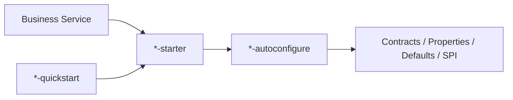

# peach-cloud

English | [中文](README.md)

`peach-cloud` is an enterprise microservice project built on Java 21, Spring Boot 3.5.x and Spring Cloud 2025.x. The repository contains business services, the API gateway, reusable components, middleware starters, the frontend, deployment assets and engineering documentation.

## Repository Layout

```text
peach-cloud/
├── peach-auth/               # Authentication, users, roles, resources and permissions
├── peach-gateway/            # API gateway
├── peach-fileservice/        # File-domain service
├── peach-message/            # Messages, notices and push
├── peach-setting/            # Dictionaries, value sets and i18n configuration
├── peach-monitor/            # Monitoring and audit domain
├── peach-generator/          # Code generation domain
├── peach-scheduled/          # Distributed scheduler control plane
├── peach-common/             # Business-neutral shared foundations
├── peach-component/          # Reusable component starters
├── peach-middleware/         # Middleware starters
├── peach-sample/             # Business-level integration sample
├── peach-cloud-front/        # Vue 3 + TypeScript + Vite frontend
├── docs/                     # Project design, integration and operations docs
└── deploy*/                  # Local and CI/CD deployment assets
```

Use the root `pom.xml`, `peach-dependencies/pom.xml` and frontend `package.json` as the version sources of truth.

## Starter Convention

Reusable capabilities under `peach-component` and `peach-middleware` follow the same public three-layer structure:



- `*-autoconfigure`: public contracts, configuration binding, auto-configuration, default implementations and SPI/provider assembly.
- `*-starter`: minimal dependency entry point for business services.
- `*-quickstart`: runnable minimal integration sample; never a production dependency.
- `core`, `common`, `provider-*` and `transport-*` remain only when they have a real independent responsibility.
- Non-business starter families no longer use `example` / `*-example`; runnable examples use `quickstart`.

See [`docs/starter-architecture.md`](docs/starter-architecture.md) for the full convention.

## Module Navigation

### Business services

| Module | Responsibility |
| --- | --- |
| `peach-auth` | Login, users, organizations, roles, menus, resources and permissions |
| `peach-fileservice` | File business logic, metadata and storage integration |
| `peach-message` | Notices, inbox messages, tasks and push |
| `peach-setting` | Dictionaries, value sets, notifications and i18n configuration |
| `peach-monitor` | Runtime monitoring, audit and queries |
| `peach-generator` | Data sources, metadata, templates and code generation |
| `peach-scheduled` | Job definitions, state, execution history and scheduler control plane |
| `peach-gateway` | Unified ingress, authentication, authorization and gateway governance |

### Components

[`peach-component`](peach-component/README.en-US.md) contains reusable Captcha, Code, Email, Initialize, Observability, Scheduler, Storage, legacy ThreadPool compatibility and Virtual Thread capabilities.

### Middleware

[`peach-middleware`](peach-middleware/README.en-US.md) contains RocketMQ, Redis, Redisson, MongoDB, Sa-Token and OpenFeign integrations. Placeholder modules without a real starter implementation are not part of the reactor.

## Build

Full Maven build:

```bash
mvn clean package -Pdevelopment
```

Build and test a selected module with dependencies:

```bash
mvn -pl peach-component/peach-virtual-thread -am test -Pdevelopment
mvn -pl peach-middleware/peach-rocket -am test -Pdevelopment
```

Frontend build:

```bash
cd peach-cloud-front
npm install
npm run build
```

## Documentation Convention

- `README.md` is the Chinese primary document and `README.en-US.md` is the semantically equivalent English document. Features, configuration, APIs, commands, diagrams and limitations change together.
- README files provide positioning, minimum integration, key boundaries and links to deeper material; complex design, references, migrations and troubleshooting belong in `docs/`.
- Technical facts are grounded in current source, configuration, tests, POMs, SQL, quickstarts and version-matched official documentation.
- Architecture, call flows, state, lifecycle and data flow should prefer maintainable Mermaid / PlantUML / draw.io diagrams.

See [`AGENTS.md`](AGENTS.md) for repository Agent, Rule, Skill and centralized quality-gate conventions.
