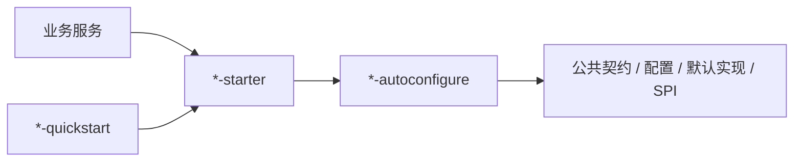

# peach-cloud

[English](README.en-US.md) | 中文

`peach-cloud` 是基于 Java 21、Spring Boot 3.5.x、Spring Cloud 2025.x 构建的企业级微服务工程。仓库同时包含业务服务、网关、公共组件、中间件 Starter、前端、部署脚本与工程文档。

## 项目结构

```text
peach-cloud/
├── peach-auth/               # 认证、用户、角色、资源与权限
├── peach-gateway/            # API 网关
├── peach-fileservice/        # 文件业务服务
├── peach-message/            # 消息、公告、站内信与推送
├── peach-setting/            # 字典、值集、通知与多语言配置
├── peach-monitor/            # 监控与审计业务
├── peach-generator/          # 代码生成业务
├── peach-scheduled/          # 分布式调度控制面
├── peach-common/             # 业务无关公共基础能力
├── peach-component/          # 可复用组件 Starter
├── peach-middleware/         # 中间件 Starter
├── peach-sample/             # 业务级综合样例
├── peach-cloud-front/        # Vue 3 + TypeScript + Vite 前端
├── docs/                     # 项目级设计、接入和运维文档
└── deploy*/                  # 本地与 CI/CD 部署编排
```

具体版本以根 `pom.xml`、`peach-dependencies/pom.xml` 和前端 `package.json` 为准。

## Starter 规范

`peach-component` 与 `peach-middleware` 中可复用能力统一采用三层对外结构：



- `*-autoconfigure`：公共契约、配置绑定、自动配置、默认实现、SPI/Provider 装配。
- `*-starter`：业务接入的最小依赖入口。
- `*-quickstart`：可运行的最小接入样例，不作为生产依赖。
- `core`、`common`、`provider-*`、`transport-*` 只有存在真实独立职责时保留。
- 非业务 Starter 不再使用 `example` / `*-example`，统一使用 `quickstart`。

完整约定见 [`docs/starter-architecture.md`](docs/starter-architecture.md)。

## 模块导航

### 业务服务

| 模块 | 职责 |
| --- | --- |
| `peach-auth` | 登录、用户、机构、角色、菜单、资源和权限 |
| `peach-fileservice` | 文件业务、元数据和存储接入 |
| `peach-message` | 公告、站内信、待办和推送 |
| `peach-setting` | 字典、值集、通知与国际化配置 |
| `peach-monitor` | 运行监控、审计与查询 |
| `peach-generator` | 数据源、元数据、模板与代码生成 |
| `peach-scheduled` | 调度任务定义、状态、执行记录与控制面 |
| `peach-gateway` | 统一入口、认证、权限与网关治理 |

### 通用组件

[`peach-component`](peach-component/README.md) 维护 Captcha、Code、Email、Initialize、Observability、Scheduler、Storage、ThreadPool 兼容层与 Virtual Thread 等可复用能力。

### 中间件

[`peach-middleware`](peach-middleware/README.md) 维护 RocketMQ、Redis、Redisson、MongoDB、Sa-Token 与 OpenFeign 接入。未形成真实 Starter 实现的占位模块不进入聚合构建。

## 构建

完整 Maven 构建：

```bash
mvn clean package -Pdevelopment
```

只构建指定模块及依赖：

```bash
mvn -pl peach-component/peach-virtual-thread -am test -Pdevelopment
mvn -pl peach-middleware/peach-rocket -am test -Pdevelopment
```

前端独立构建：

```bash
cd peach-cloud-front
npm install
npm run build
```

## 文档约定

- `README.md` 为中文主文档，`README.en-US.md` 为英文等价文档，功能、配置、API、命令、图和限制变更时必须同步。
- README 负责定位、最小接入、关键边界和深入阅读；复杂设计、Reference、迁移和排障进入 `docs/`。
- 技术事实以当前源码、配置、测试、POM、SQL、quickstart 和当前版本官方文档为依据。
- 架构、调用链、状态、生命周期和数据流优先使用 Mermaid / PlantUML / draw.io 表达。

项目 Agent、Rule、Skill 和统一质量门禁约定见 [`AGENTS.md`](AGENTS.md)。
