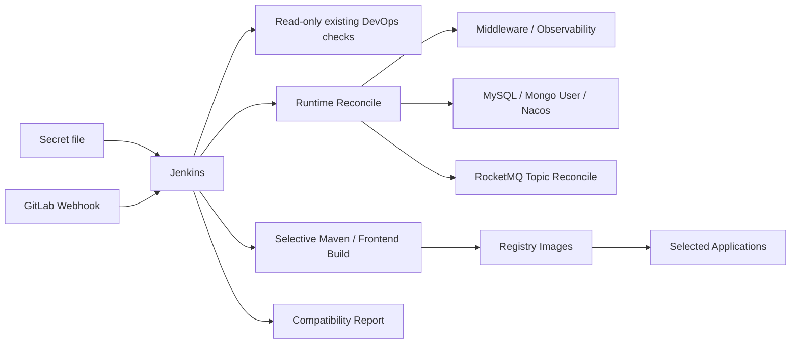

# Peach Cloud Docker CI/CD & Infrastructure

[中文](README.md)

`deploy-pipline` is the Docker infrastructure and continuous-delivery workspace for Peach Cloud. The operating goal is: **maintain one Jenkins Secret file, then let Jenkins/webhooks render runtime configuration, reconcile infrastructure, initialize data, selectively build, deploy, and verify without replacing the already-working GitLab/Jenkins/Nexus/Registry data.**

## Automation boundary



- Existing `gitlab`, `jenkins`, `nexus`, `local-registry`, `registry-ui`, and their external volumes are never recreated by Jenkins.
- Existing Middleware/Observability containers are preserved or started; only missing containers are created.
- MySQL baseline runs only for an empty database; MongoDB only ensures the application user; Nacos preserves existing configuration by default; declared RocketMQ topics are reconciled.
- Automation rejects destructive volume operations.

## Private configuration

Use [`env/deploy.env.example`](env/deploy.env.example) as the Jenkins Secret file template and keep Credential ID `peach-deploy-env`. Non-sensitive defaults are versioned in [`env/defaults.env`](env/defaults.env). Previous full env files remain compatible because private values override repository defaults.

## Jenkins build modes

- `BUILD_BRANCH=AUTO`: webhook/current SCM branch; manual builds may enter a branch.
- `BUILD_MODE=AUTO`: resolve affected services from Git diff.
- `BUILD_MODE=SELECTED`: provide space/comma-separated services in `DEPLOY_SERVICES`.
- `BUILD_MODE=ALL`: build all applications.

No new Jenkins parameter plugin is installed, deliberately avoiding a Jenkins migration on an existing installation.

## RocketMQ

[`config/rocketmq/topics.json`](config/rocketmq/topics.json) is the governed topic catalog. `ensure` creates missing topics, `verify` only checks, and `off` skips governance. Each run archives `runtime/reports/rocketmq-status.txt` with Broker and application auto-create state.

## Cold start vs daily delivery

With an existing Jenkins/GitLab environment, daily delivery requires no manual bootstrap/init commands. Only a brand-new Docker host with no Jenkins needs:

```bash
PEACH_ENV_FILE=deploy-pipline/env/deploy.env deploy-pipline/scripts/bootstrap/bootstrap.sh
```

## Documentation

- [Startup and migration](docs/getting-started.md)
- [Architecture, data protection and operations](docs/architecture-and-operations.md)
- [Jenkins / Nexus / Registry / webhook delivery](docs/ci-cd.md)
