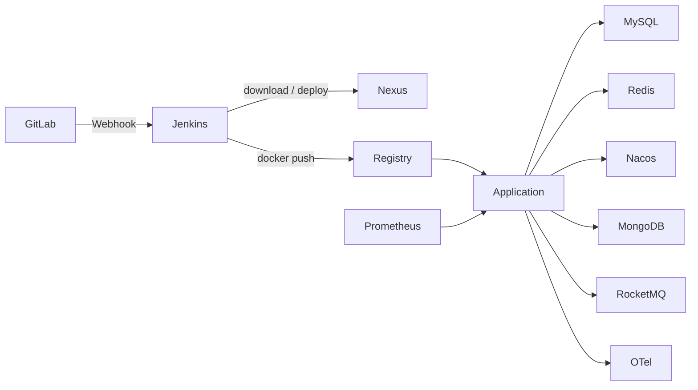

# Peach Cloud Docker CI/CD & Infrastructure

[中文](README.md)

`deploy-pipline` is the independent Docker infrastructure and continuous-delivery workspace for Peach Cloud. DevOps, Middleware, Observability and Application are separate lifecycle domains. Infrastructure is started ahead of application delivery and kept persistent; Jenkins only verifies dependencies, publishes Maven artifacts to Nexus, pushes Docker images to Registry, and updates application containers.

## Architecture

## Runtime domains

| Domain | Compose | Main components | Lifecycle |
| --- | --- | --- | --- |
| DevOps | [`compose/devops/docker-compose.yml`](compose/devops/docker-compose.yml) | GitLab, Jenkins, Nexus, Registry, Registry UI, Nginx | Long-lived |
| Middleware | [`compose/middleware/docker-compose.yml`](compose/middleware/docker-compose.yml) | MySQL, Redis, Nacos, MongoDB, RocketMQ | Long-lived and required before delivery |
| Observability | [`compose/observability/docker-compose.yml`](compose/observability/docker-compose.yml) | Prometheus, Tempo, OTel, Loki, Alloy, Grafana | Long-lived |
| Application | [`compose/application/docker-compose.yml`](compose/application/docker-compose.yml) | Peach Cloud backend services and frontend | Updated by Jenkins |

## First install or migration

1. Read [`docs/migration.md`](docs/migration.md) and inventory existing containers, volumes and networks.
2. Copy `env/deploy.env.example` to `env/deploy.env` and replace all `change_me_*` values.
3. Set `PEACH_LOG_ROOT` to an absolute Docker-daemon-visible path ending in `deploy-pipline/runtime/logs`.
4. Run the same `bootstrap.sh` command shown in the Chinese README.

Bootstrap reuses protected containers and named volumes. It never performs `down -v`, volume pruning or destructive database resets.

## Daily delivery

GitLab Webhook triggers [`Jenkinsfile`](Jenkinsfile): Checkout → credential validation → infrastructure verification → Maven `clean deploy` through Nexus → Docker build/push → selected application update → health verification.

Jenkins does **not** start or initialize MySQL, Redis, Nacos, MongoDB or RocketMQ.

## Data protection

Existing persistent identities remain unchanged, including `peach-gitlab-data`, `peach-jenkins-data`, `peach-nexus-data`, `peach-registry-data`, `peach-mysql-data`, `peach-redis-data`, `peach-nacos-data`, and `peach-rocketmq-store`. MongoDB only adds `peach-mongo-data`.

## Documentation

- [Architecture](docs/architecture.md)
- [Infrastructure bootstrap](docs/bootstrap.md)
- [Networking and storage](docs/network-and-storage.md)
- [Middleware](docs/middleware.md)
- [Initialization](docs/initialization.md)
- [Jenkins pipeline](docs/jenkins-pipeline.md)
- [Maven and Nexus](docs/nexus-maven.md)
- [Docker Registry](docs/registry.md)
- [Observability](docs/observability.md)
- [Migration](docs/migration.md)
- [Troubleshooting](docs/troubleshooting.md)
