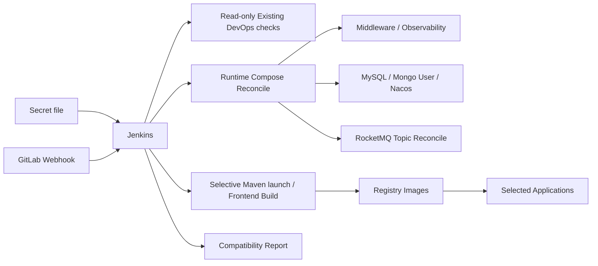

# Peach Cloud Docker CI/CD & Infrastructure

[中文](README.md)

`deploy-pipline` is the Docker infrastructure and continuous-delivery workspace for Peach Cloud. The operating goal is: **maintain one Jenkins Secret file, then let Jenkins/webhooks render runtime configuration, reconcile infrastructure, initialize data, selectively build, publish images, deploy applications, and verify the result without replacing the already-working GitLab/Jenkins/Nexus/Registry data.**

## Automation boundary



- **Protected DevOps**: existing `gitlab`, `jenkins`, `nexus`, `local-registry`, `registry-ui`, and their external volumes are not recreated by the daily Jenkins pipeline.
- **Runtime reconcile**: Middleware and Observability services are applied from the current Compose definitions with `up -d`; legacy Runtime containers may be replaced while external volumes and data remain intact.
- **Recoverable initialization**: MySQL creates only missing baseline tables and records a checksum; MongoDB only ensures the application user; Nacos preserves existing DataIds by default; RocketMQ topics are reconciled from a declarative catalog.
- **Safe storage default**: file storage defaults to `local`; OSS/COS/BOS/OBS providers are omitted unless a complete credential pair is configured.
- **Secret cleanup**: runtime env, Maven settings, rendered Nacos files, and initialization artifacts are removed on success, failure, and interruption paths.
- **Destructive operations are forbidden**: repository gates reject `down -v`, `docker volume prune`, `docker volume rm`, and equivalent commands.

## Private configuration

Use [`env/deploy.env.example`](env/deploy.env.example) as the template for a local private file or Jenkins Secret file. The Jenkins Credential ID is `peach-deploy-env`. Non-sensitive defaults are versioned in [`env/defaults.env`](env/defaults.env). Previous full env files remain compatible because private values override repository defaults.

## Jenkins build modes

- `BUILD_BRANCH=AUTO`: webhook/current SCM branch; manual builds may enter `main`, `develop`, or `feature/...`.
- `BUILD_MODE=AUTO`: resolve affected services from Git diff.
- `BUILD_MODE=SELECTED`: provide space- or comma-separated services in `DEPLOY_SERVICES`.
- `BUILD_MODE=ALL`: build every application.

Backend entries point directly to runnable `*-launch` Maven modules. Changes to shared modules, `.mvn/`, or repository build scripts safely expand the backend build scope.

## Cold start vs daily delivery

With an existing Jenkins/GitLab environment, daily delivery requires no manual bootstrap or initialization command. Only a brand-new Docker host with no Jenkins needs the one-time cold-start entry point:

```bash
PEACH_ENV_FILE=deploy-pipline/env/deploy.env \
  sh deploy-pipline/scripts/bootstrap/bootstrap.sh
```

## Documentation

- [Complete startup, configuration, usage, and troubleshooting guide (Chinese)](docs/startup-and-configuration.md)
- [Quick start for Windows and Linux](docs/getting-started.md)
- [Architecture, data protection, and operations](docs/architecture-and-operations.md)
- [Jenkins, Nexus, Registry, and webhook delivery](docs/ci-cd.md)
