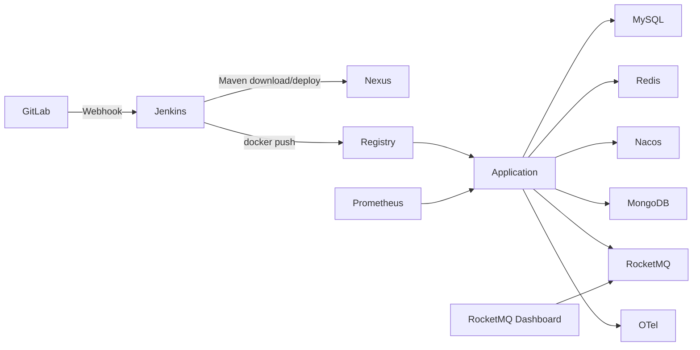

# Peach Cloud Docker CI/CD & Infrastructure

[中文](README.md)

`deploy-pipline` is the Docker infrastructure and continuous-delivery workspace for Peach Cloud. DevOps, Middleware, Observability and Application have separate lifecycles. Long-lived infrastructure is kept outside application delivery; Jenkins only validates dependencies, builds and publishes artifacts/images, and updates application containers.

## Architecture



## Runtime domains

| Domain | Compose | Main components | Lifecycle |
| --- | --- | --- | --- |
| DevOps | [`compose/devops/docker-compose.yml`](compose/devops/docker-compose.yml) | GitLab, Jenkins, Nexus, Registry, Registry UI, Nginx | Long-lived |
| Middleware | [`compose/middleware/docker-compose.yml`](compose/middleware/docker-compose.yml) | MySQL, Redis, Nacos, MongoDB, RocketMQ, RocketMQ Dashboard | Long-lived; required before delivery |
| Observability | [`compose/observability/docker-compose.yml`](compose/observability/docker-compose.yml) | Prometheus, Tempo, OTel, Loki, Alloy, Grafana | Long-lived |
| Application | [`compose/application/docker-compose.yml`](compose/application/docker-compose.yml) | Peach Cloud backend services and frontend | Updated by Jenkins |

## Shortest startup path

1. Copy `env/deploy.env.example` to private `env/deploy.env`.
2. Replace `change_me_*`, `PEACH_RUNTIME_ROOT`, and `PEACH_LOG_ROOT`.
3. From the repository root run:

```bash
PEACH_ENV_FILE=deploy-pipline/env/deploy.env deploy-pipline/scripts/bootstrap/bootstrap.sh
```

Bootstrap reuses protected containers/volumes, starts DevOps, Middleware and Observability, performs idempotent MySQL/Nacos infrastructure initialization, and only ensures that the MongoDB application user exists. **MongoDB schema/index/seed data is not initialized.**

RocketMQ Dashboard is available by default at:

```text
http://localhost:18088
```

## Verification

```bash
PEACH_ENV_FILE=deploy-pipline/env/deploy.env deploy-pipline/scripts/bootstrap/verify-infrastructure.sh
```

This verifies Registry, Nexus, middleware and critical network connectivity. Application delivery is owned by [`Jenkinsfile`](Jenkinsfile); Jenkins does not start databases or middleware.

## Data protection

Core named volumes use stable external identities such as `peach-gitlab-data`, `peach-jenkins-data`, `peach-nexus-data`, `peach-mysql-data`, `peach-redis-data`, `peach-nacos-data`, `peach-mongo-data`, and `peach-rocketmq-store`. Normal automation forbids destructive operations such as `down -v`, `docker volume prune`, and `docker volume rm`.

## Documentation

The documentation set is intentionally compact:

- [Getting started and command-by-command startup guide](docs/getting-started.md)
- [Architecture and operations: networking, volumes, migration, logs and health checks](docs/architecture-and-operations.md)
- [CI/CD: Jenkins, Nexus, Registry, webhook and delivery flow](docs/ci-cd.md)
