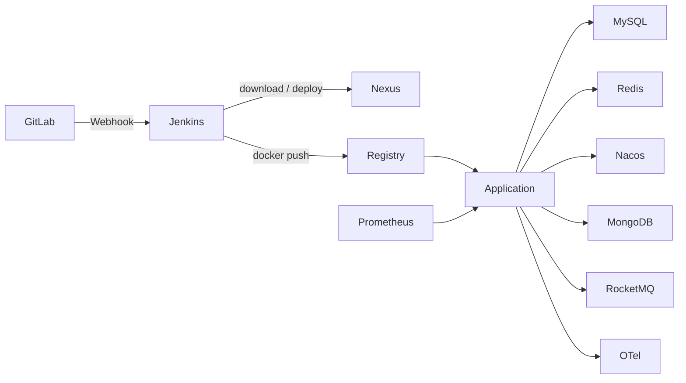

# Peach Cloud Docker CI/CD & Infrastructure

[English](README.en-US.md)

`deploy-pipline` 是 Peach Cloud 独立的 Docker 构建、基础设施与持续交付目录。它把 DevOps、Middleware、Observability 和 Application 四个生命周期分开：基础设施提前启动并长期保留，Jenkins 只验证依赖、构建 Maven 构件、推送 Nexus/Registry 并更新业务容器。

## 架构



## 四个运行域

| 域 | Compose | 主要组件 | 生命周期 |
| --- | --- | --- | --- |
| DevOps | [`compose/devops/docker-compose.yml`](compose/devops/docker-compose.yml) | GitLab、Jenkins、Nexus、Registry、Registry UI、Nginx | 长期常驻 |
| Middleware | [`compose/middleware/docker-compose.yml`](compose/middleware/docker-compose.yml) | MySQL、Redis、Nacos、MongoDB、RocketMQ | 长期常驻，业务发布前必须就绪 |
| Observability | [`compose/observability/docker-compose.yml`](compose/observability/docker-compose.yml) | Prometheus、Tempo、OTel、Loki、Alloy、Grafana | 长期常驻 |
| Application | [`compose/application/docker-compose.yml`](compose/application/docker-compose.yml) | Peach Cloud 后端服务与前端 | Jenkins 按服务更新 |

## 第一次部署或现有环境迁移

1. 阅读 [`docs/migration.md`](docs/migration.md)，确认现有 Container、Volume、Network 名称。
2. 复制 `env/deploy.env.example` 为 `env/deploy.env`，替换 `change_me_*`。
3. 确保 `PEACH_LOG_ROOT` 是 Docker daemon 可见的绝对路径，并指向 `deploy-pipline/runtime/logs`。
4. 执行：

```bash
PEACH_ENV_FILE=deploy-pipline/env/deploy.env deploy-pipline/scripts/bootstrap/bootstrap.sh
```

Bootstrap 会复用已存在的受保护容器和 named volume，不会执行 `down -v`、volume prune 或 destructive database reset。

## 日常发布

日常发布由 GitLab Webhook 触发 [`Jenkinsfile`](Jenkinsfile)：

```text
Checkout
→ Validate credentials
→ Verify infrastructure
→ Maven clean deploy (Nexus only)
→ Docker build
→ Docker push Registry
→ Application Compose pull/up
→ Application health verification
```

Jenkins **不会**启动或初始化 MySQL、Redis、Nacos、MongoDB、RocketMQ。

## 数据保护

现有核心数据身份保持不变，包括 `peach-gitlab-data`、`peach-jenkins-data`、`peach-nexus-data`、`peach-registry-data`、`peach-mysql-data`、`peach-redis-data`、`peach-nacos-data`、`peach-rocketmq-store` 等。MongoDB 只新增 `peach-mongo-data`。详见 [`docs/network-and-storage.md`](docs/network-and-storage.md)。

## 文档

- [总体架构](docs/architecture.md)
- [基础设施 Bootstrap](docs/bootstrap.md)
- [网络与存储](docs/network-and-storage.md)
- [中间件](docs/middleware.md)
- [初始化策略](docs/initialization.md)
- [Jenkins 流水线](docs/jenkins-pipeline.md)
- [Maven 与 Nexus](docs/nexus-maven.md)
- [Docker Registry](docs/registry.md)
- [可观测性](docs/observability.md)
- [现有环境迁移](docs/migration.md)
- [排障](docs/troubleshooting.md)
