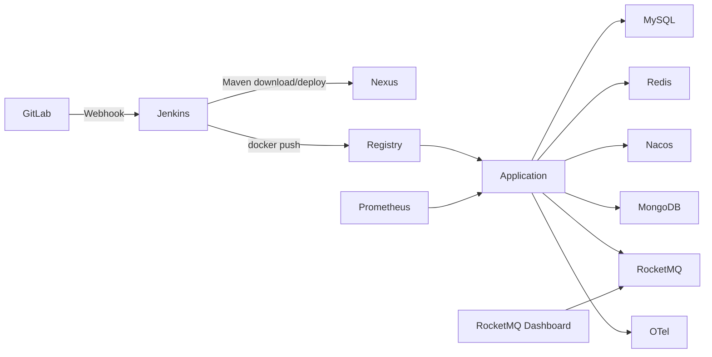

# Peach Cloud Docker CI/CD & Infrastructure

[English](README.en-US.md)

`deploy-pipline` 是 Peach Cloud 独立的 Docker 基础设施与持续交付目录。DevOps、Middleware、Observability、Application 四个运行域彼此解耦：基础设施长期保留，Jenkins 只负责验证、构建、发布与更新业务容器。

## 架构



## 四个运行域

| 域 | Compose | 主要组件 | 生命周期 |
| --- | --- | --- | --- |
| DevOps | [`compose/devops/docker-compose.yml`](compose/devops/docker-compose.yml) | GitLab、Jenkins、Nexus、Registry、Registry UI、Nginx | 长期常驻 |
| Middleware | [`compose/middleware/docker-compose.yml`](compose/middleware/docker-compose.yml) | MySQL、Redis、Nacos、MongoDB、RocketMQ、RocketMQ Dashboard | 长期常驻，发布前必须就绪 |
| Observability | [`compose/observability/docker-compose.yml`](compose/observability/docker-compose.yml) | Prometheus、Tempo、OTel、Loki、Alloy、Grafana | 长期常驻 |
| Application | [`compose/application/docker-compose.yml`](compose/application/docker-compose.yml) | Peach Cloud 后端服务与前端 | Jenkins 按服务更新 |

## 最短启动路径

1. 复制 `env/deploy.env.example` 为私有 `env/deploy.env`。
2. 修改 `change_me_*`、`PEACH_RUNTIME_ROOT`、`PEACH_LOG_ROOT`。
3. 在仓库根目录执行：

```bash
PEACH_ENV_FILE=deploy-pipline/env/deploy.env deploy-pipline/scripts/bootstrap/bootstrap.sh
```

Bootstrap 会复用已有受保护容器/Volume，启动 DevOps、Middleware、Observability，执行 MySQL/Nacos 幂等初始化，并仅确保 MongoDB 业务用户存在。**MongoDB 不做 schema/index/seed 数据初始化。**

RocketMQ 可视化控制台默认访问：

```text
http://localhost:18088
```

## 验证

```bash
PEACH_ENV_FILE=deploy-pipline/env/deploy.env deploy-pipline/scripts/bootstrap/verify-infrastructure.sh
```

该命令验证 Registry、Nexus、中间件与关键网络连通性。业务发布由 [`Jenkinsfile`](Jenkinsfile) 完成，Jenkins 不启动数据库或中间件。

## 数据保护

核心 named volume 使用固定 external identity，例如 `peach-gitlab-data`、`peach-jenkins-data`、`peach-nexus-data`、`peach-mysql-data`、`peach-redis-data`、`peach-nacos-data`、`peach-mongo-data`、`peach-rocketmq-store`。普通脚本禁止 `down -v`、`docker volume prune`、`docker volume rm` 等 destructive 操作。

## 文档

`docs/` 只保留三份真正需要长期维护的文档：

- [启动手册：从 0 启动全部服务、逐条解释命令](docs/getting-started.md)
- [架构与运维：网络、Volume、数据保护、迁移、日志、健康检查](docs/architecture-and-operations.md)
- [CI/CD：Jenkins、Nexus、Registry、Webhook 与发布流程](docs/ci-cd.md)
