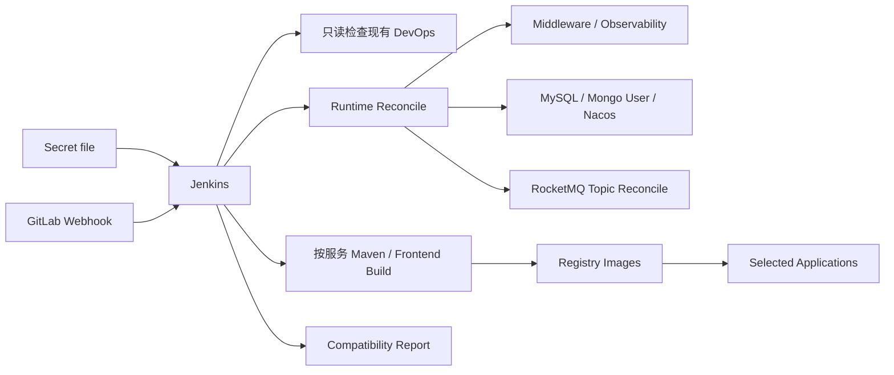

# Peach Cloud Docker CI/CD & Infrastructure

[English](README.en-US.md)

`deploy-pipline` 是 Peach Cloud 的 Docker 基础设施与持续交付目录。当前目标是：**日常只维护 Jenkins Secret file，Jenkins/Webhook 自动完成运行时配置合成、基础设施对账、数据初始化、按需构建、部署和验证，同时保护已经跑通的 GitLab/Jenkins/Nexus/Registry 数据。**

## 自动化边界



- **DevOps 保护区**：已有 `gitlab`、`jenkins`、`nexus`、`local-registry`、`registry-ui` 和对应 external volumes 不由 Jenkins 重建。
- **运行时自动对账**：Middleware/Observability 已存在则复用或启动，缺失才创建。
- **初始化幂等**：MySQL 只在空库执行 baseline；MongoDB 只确保业务用户；Nacos 默认保留已有配置；RocketMQ Topic 按声明确保存在。
- **禁止破坏性动作**：自动化门禁禁止 `down -v`、`docker volume prune`、`docker volume rm`。

## 你需要维护的唯一私有文件

以 [`env/deploy.env.example`](env/deploy.env.example) 为模板保存 Jenkins Secret file，Credential ID 继续使用 `peach-deploy-env`。仓库维护的非敏感默认值位于 [`env/defaults.env`](env/defaults.env)。旧版完整 `deploy.env` 仍兼容，私有文件中的同名值会覆盖默认值。

## Jenkins 构建模式

- `BUILD_BRANCH=AUTO`：Webhook/当前 SCM 分支；也可手工填写 `main`、`develop`、`feature/...`。
- `BUILD_MODE=AUTO`：根据 Git diff 自动计算受影响服务。
- `BUILD_MODE=SELECTED`：`DEPLOY_SERVICES` 填空格或逗号分隔的服务名。
- `BUILD_MODE=ALL`：构建全部应用。

为避免升级或重建现有 Jenkins，本次不新增 Git Parameter/Active Choices 插件，因此分支和多服务选择使用 Jenkins 原生参数。

## RocketMQ

[`config/rocketmq/topics.json`](config/rocketmq/topics.json) 保存受治理 Topic。默认 `ROCKETMQ_TOPIC_PROVISION_MODE=ensure`：缺失时自动创建；`verify` 只检查；`off` 不治理。每次执行生成 `runtime/reports/rocketmq-status.txt`，同时显示 Broker `autoCreateTopicEnable`、Peach Starter 自动创建开关和 Topic 对账结果。

## 冷启动与日常运行

已有 Jenkins/GitLab 环境下，**日常无需手动执行 bootstrap/init 脚本**，直接使用 Webhook 或 Jenkins 参数构建。只有全新 Docker 主机尚未存在 Jenkins 时，才使用一次性冷启动入口：

```bash
PEACH_ENV_FILE=deploy-pipline/env/deploy.env deploy-pipline/scripts/bootstrap/bootstrap.sh
```

## 文档

- [启动与迁移](docs/getting-started.md)
- [架构、数据保护与运维](docs/architecture-and-operations.md)
- [Jenkins / Nexus / Registry / Webhook 发布流程](docs/ci-cd.md)
