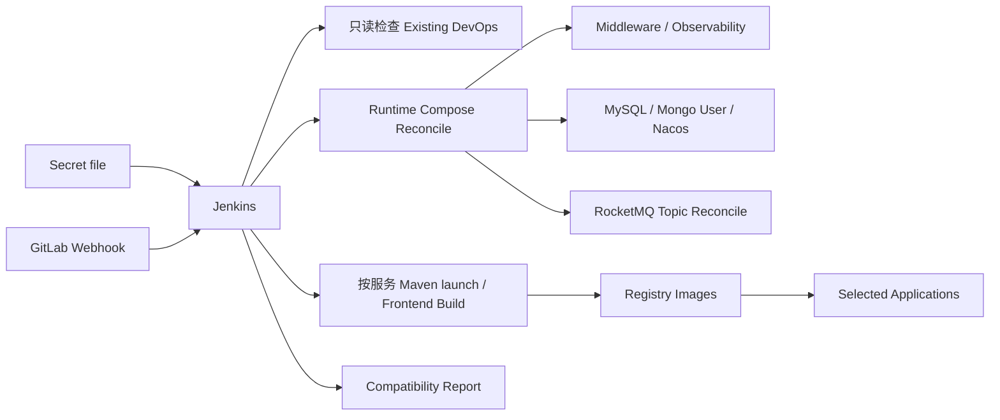

# Peach Cloud Docker CI/CD & Infrastructure

[English](README.en-US.md)

`deploy-pipline` 是 Peach Cloud 的 Docker 基础设施与持续交付目录。当前目标是：**日常只维护一份 Jenkins Secret file，由 Jenkins/Webhook 自动完成运行时配置合成、基础设施对账、数据初始化、按需构建、镜像发布、应用部署和验证，同时保护已经跑通的 GitLab/Jenkins/Nexus/Registry 数据。**

## 自动化边界



- **DevOps 保护区**：已有 `gitlab`、`jenkins`、`nexus`、`local-registry`、`registry-ui` 及其 external volume 不由日常 Jenkins Pipeline 重建。
- **Runtime 自动对账**：Middleware/Observability 使用当前 Compose 定义执行 `up -d`；旧 Runtime 容器可被替换，但 external volume 和数据继续保留。
- **初始化可恢复**：MySQL 按预期表集合补建缺失表并记录 baseline checksum；MongoDB 只确保业务用户；Nacos 默认保留已有 DataId；RocketMQ Topic 按声明式目录对账。
- **安全默认值**：文件存储默认使用 `local`；未完整配置凭据的 OSS/COS/BOS/OBS 不会写入 Nacos。
- **Secret 清理**：Runtime env、Maven settings、Nacos 渲染文件和初始化临时文件在正常、失败和中断路径中清理。
- **禁止破坏性动作**：自动化门禁禁止 `down -v`、`docker volume prune`、`docker volume rm` 等危险操作。

## 唯一私有配置

以 [`env/deploy.env.example`](env/deploy.env.example) 为模板维护本地私有配置或 Jenkins Secret file，Credential ID 使用 `peach-deploy-env`。仓库维护的非敏感默认值位于 [`env/defaults.env`](env/defaults.env)。旧版完整 `deploy.env` 仍兼容，私有文件中的同名值覆盖默认值。

## Jenkins 构建模式

- `BUILD_BRANCH=AUTO`：Webhook/当前 SCM 分支；也可手工填写 `main`、`develop`、`feature/...`。
- `BUILD_MODE=AUTO`：根据 Git diff 自动计算受影响服务。
- `BUILD_MODE=SELECTED`：`DEPLOY_SERVICES` 填空格或逗号分隔的服务名。
- `BUILD_MODE=ALL`：构建全部应用。

后端服务目录直接映射到可执行 `*-launch` Maven 模块；公共模块、`.mvn/` 或仓库构建脚本变化时会安全扩大后端构建范围。

## 冷启动与日常运行

已有 Jenkins/GitLab 环境下，日常无需手工执行 bootstrap/init 脚本，直接使用 Webhook 或 Jenkins 参数构建。只有全新 Docker 主机尚未存在 Jenkins 时，才使用一次性冷启动入口：

```bash
PEACH_ENV_FILE=deploy-pipline/env/deploy.env \
  sh deploy-pipline/scripts/bootstrap/bootstrap.sh
```

## 文档

- [完整启动、配置、使用与故障排查手册](docs/startup-and-configuration.md)
- [快速开始（Windows / Linux）](docs/getting-started.md)
- [架构、数据保护与运维](docs/architecture-and-operations.md)
- [Jenkins / Nexus / Registry / Webhook 发布流程](docs/ci-cd.md)
