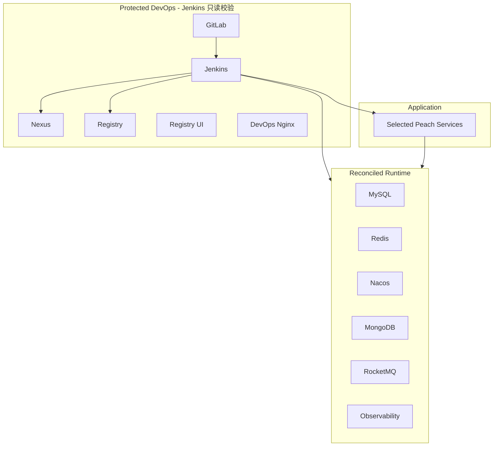

# 架构、数据保护与运维

## 1. 生命周期边界



核心原则：**已经跑通的 DevOps 是受保护资产；Jenkins 可以按当前 Compose 定义对账 Runtime，但不能把自己、GitLab、Nexus、Registry 当作日常发布对象重建。**

## 2. Reconcile 语义

`scripts/bootstrap/reconcile-runtime.sh` 依次：

1. 确保 Docker network 和 external volume。
2. 同步仓库配置到 `PEACH_RUNTIME_ROOT/config`。
3. 调用 `start-runtime.sh` 对账 Middleware/Observability。
4. 验证基础设施。
5. 执行 MySQL、MongoDB 用户、Nacos、RocketMQ 幂等初始化。
6. 再次验证。

Runtime 容器处理规则：

- 容器属于当前 Compose project/service：执行 `docker compose up -d --no-deps`，让新镜像、环境变量、挂载和 healthcheck 生效。
- 容器缺少正确 Compose identity：删除旧容器后按当前定义创建。
- external volume：继续复用，不随容器替换删除。
- Protected DevOps：不进入 Runtime 替换路径。

一次性冷启动中的 `start.sh` 也将 Runtime 委托给 `start-runtime.sh`，因此冷启动与 Jenkins 日常 reconcile 使用同一套 Runtime 容器语义。

## 3. 数据初始化边界

### 3.1 MySQL

初始化不再以“数据库存在任意一张表”为完成条件。脚本从 baseline schema 提取预期表集合，补建缺失表段，重新验证全部预期表，执行幂等 seed，并在 `PEACH_DEPLOY_SCHEMA_HISTORY` 记录 `baseline-v1` 和 schema checksum。

这可以恢复首次初始化中断后留下的半初始化数据库，但不是通用版本化迁移框架。

### 3.2 MongoDB

只确保业务用户存在并授予目标数据库 `readWrite`。不创建业务 collection、index 或 seed，也不自动轮换已存在用户的密码。

### 3.3 Nacos

Namespace 缺失则创建；DataId 缺失则发布；已有 DataId 默认保留。只有显式执行 `init-nacos.sh --sync` 才覆盖同名配置。渲染后的 Secret YAML 和 access token 位于受限临时目录，并在退出路径中删除。

当前默认 `NACOS_AUTH_ENABLE=false`。在应用客户端认证参数完整透传并验证前，不应仅通过修改 Secret 打开认证。

### 3.4 RocketMQ

`config/rocketmq/topics.json` 是声明式 catalog。`ensure` 创建缺失 Topic、`verify` 只检查、`off` 不治理。Broker 自动创建开关和 Peach Starter 自动创建开关都会写入状态报告。

## 4. 存储安全默认值

默认：

```env
PEACH_STORAGE_PRIMARY=local
```

本地数据写入 `peach-fileservice-upload` volume 中的 `/app/upload/peach-storage`。OSS、COS、BOS、OBS 只有 AccessKey 和 SecretKey 同时配置时才进入 Nacos；半组凭据或缺少 primary 对应凭据会在渲染阶段失败。

## 5. 受保护 Docker Identity

| 组件 | 固定容器/Volume |
| --- | --- |
| GitLab | `gitlab` / `peach-gitlab-config` / `peach-gitlab-data` |
| Jenkins | `jenkins` / `peach-jenkins-data` |
| Nexus | `nexus` / `peach-nexus-data` |
| Registry | `local-registry` / `peach-registry-data` |

MySQL、Redis、Nacos、MongoDB、RocketMQ、Observability 和应用服务继续沿用固定 external volume identity。保护的是数据卷，不是永不更新的旧 Runtime 容器定义。

## 6. Network

- `peach-devops`：Jenkins、Nexus、Registry、GitLab、DevOps Nginx 与部分 Observability 通讯。
- `peach-cloud-runtime`：应用、Runtime 中间件、Jenkins、DevOps Nginx 与部分 Observability 通讯。
- Jenkins 只在需要时附加到 runtime network，不会因此重建 Jenkins 容器。

## 7. Secret 生命周期

- Runtime env：Jenkins `post.always` 或 bootstrap `trap` 删除。
- Maven settings：使用 Workspace 下的临时受限目录，不长期写入 `.m2` 配置位置。
- Nacos 渲染文件/token：`mktemp` + `umask 077` + `trap cleanup`。
- MySQL 恢复 SQL/metadata：临时目录，退出时删除。

Secret、token、密码和签名信息不得写入日志、报告、文档或 Git。

## 8. 版本兼容性

[`config/compatibility-baseline.json`](../config/compatibility-baseline.json) 固化要求保持的非业务镜像引用；[`env/defaults.env`](../env/defaults.env) 提供实际默认版本。`generate-compatibility-report.mjs` 检查仓库配置漂移，并只读记录当前容器 `Config.Image`、状态和 DevOps volume 是否存在。

为保护现有环境，本次不主动升级 GitLab、Jenkins LTS、Registry UI、RocketMQ Dashboard 等既有浮动标签。版本锁定或升级应作为独立迁移任务处理。

## 9. 已知运维边界

当前不自动处理：

- 全新 Nexus/GitLab/Jenkins 的产品级首次管理员、用户、仓库或 Job 配置。
- external volume 自动备份与恢复演练。
- 已有 MongoDB 应用用户密码轮换。
- 应用发布失败后的自动镜像回滚。
- 前端 HTTP 健康检查。
- 通用版本化数据库迁移。

## 10. 排障原则

优先顺序：

1. Jenkins 失败阶段。
2. `compatibility-report.md` 和 `rocketmq-status.txt`。
3. `docker ps -a`、`docker logs`、`docker inspect`。
4. network/volume inspect。
5. 重新执行 `reconcile-runtime.sh`。

不要通过 `down -v`、volume prune 或删除受保护 volume 处理业务发布失败。完整命令和验收清单见 [完整使用手册](startup-and-configuration.md)。
