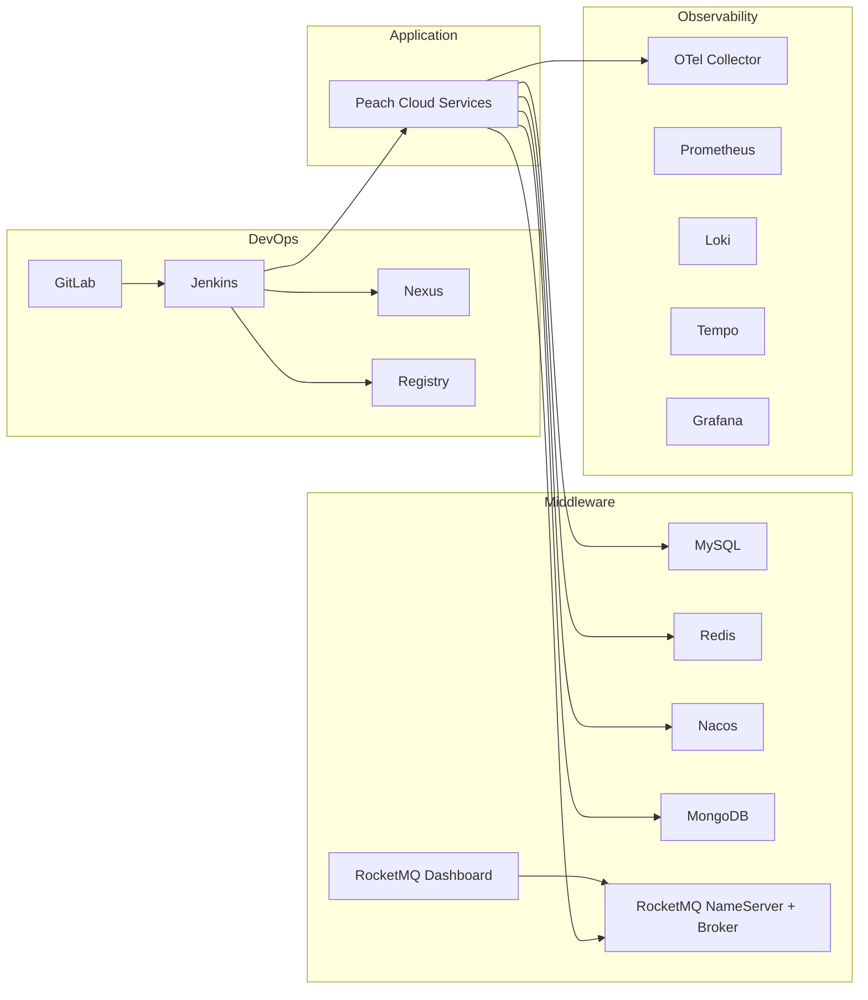

# 架构、网络、存储与运维

## 1. 生命周期边界



核心原则：**基础设施长生命周期，Application 短生命周期；Jenkins 只能发布业务，不拥有数据库和中间件生命周期。**

## 2. Docker 网络

### `peach-devops`

用于 GitLab、Jenkins、Nexus、Registry 等 CI/CD 组件互通。

### `peach-cloud-runtime`

用于业务服务与 MySQL、Redis、Nacos、MongoDB、RocketMQ、可观测组件互通。

Jenkins 和部分观测组件会同时加入两个网络，用于构建发布和探测；数据库不需要加入 `peach-devops`。

查看网络成员：

```bash
docker network inspect peach-cloud-runtime
```

该命令只读取 Docker 网络信息，不修改容器。

## 3. 受保护数据 Volume

关键 named volume：

| 组件 | Volume |
| --- | --- |
| GitLab | `peach-gitlab-config`、`peach-gitlab-data` |
| Jenkins | `peach-jenkins-data` |
| Nexus | `peach-nexus-data` |
| Registry | `peach-registry-data` |
| MySQL | `peach-mysql-data` |
| Redis | `peach-redis-data` |
| Nacos | `peach-nacos-data` |
| MongoDB | `peach-mongo-data` |
| RocketMQ | `peach-rocketmq-store` |
| Prometheus | `peach-prometheus-data` |
| Tempo | `peach-tempo-data` |
| Loki | `peach-loki-data` |
| Grafana | `peach-grafana-data` |

这些 Volume 在 Compose 中声明为 `external: true`，目的是把“删除 Compose 项目”和“删除真实数据”解耦。

查看一个 Volume：

```bash
docker volume inspect peach-mysql-data
```

该命令只读取 metadata 和真实挂载位置。

## 4. 数据初始化边界

### MySQL

`scripts/init/init-mysql.sh` 负责幂等执行仓库定义的 SQL 初始化。重复执行不应 destructive reset 已有数据库。

### Nacos

`scripts/init/init-nacos.sh` 负责 namespace/config 导入。它属于基础设施 Bootstrap，不属于 Jenkins 发布流程。

### MongoDB

MongoDB **不做业务数据初始化**：

- 不维护 `init/mongodb/schema`。
- 不维护 `init/mongodb/indexes`。
- 不维护 `init/mongodb/data`。
- 不自动插入 seed 文档。

`scripts/init/ensure-mongodb-user.sh` 仅负责最小权限业务账号的幂等创建，避免应用使用 root；这不是业务数据初始化。

Mongo 数据只保存在 `peach-mongo-data`。数据库日志使用 Docker stdout/stderr，通过 `docker logs peach-mongo` 查看，避免宿主机 UID/GID 导致日志目录权限问题。

## 5. RocketMQ 与 Dashboard

运行容器：

- `peach-rocketmq-namesrv`
- `peach-rocketmq-broker`
- `peach-rocketmq-dashboard`

Dashboard 默认映射 `127.0.0.1:18088 -> 8080`，并通过 `rocketmq-namesrv:9876` 查询集群。

Dashboard 主要用于观察和运维 Topic、Consumer、Broker 和消息。生产环境修改 Topic/Consumer 配置时仍应遵循项目的 RocketMQ 治理约定，不应把 Dashboard 当作绕过配置治理的入口。

## 6. 已有环境迁移策略

迁移前先执行：

```bash
docker ps -a
docker volume ls
docker network ls
```

分别盘点容器、Volume 和 Network。它们都是只读命令。

然后执行：

```bash
PEACH_ENV_FILE=deploy-pipline/env/deploy.env deploy-pipline/scripts/bootstrap/inspect-existing.sh
```

该脚本用于比较 V2 期望的 Docker identity 与当前环境；发现已有容器时，Bootstrap 优先复用并启动，不主动重建。

### 绝对禁止的日常命令

```text
docker compose down -v
docker volume prune
docker system prune --volumes
docker volume rm <protected-volume>
```

这些命令可能删除不可恢复的持久化数据，除非明确执行灾难恢复/重建方案，否则不要使用。

## 7. 日志

统一日志根目录来自：

```dotenv
PEACH_LOG_ROOT=...
```

应用日志落在 `runtime/logs/application/*`；中间件中支持文件日志的组件落在 `runtime/logs/middleware/*`。MongoDB 保持 stdout 日志。

常见命令：

```bash
docker logs --tail 200 peach-mysql
docker logs --tail 200 peach-nacos
docker logs --tail 200 peach-rocketmq-broker
```

这些命令只读取容器日志。

## 8. 健康验证

统一验证：

```bash
PEACH_ENV_FILE=deploy-pipline/env/deploy.env deploy-pipline/scripts/bootstrap/verify-infrastructure.sh
```

覆盖：Registry、Nexus、MySQL、Redis、Nacos、MongoDB、RocketMQ，以及 Jenkins 到 Nexus/Registry 的网络连通性。

Middleware 单独验证：

```bash
PEACH_ENV_FILE=deploy-pipline/env/deploy.env deploy-pipline/scripts/bootstrap/verify-middleware.sh
```

如果某项失败，先看失败容器的 `docker logs`，再看网络成员和环境变量，不要先删 Volume 重建。
