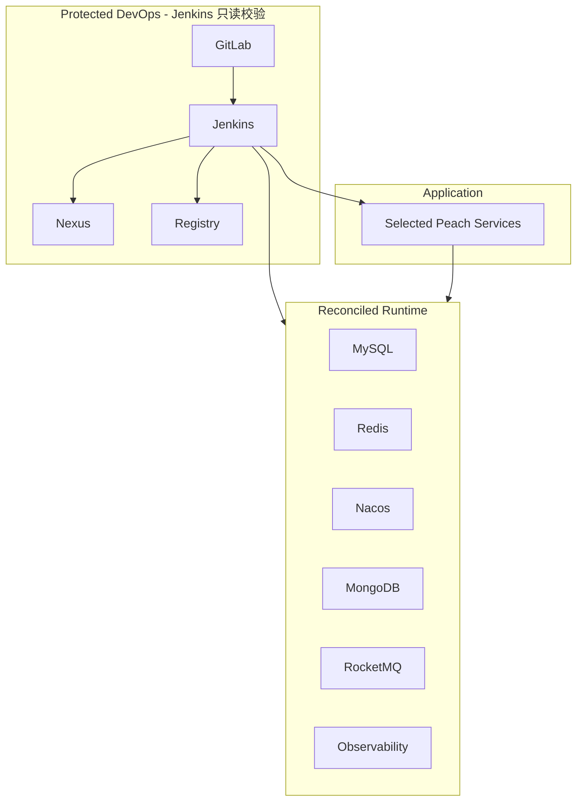

# 架构、数据保护与运维

## 1. 生命周期边界

核心原则：**已经跑通的 DevOps 是受保护资产；Jenkins 可以对账 Runtime，但不能把自己、GitLab、Nexus、Registry 当作发布对象重建。**

## 2. Reconcile 语义

`scripts/bootstrap/reconcile-runtime.sh` 依次确保网络/受保护 external volume、同步仓库配置到 `PEACH_RUNTIME_ROOT/config`、复用/启动/创建缺失 Runtime 服务、健康检查、执行 MySQL/MongoDB/Nacos/RocketMQ 幂等初始化并再次验证。该脚本不引用 DevOps Compose。

## 3. 数据初始化边界

### MySQL

数据库无表时执行 baseline schema + seed；检测到已有表则保留数据库。

### MongoDB

只确保业务用户存在，不创建业务 collection/index/seed 数据。

### Nacos

Namespace 不存在则创建；已有 DataId 默认保留。只有显式 `--sync` 才允许用仓库模板同步覆盖配置。

### RocketMQ

`topics.json` 是声明式 catalog。`ensure` 创建缺失 Topic、`verify` 只检查、`off` 不治理。Broker 配置和 Peach Starter 自动创建开关都会写入状态报告。

## 4. 受保护 Docker Identity

| 组件 | 固定容器/Volume |
| --- | --- |
| GitLab | `gitlab` / `peach-gitlab-config` / `peach-gitlab-data` |
| Jenkins | `jenkins` / `peach-jenkins-data` |
| Nexus | `nexus` / `peach-nexus-data` |
| Registry | `local-registry` / `peach-registry-data` |

MySQL/Redis/Nacos/MongoDB/RocketMQ 和 Observability 继续沿用 PR #7 已确定的 fixed external volume identity。

## 5. 版本兼容性

[`config/compatibility-baseline.json`](../config/compatibility-baseline.json) 固化本次要求保持的非业务镜像引用；[`env/defaults.env`](../env/defaults.env) 提供实际默认版本。`generate-compatibility-report.mjs` 检查仓库配置漂移，并只读记录当前容器 `Config.Image`/状态和 DevOps volume 是否存在。

为保护现有环境，本次不主动升级 `gitlab/gitlab-ce:latest`、Jenkins LTS、Registry UI、RocketMQ Dashboard 等既有浮动标签。后续版本锁定应作为独立迁移任务处理，而不是夹在自动化改造中重建容器。

## 6. 网络

- `peach-devops`：现有 Jenkins/Nexus/Registry/GitLab 通讯网络，Jenkins preflight 要求它已经存在。
- `peach-cloud-runtime`：应用与 Runtime 通讯网络，reconcile 可在缺失时创建。
- Jenkins 只会在需要时附加到 runtime network，不会因此重建 Jenkins 容器。

## 7. 排障原则

先看 `compatibility-report.md` 和 `rocketmq-status.txt`，再看 `docker ps -a`、`docker logs`、network/volume inspect。不要使用删除 volume 或重建 DevOps 的方式处理业务发布失败。
