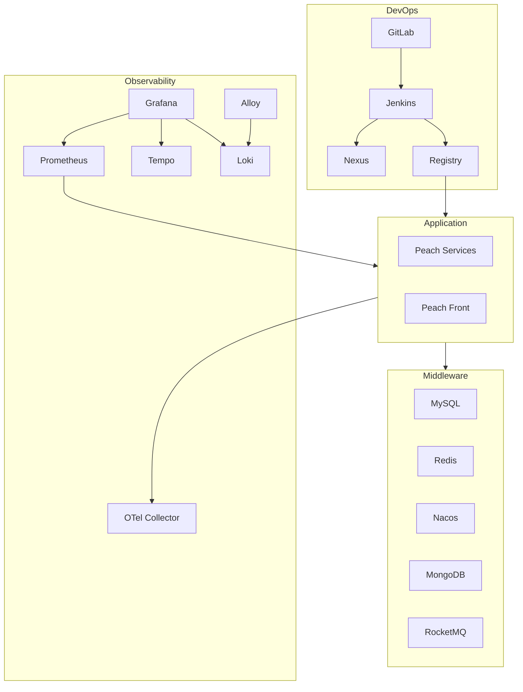

# Docker V2 总体架构

本方案只覆盖 Docker / Docker Compose。核心设计是将基础设施生命周期与应用交付生命周期拆开，避免每次业务发布触碰 GitLab、Jenkins、Nexus、Registry 和数据库数据。

Bootstrap 管理 DevOps、Middleware、Observability 的存在性、启动和首次初始化；Jenkins 只执行 Application Delivery。已有受保护容器优先 `start` 而不是 recreate，数据 named volume 使用 `external: true` 声明。

应用发布失败不得通过清理数据库、中间件 Volume 或重新初始化基础设施来处理。
