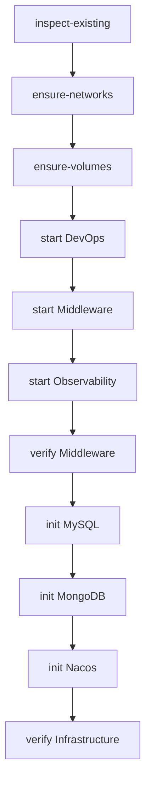

# Infrastructure Bootstrap

Bootstrap 用于第一次安装、Docker Desktop 重启后的恢复以及基础设施缺失时的安全补齐，不用于日常代码发布。

安全语义：Container 已运行则跳过；存在但停止则 `docker start`；不存在才通过对应 Compose 创建。普通 Bootstrap 不使用 `--force-recreate` 更新 GitLab/Jenkins/Nexus/Registry，也不执行 `docker compose down -v`、volume prune 或 destructive reset。

运行命令见根 [README](../README.md)。
