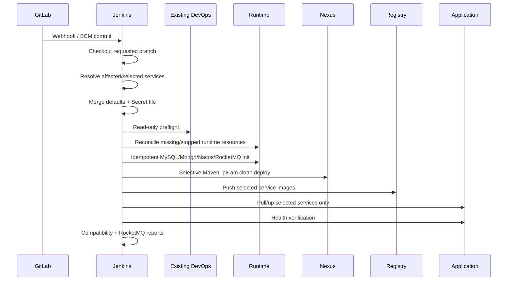

# Jenkins、Nexus、Registry 与全自动发布

## 1. 发布链路



## 2. Existing DevOps 保护策略

流水线不执行 DevOps Compose 生命周期操作。`preflight.sh` 要求已有 `peach-devops` network，以及 running `local-registry`、`nexus`、`jenkins`，并检查 Jenkins 到 Nexus/Registry 的连通性。GitLab/Jenkins/Nexus/Registry 原有容器、配置与 external volume 不被自动重建；缺失时 fail-fast。

## 3. Secret file

继续使用现有 Jenkins Credential：

```text
ID: peach-deploy-env
Kind: Secret file
```

模板为 `env/deploy.env.example`；仓库默认配置在 `env/defaults.env`。`render-runtime-env.mjs` 合成为临时文件并设置 `0600` 权限，Pipeline `post` 删除生成的 runtime env。

## 4. 分支和服务参数

- `BUILD_BRANCH`：`AUTO` 使用当前 SCM/Webhook；手工可填具体分支。
- `BUILD_MODE=AUTO`：根据上一次成功 commit 到当前 HEAD 的 diff 计算服务；首次或跨分支安全回退全量应用。
- `BUILD_MODE=SELECTED`：使用 `DEPLOY_SERVICES`。
- `BUILD_MODE=ALL`：所有应用。

服务清单 Source of Truth 为 `config/services.json`。为不改变现有 Jenkins 插件集合，本次使用原生参数而不安装 Git Parameter/Active Choices。

## 5. Maven 真正按服务构建

`SELECTED`/`AUTO` 使用：

```text
mvn ... -pl peach-auth,peach-gateway -am clean deploy
```

公共后端基础模块变化时 resolver 选择全部后端；`ALL` 使用完整 reactor。只修改前端时跳过 Maven。

## 6. Runtime Reconcile 与初始化

Jenkins 在 DevOps preflight 后执行 `reconcile-runtime.sh`。已有 Middleware/Observability 容器不会 recreate；停止的 existing container 只 start；缺失服务才创建。

初始化全部幂等：MySQL 空库 baseline、MongoDB application user、Nacos 已有 config 默认 preserve、RocketMQ 按 `topics.json` ensure/verify/off。

## 7. RocketMQ 状态输出

每次 reconcile Archive `runtime/reports/rocketmq-status.txt`，包括 NameServer、Cluster、Broker `autoCreateTopicEnable`、`PEACH_ROCKET_TOPIC_AUTO_CREATE`、CI provisioning mode 和 Topic 对账结果。

当前保留原有 `PEACH_ROCKET_TOPIC_AUTO_CREATE=true` 和 Broker `autoCreateTopicEnable=true`，保证改造后的能力与之前版本一致；同时新增显式 Topic catalog，逐步把生产 Topic 转为可治理资源。

## 8. 兼容性报告

`generate-compatibility-report.mjs` 对照 `compatibility-baseline.json` 检查非业务镜像默认版本和 9 个应用服务合同，并只读记录实际容器/受保护 DevOps volume 状态，输出 `runtime/reports/compatibility-report.md`。仓库默认版本发生非预期漂移时 Pipeline 失败，不会自动升级现有基础设施。

## 9. Webhook 与手工构建

Webhook 推荐 `BUILD_BRANCH=AUTO` + `BUILD_MODE=AUTO`。手工构建填写目标 branch，选择 `SELECTED`，在 `DEPLOY_SERVICES` 填目标服务。未选服务默认保持原状态，除非显式打开 `STOP_UNSELECTED_SERVICES`。

## 10. 失败排查

先定位失败阶段：Existing DevOps → Runtime Reconcile → Maven → Image/Deploy → Compatibility。任何阶段都不应通过 `down -v` / volume prune 解决。
