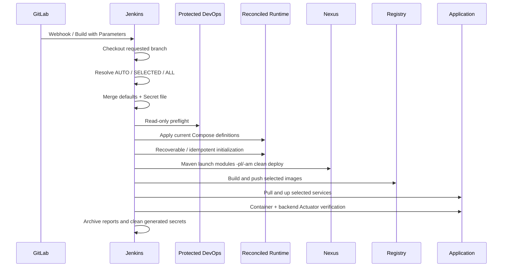

# Jenkins、Nexus、Registry 与全自动发布

## 1. 发布链路



## 2. Existing DevOps 保护策略

日常 Pipeline 不执行 DevOps Compose 生命周期操作。`preflight.sh` 要求已有 `peach-devops` network，以及可访问的 `local-registry`、`nexus` 和 `jenkins`。GitLab/Jenkins/Nexus/Registry 原有容器、配置与 external volume 不由 Pipeline 重建；缺失时 fail-fast。

一次性冷启动允许创建缺失 DevOps 服务，但同名已有 DevOps 容器会被保留或启动。

## 3. Secret file

继续使用 Jenkins Credential：

```text
ID: peach-deploy-env
Kind: Secret file
```

模板为 `env/deploy.env.example`，仓库默认值位于 `env/defaults.env`。`render-runtime-env.mjs` 合成 Runtime env，并设置受限权限。

敏感临时文件处理：

- Runtime env：Pipeline `post.always` 删除。
- Maven settings：Workspace 临时目录，构建退出时删除。
- Nacos Secret YAML/token：`mktemp` + `umask 077` + `trap cleanup`。
- MySQL 恢复 SQL/metadata：临时目录，退出时删除。

## 4. 分支和服务参数

| 参数 | 行为 |
| --- | --- |
| `BUILD_BRANCH` | `AUTO` 使用当前 SCM/Webhook；手工可填远程分支 |
| `BUILD_MODE=AUTO` | 根据上一次成功 commit 到当前 HEAD 的 diff 计算服务 |
| `BUILD_MODE=SELECTED` | 使用 `DEPLOY_SERVICES` |
| `BUILD_MODE=ALL` | 选择全部应用 |
| `STOP_UNSELECTED_SERVICES` | 默认 `false`，未选择服务保持当前状态 |

服务清单 Source of Truth 为 `config/services.json`。为避免改变现有 Jenkins 插件集合，当前使用原生参数，不安装 Git Parameter/Active Choices。

## 5. AUTO 影响范围

- 单个服务目录变化：选择对应服务。
- 公共后端模块、根 `pom.xml`、`.mvn/` 或仓库构建脚本变化：选择全部后端。
- `peach-cloud-front/` 变化：选择前端。
- `deploy-pipline/` 或部署 Workflow 变化：选择全部应用。
- 首次构建、跨分支或无法确认上次成功提交：安全回退全部应用。

## 6. Maven 真正按服务构建

`SELECTED` / `AUTO` 的服务清单直接指向 runnable `*-launch` 模块，例如：

```text
peach-auth/peach-auth-launch
peach-gateway/peach-gateway-launch
peach-scheduled/peach-scheduled-launch
```

命令形态：

```text
mvn ... -pl <selected-launch-modules> -am clean deploy
```

`-am` 构建所需 reactor 依赖。`ALL` 使用完整 reactor。只修改前端时跳过 Maven。

Maven 会使用实际配置的 `MAVEN_NEXUS_URL`，不会把部署地址固定为某个本地 hostname。

## 7. Scheduler 名称契约

```text
Compose service/container/image: peach-scheduled
Spring application/Nacos service: peach-scheduler
Nacos DataId: peach-scheduler.yml
```

这样既保持 Docker 资源命名，又保持 Feign 客户端的 `peach-scheduler` 服务发现契约。

## 8. Runtime Reconcile 与初始化

Jenkins 在 DevOps preflight 后执行 `reconcile-runtime.sh`：

1. 确保 network 和 external volume。
2. 同步 Runtime 配置。
3. 使用当前 Middleware/Observability Compose 定义执行 `up -d --no-deps`。
4. 旧 Runtime 容器缺少正确 Compose identity 时替换容器，但保留 external volume。
5. 验证基础设施。
6. 补齐 MySQL baseline、确保 MongoDB 用户、初始化 Nacos、对账 RocketMQ Topic。
7. 再次验证。

保护的是 DevOps 和数据卷，不是永不更新的旧 Runtime 容器定义。

## 9. 存储配置

默认：

```env
PEACH_STORAGE_PRIMARY=local
```

未完整配置凭据的 OSS、COS、BOS、OBS 不写入 Nacos。选择云 Provider 为 primary 时，凭据缺失会在渲染阶段失败。

## 10. 构建与镜像发布

后端构建完成后，从对应 `*-launch/target` 查找 runnable JAR，复制为临时 `app.jar`，再使用服务 Dockerfile 构建镜像。

前端使用 Node 22 执行：

```bash
npm ci
npm run build
```

镜像标签使用当前 Git commit 的 12 位短 SHA：

```text
localhost:5000/peach-cloud/peach-auth:<commit>
localhost:5000/peach-cloud/peach-front:<commit>
```

## 11. 应用部署

部署脚本对本次选中服务执行：

```text
docker compose ... pull <services>
docker compose ... up -d --no-build --no-deps <services>
```

未选择服务默认保持当前状态。只有显式打开 `STOP_UNSELECTED_SERVICES` 才停止其他应用。

## 12. 发布后验证

当前自动检查：

- 选中容器处于 `running`。
- 后端 `/actuator/health` 返回 `UP`。

当前前端只检查容器运行状态，尚未自动执行 HTTP 页面探测。首次迁移和重要发布应增加人工检查：

```bash
docker exec jenkins curl -fsS http://peach-front/
```

## 13. RocketMQ 状态输出

每次 reconcile 生成：

```text
runtime/reports/rocketmq-status.txt
```

其中包括 NameServer、Cluster、Broker `autoCreateTopicEnable`、`PEACH_ROCKET_TOPIC_AUTO_CREATE`、provisioning mode 和 Topic 对账结果。

## 14. 兼容性报告

`generate-compatibility-report.mjs` 输出：

```text
runtime/reports/compatibility-report.md
```

用于检查非业务镜像默认版本、9 个应用服务合同、实际容器 image/status 和受保护 DevOps volume 状态。

## 15. Webhook 与手工构建

Webhook 推荐：

```text
BUILD_BRANCH=AUTO
BUILD_MODE=AUTO
STOP_UNSELECTED_SERVICES=false
```

手工构建：

```text
BUILD_BRANCH=develop
BUILD_MODE=SELECTED
DEPLOY_SERVICES=peach-auth,peach-gateway
STOP_UNSELECTED_SERVICES=false
```

## 16. 失败排查

按阶段定位：

```text
Checkout / Resolve
  -> Secret Render
  -> Existing DevOps Preflight
  -> Runtime Reconcile
  -> Maven / Frontend Build
  -> Image Build / Push
  -> Application Deploy
  -> Health Verification
  -> Compatibility Report
```

任何阶段都不应通过 `down -v`、volume prune 或删除受保护 volume 解决。完整命令和验收清单见 [完整使用手册](startup-and-configuration.md)。
