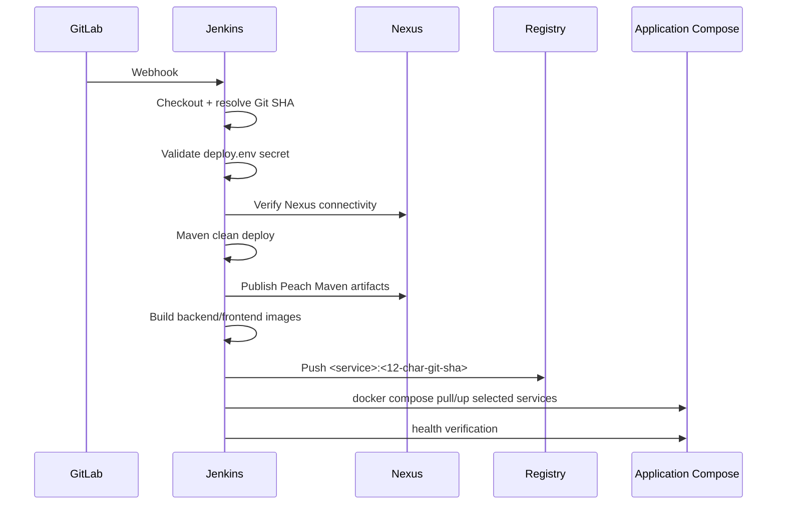

# Jenkins、Nexus、Registry 与应用发布

## 1. 发布链路



Jenkins 不负责 `docker compose up` MySQL/Redis/Nacos/Mongo/RocketMQ，也不执行这些中间件的初始化脚本。

## 2. Jenkins 必备 Secret file

Jenkins Credentials 中需要一个 **Secret file**：

```text
ID: peach-deploy-env
```

文件内容使用 `env/deploy.env` 格式，包含真实数据库密码、Nexus 凭据、Mongo URI 等。仓库中的 `deploy.env.example` 只提供字段模板。

## 3. Pipeline 关键参数

### `DEPLOY_SERVICES`

指定本次构建/部署服务，例如：

```text
peach-gateway peach-auth peach-front
```

填写 `all` 表示全部服务。

### `STOP_UNSELECTED_SERVICES`

默认 `false`。关闭时，本次没选择的业务容器保持当前状态；只有显式打开时才允许流水线处理未选服务。

## 4. Maven 为什么只走 Nexus

CI 渲染 `config/maven/settings.xml`，其中：

```xml
<mirrorOf>*</mirrorOf>
```

表示所有 Maven repository 请求统一先经过 Nexus `maven-public`。这样 Jenkins 构建不会因为每个 POM 单独配置外部仓库而产生不可控的网络行为。

流水线执行的是：

```text
mvn clean deploy
```

含义：

- `clean`：删除当前 Maven 构建目录。
- `deploy`：完成编译、测试、打包，并把可发布 Maven 构件上传到 Nexus 对应 hosted repository。

Nexus 上传账号密码必须存在；Pipeline 会在构建前 fail-fast，而不是构建到最后再失败。

## 5. Docker 镜像版本

Jenkins 用：

```bash
git rev-parse --short=12 HEAD
```

得到 12 位 Git SHA，并作为 `PEACH_IMAGE_TAG`。这样运行中的容器可以直接追溯到源代码 commit，避免只有 `latest` 无法审计。

镜像前缀默认：

```text
localhost:5000/peach-cloud
```

Registry API：

```text
http://localhost:5000/v2/
```

Registry UI 默认：

```text
http://localhost:5001
```

## 6. Jenkins 发布前验证什么

`scripts/ci/preflight.sh` 会：

1. 加载 Jenkins Secret file。
2. 检查 MySQL/Redis/Mongo/Nexus 等必须变量。
3. 检查 Docker CLI、Docker daemon 与 Compose。
4. 检查 `peach-devops`、`peach-cloud-runtime` 网络。
5. 调用 `verify-infrastructure.sh` 做真实基础设施连通性验证。

任何一步失败，发布立即停止；不会尝试“自动重建数据库”来规避错误。

## 7. 手动构建时怎么模拟 Jenkins

先确认本机环境文件：

```bash
export PEACH_ENV_FILE="$PWD/deploy-pipline/env/deploy.env"
```

**作用：** 告诉后续脚本使用哪个 Secret env 文件。

执行预检：

```bash
deploy-pipline/scripts/ci/preflight.sh
```

**作用：** 只校验依赖和连通性，不发布业务。

执行 Maven 构建/发布：

```bash
deploy-pipline/scripts/ci/maven-build.sh
```

**作用：** 在 CI 镜像中执行 Maven 构建，并通过渲染后的 settings 访问 Nexus。该命令会向 Nexus deploy 项目 Maven 构件，因此不是只读操作。

应用部署由 `deploy-services.sh` 完成。建议日常仍通过 Jenkins 调用，不要同时手工和 Jenkins 操作同一批业务容器。

## 8. GitLab Webhook

GitLab Webhook 只负责通知 Jenkins “有代码变化”；真正 checkout 哪个 commit、构建什么、发布什么由 Jenkinsfile 决定。

Webhook 构建正常但 Jenkins 手动构建异常时，优先比较：

- 是否使用同一个分支/commit。
- 是否加载同一个 `peach-deploy-env`。
- Jenkins 构建参数是否一致。
- Docker daemon / network 是否可访问。
- 手动构建是否跳过了 GitLab Webhook 自动传入的 SCM 上下文。

## 9. 发布失败排查顺序

1. `preflight.sh`：基础设施是否健康。
2. Nexus `/service/rest/v1/status`：Jenkins 是否能访问。
3. Maven settings：是否仍为 `<mirrorOf>*</mirrorOf>`。
4. Registry `/v2/`：Jenkins 是否能访问。
5. `docker ps -a`：业务容器是否退出。
6. `docker logs --tail 200 <service>`：查看应用启动失败原因。
7. Nacos：配置/namespace/group 是否和 env 一致。

不要用删除 Volume 的方式解决发布错误。
