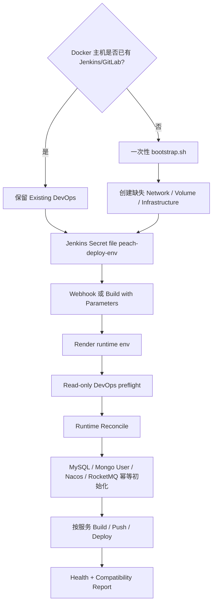

# Deploy Pipeline 启动与配置手册

本文只覆盖 `deploy-pipline/` 的启动、配置、迁移和日常发布操作。文档面向两类环境：

1. **已经跑通的现有环境**：GitLab、Jenkins、Nexus、Registry 已经存在并且包含历史数据。这是当前 Peach Cloud 的主要使用场景。
2. **全新 Docker 主机**：尚未创建 Jenkins/GitLab/Nexus/Registry，需要执行一次冷启动。

> **最重要的原则**：已有 GitLab、Jenkins、Nexus、Registry 以及对应 external volume 都是受保护资产。日常 Jenkins Pipeline 不重建这些 DevOps 容器，也不删除其数据卷。

---

## 1. 适用范围

`deploy-pipline/` 管理四类资源：

| 类型 | 组件 |
| --- | --- |
| DevOps | GitLab、Jenkins、Nexus、Docker Registry、Registry UI、DevOps Nginx |
| 运行时中间件 | MySQL、Redis、Nacos、MongoDB、RocketMQ NameServer/Broker/Dashboard |
| 可观测性 | Prometheus、Tempo、OpenTelemetry Collector、Loki、Alloy、Grafana |
| 应用服务 | `peach-gateway`、`peach-auth`、`peach-monitor`、`peach-fileservice`、`peach-message`、`peach-setting`、`peach-generator`、`peach-scheduled`、`peach-front` |

日常发布时，DevOps 容器属于 **Protected DevOps**。Jenkins 只做只读检查，不通过 Pipeline 重新创建 Jenkins/GitLab/Nexus/Registry。

运行时中间件和可观测性采用 **reconcile**：

- 容器存在且运行：保留。
- 容器存在但停止：`docker start`。
- 容器不存在：按 Compose 创建。
- external volume 已存在：继续复用。
- external volume 缺失：只创建缺失 volume。

---

## 2. 运行模式总览



### 2.1 已有环境

正常情况下你只需要：

```text
维护 Jenkins Secret file
        +
Git push / Jenkins Build with Parameters
```

不需要日常手工执行初始化脚本。

### 2.2 全新主机

只有主机上连 Jenkins 都还不存在时，才执行一次 `bootstrap.sh`。之后切换到 Jenkins/Webhook 日常模式。

---

## 3. Windows 与 Linux 的关键区别

| 项目 | Windows | Linux |
| --- | --- | --- |
| Docker | Docker Desktop，使用 Linux containers | Docker Engine + Docker Compose V2 |
| 推荐本地 Shell | PowerShell 做文件/诊断；Git Bash 执行项目 `.sh` | Bash / sh |
| `PEACH_RUNTIME_ROOT` | Docker Desktop 可见路径，例如 `/host_mnt/d/Coding/.../runtime` | Linux 绝对路径，例如 `/opt/peach-cloud/deploy-pipline/runtime` |
| `PEACH_LOG_ROOT` | `/host_mnt/d/.../runtime/logs` | `/opt/.../runtime/logs` |
| `.sh` 脚本 | 不直接按 PowerShell 语法执行；使用 Git Bash，或已配置 Docker Desktop Integration 的 WSL2 | 直接使用 `sh`/`bash` |
| Jenkins 内部环境 | Linux container | Linux container |
| 日常 Jenkins 发布 | 与 Linux 相同 | 与 Windows 相同 |

仓库 `.gitattributes` 已固定 `*.sh` 使用 LF，因此不要把部署脚本手工转换成 CRLF。

> Windows 下尤其注意：Secret 文件中的 `PEACH_RUNTIME_ROOT` / `PEACH_LOG_ROOT` 是 **Docker Host 可见路径**，不是普通的 `D:\...` Windows 路径。

---

## 4. 关键目录

| 路径 | 作用 |
| --- | --- |
| `deploy-pipline/Jenkinsfile` | Jenkins 流水线入口 |
| `deploy-pipline/env/defaults.env` | 仓库维护的非敏感默认配置、端口和版本 |
| `deploy-pipline/env/deploy.env.example` | 私有部署配置模板 |
| `deploy-pipline/env/deploy.env` | 本机私有配置；Git 已忽略，不提交 |
| `deploy-pipline/runtime/generated/deploy.env` | defaults + Secret 合成后的运行时配置；不提交 Git |
| `deploy-pipline/config/services.json` | 应用服务清单和构建范围规则 |
| `deploy-pipline/config/rocketmq/topics.json` | RocketMQ 受治理 Topic 清单 |
| `deploy-pipline/config/compatibility-baseline.json` | 非业务组件版本和兼容性基线 |
| `deploy-pipline/compose/devops/docker-compose.yml` | GitLab、Jenkins、Nexus、Registry 等 DevOps 服务 |
| `deploy-pipline/compose/middleware/docker-compose.yml` | MySQL、Redis、Nacos、MongoDB、RocketMQ |
| `deploy-pipline/compose/observability/docker-compose.yml` | Prometheus、Tempo、OTel、Loki、Alloy、Grafana |
| `deploy-pipline/compose/application/docker-compose.yml` | Peach 应用服务 |
| `deploy-pipline/scripts/bootstrap/bootstrap.sh` | 全新 Docker 主机一次性冷启动入口 |
| `deploy-pipline/scripts/bootstrap/reconcile-runtime.sh` | 已有环境的运行时修复/对账入口；不重建 DevOps |

更深入的生命周期和数据保护说明见 [architecture-and-operations.md](architecture-and-operations.md)。Jenkins/Nexus/Registry/Webhook 原理见 [ci-cd.md](ci-cd.md)。

---

## 5. 前置条件

### 5.1 Windows

建议环境：

- Windows 10/11。
- Docker Desktop 已启动并使用 Linux containers。
- Git for Windows；需要手工执行 `.sh` 时使用 Git Bash。
- Node.js 可执行；建议使用 Node 22，与 Jenkins CI 环境保持一致。
- `docker`、`docker compose`、`node` 在当前终端可执行。

PowerShell 检查：

```powershell
docker version
docker compose version
node --version
git --version
```

如果只是日常通过 Jenkins 发布，不需要在 Windows 主机手工运行 bootstrap/reconcile。

### 5.2 Linux

要求：

- Docker Engine 已启动。
- Docker Compose V2 可执行。
- Node.js 可执行；建议 Node 22。
- 当前执行用户可以直接运行 `docker`，因为项目脚本内部直接调用 `docker`，不会自动添加 `sudo`。

检查：

```bash
docker version
docker compose version
node --version
git --version
```

---

## 6. 配置文件关系

运行时配置由两层合成：

```text
deploy-pipline/env/defaults.env
          +
deploy-pipline/env/deploy.env
          或
Jenkins Secret file: peach-deploy-env
          ↓
render-runtime-env.mjs
          ↓
deploy-pipline/runtime/generated/deploy.env
```

`defaults.env` 保存：

- 组件默认版本；
- 默认端口；
- Nacos Namespace/Group；
- 服务内部地址；
- RocketMQ 默认策略；
- Observability 默认配置；
- 其他非敏感运行参数。

私有 `deploy.env` / Jenkins Secret file 保存：

- Docker Host 可见目录；
- 数据库/Redis/MongoDB 密码；
- Nexus 账号密码；
- Grafana 密码；
- 可选 OSS/COS 密钥；
- 可选代理和认证 override。

同名 key 以私有配置为准。旧版包含大量完整配置的 `peach-deploy-env` 仍然兼容。

合成脚本：

```bash
node deploy-pipline/scripts/config/render-runtime-env.mjs \
  --secrets deploy-pipline/env/deploy.env \
  --output deploy-pipline/runtime/generated/deploy.env
```

脚本会自动派生 `PEACH_MONGO_URI`，并拒绝关键字段为空或仍使用 `change_me...` 占位值。

---

## 7. 私有配置：Windows

假设项目位于：

```text
D:\Coding\mine\new-mine\peach-cloud
```

### 7.1 PowerShell 创建私有配置

工作目录：仓库根目录。

```powershell
Set-Location D:\Coding\mine\new-mine\peach-cloud
Copy-Item .\deploy-pipline\env\deploy.env.example .\deploy-pipline\env\deploy.env
```

然后编辑：

```text
deploy-pipline/env/deploy.env
```

推荐路径示例：

```env
PEACH_RUNTIME_ROOT=/host_mnt/d/Coding/mine/new-mine/peach-cloud/deploy-pipline/runtime
PEACH_LOG_ROOT=/host_mnt/d/Coding/mine/new-mine/peach-cloud/deploy-pipline/runtime/logs

MYSQL_ROOT_PASSWORD=<existing-or-new-mysql-root-password>
REDIS_PASSWORD=<existing-or-new-redis-password>
MONGO_ROOT_PASSWORD=<mongo-root-password>
MONGO_APP_PASSWORD=<mongo-application-password>

MAVEN_NEXUS_USERNAME=Development
MAVEN_NEXUS_PASSWORD=<existing-nexus-password>
GRAFANA_ADMIN_PASSWORD=<grafana-admin-password>
```

### 7.2 Windows 路径规则

不要这样写：

```env
PEACH_RUNTIME_ROOT=D:\Coding\mine\new-mine\peach-cloud\deploy-pipline\runtime
```

当前 Jenkins 是 Linux container，并通过 Docker socket 操作 Docker Desktop；项目 Compose bind mount 使用 Docker Host 可识别路径。因此 Windows Docker Desktop 使用：

```text
D:\Coding\mine\new-mine\peach-cloud\deploy-pipline\runtime
                ↓
/host_mnt/d/Coding/mine/new-mine/peach-cloud/deploy-pipline/runtime
```

如果项目位于其他盘符，把 `/host_mnt/d/` 对应调整为 `/host_mnt/c/`、`/host_mnt/e/` 等实际盘符。

### 7.3 Windows 手工生成运行时配置

这一条可以直接在 PowerShell 执行：

```powershell
node .\deploy-pipline\scripts\config\render-runtime-env.mjs `
  --secrets .\deploy-pipline\env\deploy.env `
  --output .\deploy-pipline\runtime\generated\deploy.env
```

日常 Jenkins Pipeline 会自动完成该步骤，正常发布不需要手工执行。

---

## 8. 私有配置：Linux

假设项目位于：

```text
/opt/peach-cloud
```

工作目录：仓库根目录。

```bash
cd /opt/peach-cloud
cp deploy-pipline/env/deploy.env.example deploy-pipline/env/deploy.env
```

配置示例：

```env
PEACH_RUNTIME_ROOT=/opt/peach-cloud/deploy-pipline/runtime
PEACH_LOG_ROOT=/opt/peach-cloud/deploy-pipline/runtime/logs

MYSQL_ROOT_PASSWORD=<existing-or-new-mysql-root-password>
REDIS_PASSWORD=<existing-or-new-redis-password>
MONGO_ROOT_PASSWORD=<mongo-root-password>
MONGO_APP_PASSWORD=<mongo-application-password>

MAVEN_NEXUS_USERNAME=Development
MAVEN_NEXUS_PASSWORD=<existing-nexus-password>
GRAFANA_ADMIN_PASSWORD=<grafana-admin-password>
```

手工生成运行时配置：

```bash
node deploy-pipline/scripts/config/render-runtime-env.mjs \
  --secrets deploy-pipline/env/deploy.env \
  --output deploy-pipline/runtime/generated/deploy.env
```

Linux 使用真实绝对路径，不使用 `/host_mnt/...`。

---

## 9. 已有 Jenkins/GitLab 环境：推荐操作

这是当前项目最重要的场景。

### 9.1 不要重新 Bootstrap DevOps

如果这些容器已经存在并且包含数据：

```text
local-registry
registry-ui
gitlab
nexus
jenkins
peach-devops-nginx
```

不要为了应用新部署代码而删除、重建它们。

Jenkins Pipeline 会：

1. 合成 runtime env；
2. 只读检查 Existing DevOps；
3. reconcile Runtime；
4. 执行幂等数据准备；
5. 构建/发布选中的业务服务；
6. 生成兼容性和 RocketMQ 报告。

### 9.2 现有密码必须使用真实旧值

如果 MySQL/Nexus/Redis/GitLab/Jenkins 数据卷已经存在，私有配置应使用当前实际凭据。修改 env 文件不会自动修改已有数据卷内部已经初始化的账号密码。

因此第一次切换到本方案时，应优先把**当前跑通环境正在使用的密码和路径**整理到 Secret file，而不是生成一套全新的随机密码后直接覆盖配置。

### 9.3 Jenkins Secret file

继续使用：

```text
Credential ID: peach-deploy-env
Kind: Secret file
```

把最终确认的 `deploy.env` 作为 Secret file 上传/更新。

Windows 和 Linux 的差异只在 Secret 文件中的 Host path：

```text
Windows Docker Desktop:
/host_mnt/d/.../deploy-pipline/runtime

Linux:
/opt/peach-cloud/deploy-pipline/runtime
```

其他 Jenkins 流程相同。

---

## 10. 全新主机首次启动

只有 Docker 主机上还没有 Jenkins/GitLab/Nexus/Registry 时，才执行一次冷启动。

### 10.1 Windows + Docker Desktop

项目脚本是 POSIX `sh`，推荐从 **Git Bash** 执行冷启动。

PowerShell 负责准备配置：

```powershell
Set-Location D:\Coding\mine\new-mine\peach-cloud
Copy-Item .\deploy-pipline\env\deploy.env.example .\deploy-pipline\env\deploy.env
```

填写 Secret 后，打开 Git Bash 并进入仓库：

```bash
cd /d/Coding/mine/new-mine/peach-cloud
```

执行：

```bash
PEACH_ENV_FILE="$PWD/deploy-pipline/env/deploy.env" \
  sh deploy-pipline/scripts/bootstrap/bootstrap.sh
```

如果使用 WSL2，也必须确保 Docker Desktop 已为对应 WSL distribution 启用 Docker integration，并从 WSL 可正常执行 `docker` / `docker compose`。否则优先使用 Git Bash。

### 10.2 Linux

```bash
cd /opt/peach-cloud
cp deploy-pipline/env/deploy.env.example deploy-pipline/env/deploy.env
# 编辑 deploy.env

PEACH_ENV_FILE="$PWD/deploy-pipline/env/deploy.env" \
  sh deploy-pipline/scripts/bootstrap/bootstrap.sh
```

### 10.3 Bootstrap 会做什么

`bootstrap.sh` 会依次：

1. 合成 `runtime/generated/deploy.env`；
2. 盘点已有容器；
3. 创建缺失 Docker network；
4. 创建缺失 external volume；
5. 同步 `deploy-pipline/config/` 到 `PEACH_RUNTIME_ROOT/config`；
6. 启动/创建 DevOps；
7. 启动/创建 Middleware；
8. 启动/创建 Observability；
9. 验证基础设施；
10. 初始化 MySQL baseline；
11. 确保 MongoDB 业务用户；
12. 初始化/校验 Nacos；
13. 对账 RocketMQ Topic；
14. 再次验证基础设施。

即使冷启动入口发现同名已有容器，也会优先保留和启动现有容器，而不是直接 recreate。

---

## 11. 已有环境的手工 Reconcile

正常 Jenkins 发布会自动调用 `reconcile-runtime.sh`。只有排障、维护或首次接入 PR 时才建议手工执行。

### 11.1 Windows

先在 PowerShell 生成 runtime env：

```powershell
node .\deploy-pipline\scripts\config\render-runtime-env.mjs `
  --secrets .\deploy-pipline\env\deploy.env `
  --output .\deploy-pipline\runtime\generated\deploy.env
```

然后在 Git Bash：

```bash
cd /d/Coding/mine/new-mine/peach-cloud
PEACH_ENV_FILE="$PWD/deploy-pipline/runtime/generated/deploy.env" \
  sh deploy-pipline/scripts/bootstrap/reconcile-runtime.sh
```

### 11.2 Linux

```bash
cd /opt/peach-cloud

node deploy-pipline/scripts/config/render-runtime-env.mjs \
  --secrets deploy-pipline/env/deploy.env \
  --output deploy-pipline/runtime/generated/deploy.env

PEACH_ENV_FILE="$PWD/deploy-pipline/runtime/generated/deploy.env" \
  sh deploy-pipline/scripts/bootstrap/reconcile-runtime.sh
```

### 11.3 Reconcile 的边界

它会：

- 确保 network；
- 确保 external volume；
- 同步 runtime 配置；
- 启动 existing Runtime container；
- 创建缺失 Runtime container；
- 验证基础设施；
- 执行 MySQL/MongoDB/Nacos/RocketMQ 幂等初始化。

它**不会通过 DevOps Compose 重建 Jenkins/GitLab/Nexus/Registry**。

---

## 12. 默认端口

### 12.1 基础设施

| 服务 | 默认宿主机端口 | 容器端口 |
| --- | ---: | ---: |
| MySQL | `3307` | `3306` |
| Redis | `6380` | `6379` |
| Nacos HTTP | `8849` | `8848` |
| Nacos gRPC | `9850` | `9848` |
| MongoDB | `27017` | `27017` |
| RocketMQ NameServer | `9876` | `9876` |
| RocketMQ Broker | `10911` | `10911` |
| RocketMQ Dashboard | `18088` | `8082` |
| Registry | `5000` | `5000` |
| Registry UI | `5001` | `80` |
| GitLab HTTP | `8929` | `80` |
| GitLab SSH | `2424` | `22` |
| Jenkins | `8080` | `8080` |
| Jenkins Agent | `50000` | `50000` |
| Nexus | `8081` | `8081` |
| DevOps Nginx | `80` | `80` |
| Prometheus | `9090` | `9090` |
| Grafana | `3000` | `3000` |

### 12.2 应用服务内部端口

| 服务 | 端口 |
| --- | ---: |
| `peach-gateway` | `18080` |
| `peach-auth` | `18081` |
| `peach-monitor` | `18082` |
| `peach-fileservice` | `18083` |
| `peach-message` | `18084` |
| `peach-setting` | `18085` |
| `peach-generator` | `18086` |
| `peach-scheduled` | `18087` |
| `peach-front` | `80` |

如果宿主机端口已经被其他程序占用，应先确认是否为当前已有 Peach 容器，不要直接修改端口后重建旧 DevOps。

---

## 13. Jenkins 发布应用

Jenkinsfile 当前参数：

| 参数 | 默认值 | 作用 |
| --- | --- | --- |
| `BUILD_BRANCH` | `AUTO` | `AUTO` 使用 Webhook/Job SCM；也可以填写 `main`、`develop`、`feature/...` |
| `BUILD_MODE` | `AUTO` | `AUTO`、`SELECTED`、`ALL` |
| `DEPLOY_SERVICES` | `peach-gateway` | 只在 `SELECTED` 模式生效；支持空格或逗号分隔 |
| `STOP_UNSELECTED_SERVICES` | `false` | 是否停止本次未选择的业务服务 |

### 13.1 Webhook 推荐模式

```text
BUILD_BRANCH=AUTO
BUILD_MODE=AUTO
STOP_UNSELECTED_SERVICES=false
```

`AUTO` 会根据 Git diff 和 `config/services.json` 自动计算受影响服务。

### 13.2 手工发布指定分支和服务

```text
BUILD_BRANCH=develop
BUILD_MODE=SELECTED
DEPLOY_SERVICES=peach-auth,peach-gateway
STOP_UNSELECTED_SERVICES=false
```

### 13.3 全量发布

```text
BUILD_MODE=ALL
STOP_UNSELECTED_SERVICES=false
```

为了保护现有 Jenkins 插件集合，当前不新增 Git Parameter/Active Choices。分支和多服务使用 Jenkins 原生参数完成。

---

## 14. 构建与部署行为

### 14.1 后端

`AUTO` / `SELECTED` 会执行选择性 Maven reactor：

```text
mvn ... -pl <selected-modules> -am clean deploy
```

`-am` 会把所需 reactor 依赖一起构建。公共后端模块变化时会安全扩大为全部后端。

### 14.2 前端

前端使用 Node 22：

```bash
npm ci
npm run build
```

只修改 `peach-cloud-front` 时，Jenkins 可以跳过 Maven 后端构建。

### 14.3 镜像

默认镜像前缀：

```env
PEACH_IMAGE_PREFIX=localhost:5000/peach-cloud
```

Jenkins 使用当前 Git commit 的 12 位短 SHA 作为 image tag，例如：

```text
localhost:5000/peach-cloud/peach-auth:<commit>
localhost:5000/peach-cloud/peach-front:<commit>
```

部署阶段只 pull/up 被选择的应用服务，不重新构建未选择服务。

---

## 15. 数据初始化规则

### 15.1 MySQL

- 数据库没有业务表：执行 baseline schema + seed。
- 已经存在表：保留现有数据库，跳过 baseline 重建。

这不是数据库迁移框架；后续增量 schema 变更应单独引入 migration 方案，而不是依赖 baseline 重放。

### 15.2 MongoDB

自动化只确保业务用户存在，不创建业务 collection、index 或 seed 数据。

### 15.3 Nacos

- Namespace 缺失：创建。
- DataId 缺失：发布。
- 已有 DataId：默认保留。
- 只有显式同步模式才覆盖已有配置。

### 15.4 RocketMQ

Topic catalog：

```text
deploy-pipline/config/rocketmq/topics.json
```

默认：

```env
ROCKETMQ_TOPIC_PROVISION_MODE=ensure
```

模式：

| 模式 | 行为 |
| --- | --- |
| `ensure` | 缺失 Topic 自动创建 |
| `verify` | 只验证，缺失则失败 |
| `off` | 不治理 Topic |

当前仍保留 Broker `autoCreateTopicEnable=true` 和 Peach Rocket `PEACH_ROCKET_TOPIC_AUTO_CREATE=true`，保证与改造前的自动创建能力兼容。

---

## 16. 健康检查与报告

查看所有容器：

```bash
docker ps --format "table {{.Names}}\t{{.Image}}\t{{.Status}}\t{{.Ports}}"
```

该命令在 PowerShell、Git Bash、Linux Bash 均可执行。

查看日志：

```bash
docker logs -f jenkins
docker logs -f peach-nacos
docker logs -f peach-mysql
docker logs -f peach-rocketmq-broker
```

Jenkins Archive 会保存：

```text
deploy-pipline/runtime/reports/compatibility-report.md
deploy-pipline/runtime/reports/rocketmq-status.txt
```

`compatibility-report.md` 用于检查：

- 非业务默认镜像版本是否漂移；
- 9 个应用服务合同是否完整；
- 实际 container image/status；
- 受保护 DevOps volume 是否仍存在。

`rocketmq-status.txt` 用于检查：

- NameServer；
- Cluster/Broker；
- Broker `autoCreateTopicEnable`；
- Peach Starter Topic 自动创建开关；
- CI Topic provisioning mode；
- Topic preserved/created/missing 状态。

---

## 17. 当前非业务版本基线

本次自动化改造不借机升级已经跑通的基础设施版本：

| 组件 | 当前基线 |
| --- | --- |
| Registry | `registry:3` |
| Registry UI | `joxit/docker-registry-ui:latest` |
| GitLab | `gitlab/gitlab-ce:latest` |
| Nexus | `sonatype/nexus3:3.75.1` |
| Jenkins | `peach-jenkins:lts-jdk21` |
| Nginx | `nginx:1.25-alpine` |
| MySQL | `mysql:8.0` |
| Redis | `redis:7.2-alpine` |
| Nacos | `nacos/nacos-server:v2.3.2` |
| MongoDB | `mongo:7.0` |
| RocketMQ | `apache/rocketmq:5.3.1` |
| RocketMQ Dashboard | `apacherocketmq/rocketmq-dashboard:latest` |
| Prometheus | `prom/prometheus:v3.12.0` |
| Tempo | `grafana/tempo:2.10.7` |
| OpenTelemetry Collector | `otel/opentelemetry-collector-contrib:0.153.0` |
| Loki | `grafana/loki:3.7.4` |
| Alloy | `grafana/alloy:v1.18.0` |
| Grafana | `grafana/grafana:13.1.0` |

`latest` / Jenkins LTS 等浮动引用目前为了保持原环境策略没有在本次 PR 中强行锁定。后续版本锁定或升级应作为单独迁移任务处理。

---

## 18. 受保护数据

### 18.1 DevOps volume

```text
peach-registry-data
peach-gitlab-config
peach-gitlab-data
peach-jenkins-data
peach-nexus-data
```

### 18.2 Middleware / Observability volume

```text
peach-mysql-data
peach-redis-data
peach-nacos-data
peach-mongo-data
peach-rocketmq-store
peach-prometheus-data
peach-tempo-data
peach-loki-data
peach-alloy-data
peach-grafana-data
```

### 18.3 应用相关 volume

```text
peach-gateway-config
peach-auth-config
peach-monitor-config
peach-fileservice-config
peach-fileservice-upload
peach-message-config
peach-setting-config
peach-generator-config
peach-scheduled-config
```

---

## 19. 禁止或谨慎操作

不要把下面这些命令当作日常排障手段：

```bash
docker compose down -v
docker volume prune
docker system prune --volumes
docker volume rm <protected-volume>
```

它们可能删除 Jenkins、GitLab、Nexus、Registry、MySQL、Nacos、MongoDB、RocketMQ、Grafana 等已经存在的数据。

如果只是某个服务异常，优先执行：

1. `docker ps -a`；
2. `docker logs <container>`；
3. `docker inspect <container>`；
4. network/volume inspect；
5. `reconcile-runtime.sh`；
6. 查看 Jenkins Archive 报告。

---

## 20. Windows 常见问题

### 20.1 `PEACH_RUNTIME_ROOT` 路径不对

症状通常是 Nacos/MongoDB/RocketMQ/Prometheus 等提示配置文件不存在或 bind mount 失败。

检查 Secret 是否使用：

```text
/host_mnt/<drive-letter>/...
```

而不是：

```text
D:\...
```

### 20.2 PowerShell 无法执行 `.sh`

这是预期行为。项目 bootstrap/reconcile 是 POSIX shell 脚本。

推荐：

- PowerShell：复制文件、编辑配置、运行 `docker`/`node` 诊断。
- Git Bash：运行 `bootstrap.sh`、`reconcile-runtime.sh` 等 `.sh`。
- WSL2：只有在 Docker Desktop WSL Integration 已配置并验证后使用。

日常 Jenkins 发布不需要在 Windows 本机执行 `.sh`。

### 20.3 端口冲突

PowerShell 示例：

```powershell
Get-NetTCPConnection -LocalPort 8080 -ErrorAction SilentlyContinue
Get-NetTCPConnection -LocalPort 5000 -ErrorAction SilentlyContinue
Get-NetTCPConnection -LocalPort 8081 -ErrorAction SilentlyContinue
```

先确认占用端口的是否正是已有 Jenkins/Registry/Nexus，不要因为端口被占用就删除旧容器。

### 20.4 脚本出现 `^M`

部署脚本应保持 LF。仓库 `.gitattributes` 已固定 `*.sh text eol=lf`。不要使用会把 `.sh` 强制保存为 CRLF 的编辑方式。

---

## 21. Linux 常见问题

### 21.1 `permission denied` / 无法访问 Docker socket

项目脚本直接执行 `docker`。先确认当前用户可以运行：

```bash
docker ps
```

如果必须每条命令都加 `sudo` 才能运行，当前用户权限还没有满足自动化脚本的执行前提。

### 21.2 runtime/log 目录权限

确认配置中的目录存在且 Docker 可以 bind mount：

```bash
ls -ld /opt/peach-cloud/deploy-pipline/runtime
ls -ld /opt/peach-cloud/deploy-pipline/runtime/logs
```

实际路径以你的 `deploy.env` 为准。

### 21.3 端口冲突

```bash
ss -lntp | grep ':8080\|:5000\|:8081'
```

同样先判断是否为现有 Peach DevOps 容器。

---

## 22. Jenkins Preflight 失败

优先检查：

```bash
docker network inspect peach-devops
docker inspect local-registry
docker inspect nexus
docker inspect jenkins
```

Jenkins 必须能访问 Nexus 和 Registry：

```bash
docker exec jenkins curl -fsS http://nexus:8081/service/rest/v1/status
docker exec jenkins curl -fsS http://registry:5000/v2/
```

如果其中某个 existing DevOps 资源缺失，Pipeline 应 fail-fast，而不是自动创建一套新的 Jenkins/GitLab/Nexus/Registry 覆盖原环境。

---

## 23. RocketMQ 排障

查看 Broker：

```bash
docker logs -f peach-rocketmq-broker
```

查看 Dashboard：

```text
http://localhost:18088
```

查看自动对账结果：

```text
deploy-pipline/runtime/reports/rocketmq-status.txt
```

如果 Topic 缺失，先看 `ROCKETMQ_TOPIC_PROVISION_MODE` 和报告，不要通过删除 `peach-rocketmq-store` 重建 Broker。

---

## 24. 第一次切换到本方案的验收清单

对于**已经跑通的现有环境**，第一次使用本 PR 的 Jenkins Pipeline 前建议逐项确认：

- [ ] `gitlab`、`jenkins`、`nexus`、`local-registry` 原容器仍在。
- [ ] `peach-gitlab-*`、`peach-jenkins-data`、`peach-nexus-data`、`peach-registry-data` 原 volume 仍在。
- [ ] Secret file 中使用的是当前真实数据库/Nexus/Redis 等凭据。
- [ ] Windows 使用 `/host_mnt/<盘符>/...`；Linux 使用 Linux 绝对路径。
- [ ] Jenkins Credential ID 为 `peach-deploy-env`。
- [ ] Jenkins 可以访问 `http://nexus:8081` 和 `http://registry:5000`。
- [ ] `BUILD_MODE=AUTO` 的 Webhook 构建可以正确识别服务。
- [ ] `BUILD_MODE=SELECTED` 可以只构建指定服务。
- [ ] `compatibility-report.md` 没有非预期版本漂移。
- [ ] `rocketmq-status.txt` 显示 Topic reconcile 成功。
- [ ] 未执行任何 `down -v` / volume prune / protected volume rm。

---

## 25. 日常最短操作路径

### Windows

```text
Git Push
  ↓
GitLab Webhook
  ↓
Jenkins AUTO
  ↓
无需本机执行 shell 脚本
```

需要手工发布时，在 Jenkins `Build with Parameters` 中选择分支/模式/服务即可。

### Linux

```text
Git Push
  ↓
GitLab Webhook
  ↓
Jenkins AUTO
  ↓
无需登录服务器手工初始化
```

Windows/Linux 的**日常发布行为完全一致**；差异主要集中在第一次准备 Secret 的 Host path，以及极少数需要人工运行 bootstrap/reconcile 的场景。
