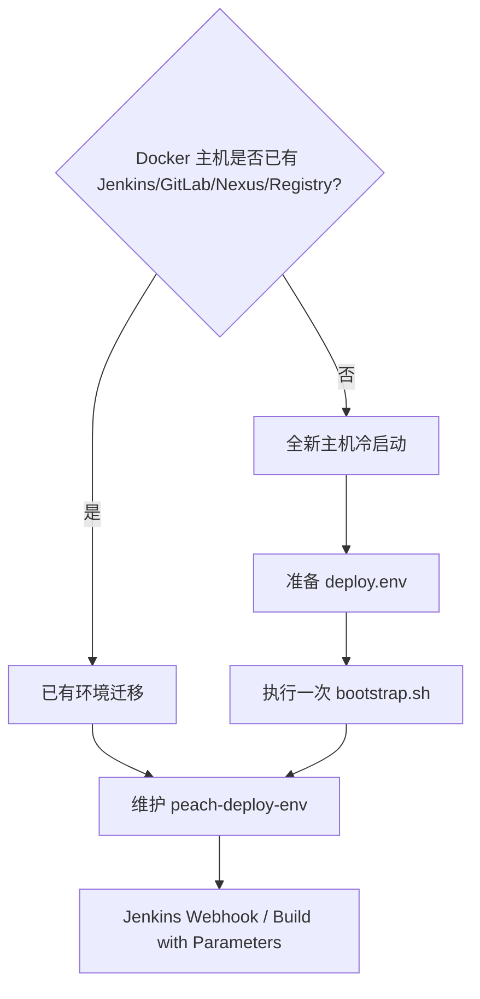

# Deploy Pipeline 快速开始

本文只提供最短成功路径。完整的配置项、端口、网络、volume、Jenkins 参数、数据初始化、安全边界和故障排查请阅读 [完整启动、配置、使用与故障排查手册](startup-and-configuration.md)。

## 1. 先判断环境类型



- **已有环境**：不要重新 bootstrap DevOps，也不要删除原 external volume。
- **全新主机**：执行一次 `bootstrap.sh`，随后切换到 Jenkins/Webhook 日常模式。

## 2. 前置检查

本地执行 bootstrap/reconcile 需要：

```bash
docker version
docker compose version
node --version
git --version
```

建议 Node.js 22。Windows 使用 Docker Desktop Linux containers；执行 `.sh` 时使用 Git Bash，或已验证 Docker Integration 的 WSL2。

## 3. 准备私有配置

工作目录：仓库根目录。

### Windows PowerShell

```powershell
Copy-Item .\deploy-pipline\env\deploy.env.example .\deploy-pipline\env\deploy.env
```

Windows Docker Desktop 路径示例：

```env
PEACH_RUNTIME_ROOT=/host_mnt/d/Coding/mine/new-mine/peach-cloud/deploy-pipline/runtime
PEACH_LOG_ROOT=/host_mnt/d/Coding/mine/new-mine/peach-cloud/deploy-pipline/runtime/logs
```

不要写成 `D:\...`。

### Linux / Git Bash

```bash
cp deploy-pipline/env/deploy.env.example deploy-pipline/env/deploy.env
```

Linux 路径示例：

```env
PEACH_RUNTIME_ROOT=/opt/peach-cloud/deploy-pipline/runtime
PEACH_LOG_ROOT=/opt/peach-cloud/deploy-pipline/runtime/logs
```

至少填写：

```env
MYSQL_ROOT_PASSWORD=<mysql-root-password>
REDIS_PASSWORD=<redis-password>
MONGO_ROOT_PASSWORD=<mongo-root-password>
MONGO_APP_PASSWORD=<mongo-app-password>
MAVEN_NEXUS_USERNAME=<nexus-user>
MAVEN_NEXUS_PASSWORD=<nexus-password>
GRAFANA_ADMIN_PASSWORD=<grafana-password>
```

密码不能保留 `change_me...`。文件存储默认使用：

```env
PEACH_STORAGE_PRIMARY=local
```

## 4. 已有环境迁移

### 4.1 生成 Runtime env

```bash
node deploy-pipline/scripts/config/render-runtime-env.mjs \
  --secrets deploy-pipline/env/deploy.env \
  --output deploy-pipline/runtime/generated/deploy.env
```

### 4.2 检查 Existing DevOps

```bash
PEACH_ENV_FILE="$PWD/deploy-pipline/runtime/generated/deploy.env" \
  sh deploy-pipline/scripts/ci/preflight.sh
```

### 4.3 对账 Runtime

```bash
PEACH_ENV_FILE="$PWD/deploy-pipline/runtime/generated/deploy.env" \
  sh deploy-pipline/scripts/bootstrap/reconcile-runtime.sh
```

Runtime 会按当前 Compose 定义更新容器；旧 Runtime 容器可能被替换，但 external volume 继续保留。GitLab、Jenkins、Nexus、Registry 不在这条替换路径中。

## 5. 全新主机冷启动

### Windows Git Bash

```bash
cd /d/Coding/mine/new-mine/peach-cloud
PEACH_ENV_FILE="$PWD/deploy-pipline/env/deploy.env" \
  sh deploy-pipline/scripts/bootstrap/bootstrap.sh
```

### Linux

```bash
cd /opt/peach-cloud
PEACH_ENV_FILE="$PWD/deploy-pipline/env/deploy.env" \
  sh deploy-pipline/scripts/bootstrap/bootstrap.sh
```

Bootstrap 会创建缺失 network/volume、启动或保留 DevOps、对账 Runtime、初始化 MySQL/MongoDB 用户/Nacos/RocketMQ，并清理生成的 Secret 临时文件。

全新 Nexus、GitLab、Jenkins 的产品级首次管理员、用户、仓库或 Job 配置仍需按现有 DevOps 运维流程完成。

## 6. Jenkins Secret file

在 Jenkins 中维护：

```text
Kind: Secret file
ID: peach-deploy-env
```

将确认后的 `deploy.env` 作为 Secret file 上传。不要把真实密码提交 Git 或写入 Jenkinsfile。

## 7. 日常发布

Webhook 推荐：

```text
BUILD_BRANCH=AUTO
BUILD_MODE=AUTO
STOP_UNSELECTED_SERVICES=false
```

手工发布指定服务：

```text
BUILD_BRANCH=develop
BUILD_MODE=SELECTED
DEPLOY_SERVICES=peach-auth,peach-gateway
STOP_UNSELECTED_SERVICES=false
```

全量发布：

```text
BUILD_MODE=ALL
STOP_UNSELECTED_SERVICES=false
```

后端服务直接构建可执行 `*-launch` Maven 模块；应用镜像标签使用当前 Git commit 的 12 位短 SHA。

## 8. 验证

查看容器：

```bash
docker ps --format "table {{.Names}}\t{{.Image}}\t{{.Status}}\t{{.Ports}}"
```

验证基础设施：

```bash
PEACH_ENV_FILE="$PWD/deploy-pipline/runtime/generated/deploy.env" \
  sh deploy-pipline/scripts/bootstrap/verify-infrastructure.sh
```

Jenkins 报告：

```text
deploy-pipline/runtime/reports/compatibility-report.md
deploy-pipline/runtime/reports/rocketmq-status.txt
```

## 9. 安全提醒

不要使用以下命令排障：

```bash
docker compose down -v
docker volume prune
docker system prune --volumes
docker volume rm <protected-volume>
```

如果问题涉及挂载、环境变量、镜像或 Compose 定义，优先重新执行 `reconcile-runtime.sh`，而不是只执行 `docker restart`。
