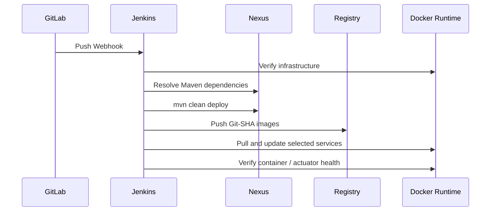

# Jenkins Pipeline

Jenkins 是应用持续交付器，不是基础设施管理器。

`DEPLOY_SERVICES` 仍支持按服务选择，`STOP_UNSELECTED_SERVICES=false` 默认不停止其他业务服务。镜像 Tag 为当前 Git 的 12 位短 SHA。Jenkins 不执行 MySQL/Mongo/Nacos 初始化，也不启动 Middleware。
