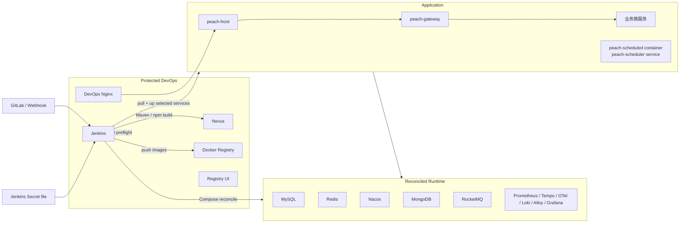
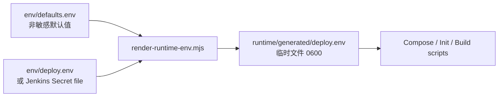
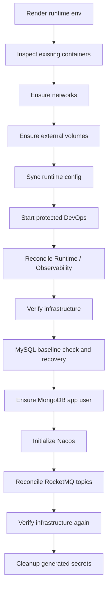
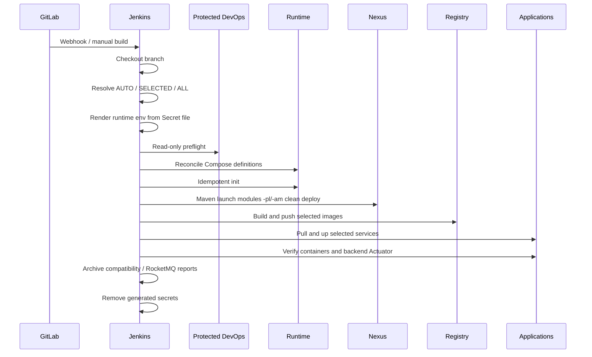

# Deploy Pipeline 完整启动、配置与使用手册

> 文档状态：**Current**  
> 适用目录：`deploy-pipline/`  
> 适用场景：Windows Docker Desktop、Linux Docker Engine、已有 DevOps 环境迁移、全新主机冷启动、Jenkins 日常发布与故障恢复。

本文是 `deploy-pipline/` 的完整操作手册。它不解释 Peach Cloud 业务功能，也不替代各中间件官方运维文档；它只说明当前仓库已经实现的部署边界、配置方法、启动顺序、Jenkins 发布流程、数据初始化策略、验证方式和故障处理方法。

阅读本文前需要先明确两类环境：

1. **已有环境**：GitLab、Jenkins、Nexus、Registry 已经运行并保存历史数据。这是当前项目的主要使用场景。
2. **全新主机**：Docker 主机上还没有上述 DevOps 容器，需要执行一次冷启动，然后再切换到 Jenkins/Webhook 日常模式。

> **最高优先级原则**：GitLab、Jenkins、Nexus、Registry 及其 external volume 是受保护资产。日常 Pipeline 不重建这些 DevOps 容器，也不会删除其数据卷。Middleware、Observability 属于可对账 Runtime，会按照当前 Compose 定义更新容器，但继续复用 external volume。

---

## 1. 系统范围与部署模型

`deploy-pipline/` 管理四类资源：

| 类型 | 组件 |
| --- | --- |
| Protected DevOps | GitLab、Jenkins、Nexus、Docker Registry、Registry UI、DevOps Nginx |
| Reconciled Runtime | MySQL、Redis、Nacos、MongoDB、RocketMQ NameServer/Broker/Dashboard |
| Observability | Prometheus、Tempo、OpenTelemetry Collector、Loki、Alloy、Grafana |
| Application | `peach-gateway`、`peach-auth`、`peach-monitor`、`peach-fileservice`、`peach-message`、`peach-setting`、`peach-generator`、`peach-scheduled`、`peach-front` |

### 1.1 部署拓扑



### 1.2 三种生命周期

| 资源类型 | 日常处理方式 | 数据处理方式 |
| --- | --- | --- |
| Protected DevOps | 只读检查；已有容器仅启动，不由 Pipeline 重建 | external volume 原样保留 |
| Runtime / Observability | 使用当前 Compose 定义执行 `up -d`；旧 Runtime 容器可被替换 | external volume 原样复用 |
| Application | 只拉取和更新本次选中的服务 | 应用配置卷、上传卷继续保留 |

这里的“替换 Runtime 容器”只表示重新创建容器定义，不表示删除 MySQL、Redis、Nacos、MongoDB、RocketMQ 或 Grafana 数据卷。

---

## 2. 术语

| 术语 | 含义 |
| --- | --- |
| `defaults.env` | 仓库维护的非敏感默认配置、版本、端口和内部地址 |
| Private env / Secret file | 本机或 Jenkins 保存的私密配置文件，包含路径、账号、密码和可选密钥 |
| Runtime env | `defaults.env` 与私密配置合成后的 `runtime/generated/deploy.env` |
| Protected DevOps | 不允许日常 Pipeline 重建的 GitLab/Jenkins/Nexus/Registry 等资产 |
| Reconcile | 根据当前 Compose 定义修复网络、配置、容器定义和运行状态，同时保留 external volume |
| Baseline | 全新或不完整 MySQL 数据库需要具备的基础表和初始化数据 |
| Service catalog | `config/services.json`，定义服务、可执行 Maven 模块和 Git 影响范围 |
| DataId | Nacos 配置文件名称，例如 `peach-scheduler.yml` |

---

## 3. 关键目录

| 路径 | 作用 |
| --- | --- |
| `deploy-pipline/Jenkinsfile` | Jenkins 流水线入口 |
| `deploy-pipline/env/defaults.env` | 非敏感默认配置 |
| `deploy-pipline/env/deploy.env.example` | 私有配置模板 |
| `deploy-pipline/env/deploy.env` | 本机私有配置；应被 Git 忽略 |
| `deploy-pipline/runtime/generated/deploy.env` | 临时 Runtime env；不得提交 Git |
| `deploy-pipline/config/services.json` | 服务清单、Maven launch 模块、Git 影响范围 |
| `deploy-pipline/config/rocketmq/topics.json` | RocketMQ Topic 声明式目录 |
| `deploy-pipline/config/compatibility-baseline.json` | 非业务组件兼容性基线 |
| `deploy-pipline/init/mysql/schema/ALL_TABLE_CREATE.sql` | MySQL baseline schema |
| `deploy-pipline/init/mysql/data/INIT.sql` | MySQL baseline seed |
| `deploy-pipline/init/nacos/config/` | Nacos 配置模板 |
| `deploy-pipline/compose/devops/docker-compose.yml` | DevOps 组件 |
| `deploy-pipline/compose/middleware/docker-compose.yml` | Runtime 中间件 |
| `deploy-pipline/compose/observability/docker-compose.yml` | 可观测性组件 |
| `deploy-pipline/compose/application/docker-compose.yml` | Peach 应用服务 |
| `deploy-pipline/scripts/bootstrap/bootstrap.sh` | 全新主机一次性冷启动入口 |
| `deploy-pipline/scripts/bootstrap/reconcile-runtime.sh` | 已有环境 Runtime 对账入口 |
| `deploy-pipline/scripts/bootstrap/start-runtime.sh` | Runtime Compose 对账实现 |
| `deploy-pipline/scripts/ci/preflight.sh` | Existing DevOps 只读检查 |
| `deploy-pipline/scripts/ci/resolve-services.mjs` | AUTO/SELECTED/ALL 服务解析 |
| `deploy-pipline/scripts/ci/maven-build.sh` | Maven 选择性构建 |
| `deploy-pipline/scripts/init/init-mysql.sh` | MySQL baseline 检查、恢复和历史记录 |
| `deploy-pipline/scripts/init/init-nacos.sh` | Nacos Namespace/DataId 初始化 |
| `deploy-pipline/scripts/init/reconcile-rocketmq-topics.sh` | RocketMQ Topic 对账 |

文档分工：

- [快速开始](getting-started.md)：最短成功路径。
- 本文：完整使用和运维手册。
- [架构、数据保护与运维](architecture-and-operations.md)：生命周期、数据边界和架构说明。
- [Jenkins、Nexus、Registry 与发布流程](ci-cd.md)：CI/CD 细节。

---

## 4. 前置条件

### 4.1 通用要求

执行本地 bootstrap/reconcile 的主机必须具备：

- Git。
- Docker Engine 或 Docker Desktop。
- Docker Compose V2，即 `docker compose`。
- Node.js，建议 Node 22。部署脚本会直接执行 `.mjs`，不是纯 Docker-only 启动流程。
- 当前用户能够直接运行 `docker`，脚本不会自动添加 `sudo`。
- 仓库文本保持 UTF-8，无 BOM；Shell 脚本保持 LF。

检查：

```bash
docker version
docker compose version
node --version
git --version
```

### 4.2 Windows

建议：

- Windows 10/11。
- Docker Desktop 使用 Linux containers。
- PowerShell 用于复制文件、编辑配置和诊断。
- Git Bash 用于执行仓库中的 `.sh` 脚本。
- WSL2 只有在 Docker Desktop WSL Integration 已启用并验证后再使用。

PowerShell 检查：

```powershell
docker version
docker compose version
node --version
git --version
```

### 4.3 Linux

建议：

- Docker Engine 已启动。
- Docker Compose V2 已安装。
- Node.js 22 或与 CI 兼容的 Node.js 版本。
- 执行用户已经加入可访问 Docker socket 的用户组。

检查：

```bash
docker ps
docker compose version
node --version
git --version
```

### 4.4 已有环境的额外要求

第一次迁移到本方案时，还需要确认：

- 当前 MySQL、Redis、MongoDB、Nexus 的真实账号密码。
- 当前 DevOps 容器和 external volume 名称没有被随意修改。
- Jenkins 已经能够通过 `peach-devops` 网络访问 `nexus:8081` 和 `registry:5000`。
- 不要用一套新密码直接覆盖 Secret 后期待已有数据卷自动修改内部密码。

---

## 5. 配置模型

运行时配置由两层合成：



同名 key 以私密配置为准。旧版完整 `deploy.env` 仍可继续作为 Jenkins Secret file 使用。

生成命令：

```bash
node deploy-pipline/scripts/config/render-runtime-env.mjs \
  --secrets deploy-pipline/env/deploy.env \
  --output deploy-pipline/runtime/generated/deploy.env
```

Runtime env 是临时文件：

- Jenkins 在 `post.always` 中删除。
- `bootstrap.sh` 在正常完成、失败或中断时删除。
- 不应提交到 Git。
- 不应作为长期凭据存储位置。

---

## 6. 创建私有配置

### 6.1 Windows

假设仓库位于：

```text
D:\Coding\mine\new-mine\peach-cloud
```

PowerShell：

```powershell
Set-Location D:\Coding\mine\new-mine\peach-cloud
Copy-Item .\deploy-pipline\env\deploy.env.example .\deploy-pipline\env\deploy.env
```

Docker Desktop bind mount 使用 Docker Host 可识别路径，不使用 `D:\...`：

```env
PEACH_RUNTIME_ROOT=/host_mnt/d/Coding/mine/new-mine/peach-cloud/deploy-pipline/runtime
PEACH_LOG_ROOT=/host_mnt/d/Coding/mine/new-mine/peach-cloud/deploy-pipline/runtime/logs
```

其他盘符相应使用 `/host_mnt/c/`、`/host_mnt/e/`。

### 6.2 Linux

```bash
cd /opt/peach-cloud
cp deploy-pipline/env/deploy.env.example deploy-pipline/env/deploy.env
```

使用真实 Linux 绝对路径：

```env
PEACH_RUNTIME_ROOT=/opt/peach-cloud/deploy-pipline/runtime
PEACH_LOG_ROOT=/opt/peach-cloud/deploy-pipline/runtime/logs
```

### 6.3 必填私有值

```env
PEACH_RUNTIME_ROOT=<Docker daemon 可访问的 runtime 绝对路径>
PEACH_LOG_ROOT=<Docker daemon 可访问的日志绝对路径>

MYSQL_ROOT_PASSWORD=<mysql-root-password>
REDIS_PASSWORD=<redis-password>
MONGO_ROOT_PASSWORD=<mongo-root-password>
MONGO_APP_PASSWORD=<mongo-application-password>

MAVEN_NEXUS_USERNAME=<nexus-user>
MAVEN_NEXUS_PASSWORD=<nexus-password>
GRAFANA_ADMIN_PASSWORD=<grafana-admin-password>
```

合成脚本会拒绝：

- 缺少的必填值；
- 空值；
- 仍然保留 `change_me...` 的占位值。

### 6.4 可选配置

Maven 代理：

```env
MAVEN_PROXY_HOST=proxy.example.com
MAVEN_PROXY_PORT=8080
MAVEN_PROXY_PROTOCOL=http
MAVEN_PROXY_ID=corp-proxy
MAVEN_PROXY_ACTIVE=true
MAVEN_PROXY_USERNAME=<proxy-user>
MAVEN_PROXY_PASSWORD=<proxy-password>
```

Nacos 认证配置在模板中保留，但当前应用 Compose 尚未完整向所有 Nacos Config/Discovery 客户端透传用户名和密码。因此当前方案的安全默认值仍是：

```env
NACOS_AUTH_ENABLE=false
```

在补齐并验证应用客户端认证参数前，不应仅通过修改 Secret 打开 Nacos 认证。

---

## 7. 存储配置

### 7.1 默认本地存储

默认值：

```env
PEACH_STORAGE_PRIMARY=local
```

Nacos 最终配置中的本地根目录：

```text
/app/upload/peach-storage
```

该路径位于 `peach-fileservice-upload` external volume 内，不依赖云存储凭据。

### 7.2 云 Provider 凭据

| Provider | `PEACH_STORAGE_PRIMARY` | 必须成对配置 |
| --- | --- | --- |
| Aliyun OSS | `aliyun` | `OSS_ACCESS_KEY` + `OSS_SECRET_KEY` |
| Tencent COS | `cos` | `COS_ACCESS_KEY` + `COS_SECRET_KEY` |
| Baidu BOS | `bos` | `BOS_ACCESS_KEY` + `BOS_SECRET_KEY` |
| Huawei OBS | `obs` | `OBS_ACCESS_KEY` + `OBS_SECRET_KEY` |

示例：

```env
PEACH_STORAGE_PRIMARY=aliyun
OSS_ACCESS_KEY=<access-key>
OSS_SECRET_KEY=<secret-key>
```

渲染规则：

- 一组凭据都为空：对应 Provider 不写入 Nacos。
- 只填写 AccessKey 或只填写 SecretKey：渲染失败。
- 将云 Provider 设为 primary，但凭据不完整：渲染失败。
- Secret 中的双引号、反斜杠等字符由专用渲染器安全转义。
- 渲染文件使用 `0600` 权限并在退出路径中删除。

---

## 8. 默认端口与访问入口

### 8.1 DevOps 与 Runtime 端口

| 服务 | 默认宿主机端口 | 容器端口 |
| --- | ---: | ---: |
| Registry | `5000` | `5000` |
| Registry UI | `5001` | `80` |
| GitLab HTTP | `8929` | `80` |
| GitLab SSH | `2424` | `22` |
| Jenkins | `8080` | `8080` |
| Jenkins Agent | `50000` | `50000` |
| Nexus | `8081` | `8081` |
| DevOps Nginx | `80` | `80` |
| MySQL | `3307` | `3306` |
| Redis | `6380` | `6379` |
| Nacos HTTP | `8849` | `8848` |
| Nacos gRPC | `9850` | `9848` |
| MongoDB | `27017`，仅绑定 `127.0.0.1` | `27017` |
| RocketMQ NameServer | `9876`，仅绑定 `127.0.0.1` | `9876` |
| RocketMQ Broker | `10911`，仅绑定 `127.0.0.1` | `10911` |
| RocketMQ Dashboard | `18088`，仅绑定 `127.0.0.1` | `8082` |
| Prometheus | `9090`，仅绑定 `127.0.0.1` | `9090` |
| Grafana | `3000`，仅绑定 `127.0.0.1` | `3000` |

### 8.2 应用内部端口

| Compose 服务 | Spring/Nginx 端口 | 说明 |
| --- | ---: | --- |
| `peach-gateway` | `18080` | 网关 |
| `peach-auth` | `18081` | 认证服务 |
| `peach-monitor` | `18082` | 监控服务 |
| `peach-fileservice` | `18083` | 文件服务 |
| `peach-message` | `18084` | 消息服务 |
| `peach-setting` | `18085` | 设置服务 |
| `peach-generator` | `18086` | 代码生成服务 |
| `peach-scheduled` | `18087` | 容器名；Spring/Nacos 服务名是 `peach-scheduler` |
| `peach-front` | `80` | 前端 Nginx |

应用容器默认不直接暴露宿主机端口，由 DevOps Nginx 和前端 Nginx 转发。

### 8.3 当前 Nginx 域名

`config/nginx/devops.conf` 当前定义：

| 域名 | 目标 |
| --- | --- |
| `peach_cloud.peachsoft.com` | Peach 前端入口 |
| `jenkins.peachsoft.com` | Jenkins |
| `gitlab.peachsoft.com` | GitLab |
| `registry.peachsoft.com` | Registry API 与 Registry UI |
| `nacos.peachsoft.com` | Nacos |
| `nexus.peachsoft.com` | Nexus |
| `grafana.peachsoft.com` | Grafana |
| `prometheus.peachsoft.com` | Prometheus |

本机 Docker Desktop 使用这些域名时，可在 hosts 中把域名指向 `127.0.0.1`；远程 Docker 主机则指向对应主机 IP。修改 hosts 只是名称解析，不会替代端口、防火墙和 Nginx 状态检查。

---

## 9. Docker Network 与 Volume

### 9.1 Network

| Network | 用途 |
| --- | --- |
| `peach-devops` | Jenkins、Nexus、Registry、GitLab、DevOps Nginx、部分 Observability 通讯 |
| `peach-cloud-runtime` | 应用、Middleware、Jenkins、DevOps Nginx、部分 Observability 通讯 |

### 9.2 Protected DevOps volume

```text
peach-registry-data
peach-gitlab-config
peach-gitlab-data
peach-jenkins-data
peach-nexus-data
```

### 9.3 Runtime / Observability volume

```text
peach-mysql-data
peach-redis-data
peach-nacos-data
peach-mongo-data
peach-rocketmq-store
peach-prometheus-data
peach-tempo-data
peach-loki-data
peach-alloy-data
peach-grafana-data
```

### 9.4 Application volume

```text
peach-gateway-config
peach-auth-config
peach-monitor-config
peach-fileservice-config
peach-fileservice-upload
peach-message-config
peach-setting-config
peach-generator-config
peach-scheduled-config
```

---

## 10. 已有环境迁移

这是推荐场景。

### 10.1 迁移前盘点

```bash
docker ps -a --format "table {{.Names}}\t{{.Image}}\t{{.Status}}"
docker volume ls
docker network ls
```

确认至少存在当前正在使用的：

```text
local-registry
registry-ui
gitlab
nexus
jenkins
peach-devops-nginx
```

在首次迁移前，应按现有运维流程备份重要 external volume。当前仓库不会自动创建备份，也不会自动验证备份可恢复性。

### 10.2 使用当前真实凭据

已有数据卷时：

- `MYSQL_ROOT_PASSWORD` 必须匹配现有 MySQL。
- `REDIS_PASSWORD` 必须匹配现有 Redis。
- `MONGO_ROOT_PASSWORD` 必须匹配现有 MongoDB root 用户。
- `MONGO_APP_PASSWORD` 必须匹配已经存在的 MongoDB 应用用户。
- `MAVEN_NEXUS_USERNAME` / `MAVEN_NEXUS_PASSWORD` 必须匹配现有 Nexus。

当前 MongoDB 初始化脚本只创建缺失应用用户；已经存在的用户会被保留，不会自动轮换密码。

### 10.3 更新 Jenkins Secret file

Jenkins Credential：

```text
Kind: Secret file
ID: peach-deploy-env
```

将确认后的 `deploy.env` 上传为该 Secret file。不要把密码粘贴进 Jenkinsfile，也不要把本地 `deploy.env` 提交 Git。

### 10.4 手工生成 Runtime env

Windows PowerShell：

```powershell
node .\deploy-pipline\scripts\config\render-runtime-env.mjs `
  --secrets .\deploy-pipline\env\deploy.env `
  --output .\deploy-pipline\runtime\generated\deploy.env
```

Linux/Git Bash：

```bash
node deploy-pipline/scripts/config/render-runtime-env.mjs \
  --secrets deploy-pipline/env/deploy.env \
  --output deploy-pipline/runtime/generated/deploy.env
```

### 10.5 Existing DevOps preflight

```bash
PEACH_ENV_FILE="$PWD/deploy-pipline/runtime/generated/deploy.env" \
  sh deploy-pipline/scripts/ci/preflight.sh
```

Preflight 会检查已有 DevOps，不会创建一套新的 Jenkins/Nexus/Registry 覆盖原环境。

### 10.6 Runtime 对账

```bash
PEACH_ENV_FILE="$PWD/deploy-pipline/runtime/generated/deploy.env" \
  sh deploy-pipline/scripts/bootstrap/reconcile-runtime.sh
```

对账行为：

1. 确保 network 和 external volume。
2. 同步仓库配置到 `PEACH_RUNTIME_ROOT/config`。
3. 检查 Runtime 容器的 Compose project/service 标签。
4. 旧 Runtime 容器不属于当前 Compose 定义时，删除旧容器并按当前定义重建。
5. 已属于当前 Compose 的 Runtime 容器执行 `docker compose up -d --no-deps`，应用镜像、环境变量、挂载和 healthcheck 变化。
6. external volume 保留。
7. 执行基础设施验证和幂等初始化。

GitLab、Jenkins、Nexus、Registry 不在这条 Runtime 替换路径内。

---

## 11. 全新主机冷启动

只有 Docker 主机还没有 Jenkins/GitLab/Nexus/Registry 时才执行。

### 11.1 Windows Docker Desktop

PowerShell：

```powershell
Set-Location D:\Coding\mine\new-mine\peach-cloud
Copy-Item .\deploy-pipline\env\deploy.env.example .\deploy-pipline\env\deploy.env
# 编辑 deploy.env
```

Git Bash：

```bash
cd /d/Coding/mine/new-mine/peach-cloud
PEACH_ENV_FILE="$PWD/deploy-pipline/env/deploy.env" \
  sh deploy-pipline/scripts/bootstrap/bootstrap.sh
```

### 11.2 Linux

```bash
cd /opt/peach-cloud
cp deploy-pipline/env/deploy.env.example deploy-pipline/env/deploy.env
# 编辑 deploy.env

PEACH_ENV_FILE="$PWD/deploy-pipline/env/deploy.env" \
  sh deploy-pipline/scripts/bootstrap/bootstrap.sh
```

### 11.3 Bootstrap 执行顺序



冷启动边界：

- 缺失的 DevOps 容器会被创建。
- 已有同名 DevOps 容器会被保留或启动。
- Runtime 使用当前 Compose 定义对账。
- external volume 不删除。
- `runtime/generated/deploy.env` 和 Secret 临时目录在脚本退出时删除。

### 11.4 首次产品初始化边界

冷启动脚本负责容器、网络、volume、Runtime 初始化，但不会自动完成所有产品控制台操作。例如，全新 Nexus 的管理员首次登录、仓库和 `Development` 用户准备仍需按当前 Nexus 运维流程完成；在 Nexus 账号和仓库可用前，Jenkins 的 Maven `clean deploy` 会认证失败。

同理，全新 GitLab/Jenkins 的首次管理员初始化、插件或 Job 配置仍以现有 DevOps 运维流程为准。

---

## 12. Jenkins 日常发布

### 12.1 Pipeline 总流程



### 12.2 Jenkins 参数

| 参数 | 默认值 | 作用 |
| --- | --- | --- |
| `BUILD_BRANCH` | `AUTO` | 使用 Webhook/当前 SCM；也可填写远程分支 |
| `BUILD_MODE` | `AUTO` | `AUTO`、`SELECTED`、`ALL` |
| `DEPLOY_SERVICES` | `peach-gateway` | `SELECTED` 模式下使用，支持空格或逗号分隔 |
| `STOP_UNSELECTED_SERVICES` | `false` | 是否停止未选择的应用服务 |

Webhook 推荐：

```text
BUILD_BRANCH=AUTO
BUILD_MODE=AUTO
STOP_UNSELECTED_SERVICES=false
```

手工发布指定服务：

```text
BUILD_BRANCH=develop
BUILD_MODE=SELECTED
DEPLOY_SERVICES=peach-auth,peach-gateway
STOP_UNSELECTED_SERVICES=false
```

全量：

```text
BUILD_MODE=ALL
STOP_UNSELECTED_SERVICES=false
```

除非明确需要停掉其他应用，不建议打开 `STOP_UNSELECTED_SERVICES`。

### 12.3 AUTO 影响范围

`config/services.json` 是 Source of Truth：

- 业务服务目录变化：选择对应服务。
- `pom.xml`、`.mvn/`、仓库构建脚本和公共后端模块变化：扩大为全部后端。
- `peach-cloud-front/` 变化：选择前端。
- `deploy-pipline/` 或部署 Workflow 变化：选择全部应用。
- 无可靠上一次成功提交时：安全回退到全量应用。

### 12.4 Maven 可执行模块

选择性构建直接指向 runnable `*-launch`：

| 服务 | Maven Project |
| --- | --- |
| `peach-gateway` | `peach-gateway/peach-gateway-launch` |
| `peach-auth` | `peach-auth/peach-auth-launch` |
| `peach-monitor` | `peach-monitor/peach-monitor-launch` |
| `peach-fileservice` | `peach-fileservice/peach-fileservice-launch` |
| `peach-message` | `peach-message/peach-message-launch` |
| `peach-setting` | `peach-setting/peach-setting-launch` |
| `peach-generator` | `peach-generator/peach-generator-launch` |
| `peach-scheduled` | `peach-scheduled/peach-scheduled-launch` |

命令形态：

```text
mvn ... -pl <selected-launch-modules> -am clean deploy
```

### 12.5 Scheduler 名称契约

| 层级 | 名称 |
| --- | --- |
| Compose service/container/image | `peach-scheduled` |
| Spring Application Name | `peach-scheduler` |
| Nacos discovery service | `peach-scheduler` |
| Nacos DataId | `peach-scheduler.yml` |

排障时不要把 Docker 容器名和服务发现名混为一谈。

### 12.6 镜像

默认前缀：

```env
PEACH_IMAGE_PREFIX=localhost:5000/peach-cloud
```

标签使用当前 Git commit 的 12 位短 SHA：

```text
localhost:5000/peach-cloud/peach-auth:<commit>
localhost:5000/peach-cloud/peach-front:<commit>
```

部署阶段只执行 pull/up，不在应用 Compose 阶段重新 build。

---

## 13. 数据初始化与配置发布

### 13.1 MySQL

当前 MySQL 初始化不再以“存在任意一张表”为完成条件。

流程：

1. 从 baseline schema 提取预期表集合。
2. 查询当前数据库已存在表。
3. 只渲染缺失表对应的 SQL 段。
4. 执行缺失表 SQL。
5. 重新验证所有预期表。
6. 执行幂等 seed。
7. 验证关键 seed。
8. 在 `PEACH_DEPLOY_SCHEMA_HISTORY` 记录 `baseline-v1` 和 checksum。

如果首次初始化中断并留下部分表，下一次执行会补齐缺失表，而不是直接跳过。

这仍然是 baseline 恢复机制，不是通用数据库迁移框架。后续版本化 DDL 仍应单独规划 migration 方案。

### 13.2 MongoDB

脚本只确保应用用户存在并授予目标数据库 `readWrite`：

- 用户缺失：创建。
- 用户已存在：保留。
- 不创建 collection、index 或业务 seed。
- 不自动轮换已有应用用户密码。

### 13.3 Nacos

默认行为：

- Namespace 缺失：创建。
- DataId 缺失：发布。
- DataId 已存在：保留。
- 配置模板按 Secret 安全渲染。
- 临时 YAML 和 access token 退出时删除。

需要明确覆盖现有 DataId 时：

```bash
PEACH_ENV_FILE="$PWD/deploy-pipline/runtime/generated/deploy.env" \
  sh deploy-pipline/scripts/init/init-nacos.sh --sync
```

`--sync` 会覆盖同 Namespace/Group 下的同名配置，执行前必须确认变更内容和回滚方案。普通 Jenkins 日常流程默认不使用 `--sync`。

### 13.4 RocketMQ

Topic 目录：

```text
deploy-pipline/config/rocketmq/topics.json
```

模式：

| `ROCKETMQ_TOPIC_PROVISION_MODE` | 行为 |
| --- | --- |
| `ensure` | 缺失 Topic 自动创建 |
| `verify` | 只检查，缺失则失败 |
| `off` | 不治理 Topic |

当前仍保留 Broker `autoCreateTopicEnable=true` 与 `PEACH_ROCKET_TOPIC_AUTO_CREATE=true`，兼容已有动态 Topic 行为。

---

## 14. Secret 与临时文件清理

受保护的临时内容包括：

- Runtime env。
- Maven settings。
- Nacos 渲染 YAML。
- Nacos access token。
- MySQL 缺表恢复 SQL/metadata。
- 前端构建临时目录和后端镜像构建上下文。

实现约束：

- Shell 使用 `umask 077`。
- Secret 文件和目录使用受限权限。
- Shell 使用 `trap cleanup EXIT HUP INT TERM`。
- Jenkins 使用 `post.always` 清理。
- Nacos 用户名、密码和 token 不拼接到 URL。
- Maven settings 不长期写入持久化 `.m2` 配置位置。

需要确认 Workspace 是否残留时：

```bash
find deploy-pipline/runtime/generated -maxdepth 2 -type f -print
```

正常 Pipeline 结束后不应残留 `deploy.env`、Nacos Secret YAML 或生成的 Maven settings。

---

## 15. 验证、日志与报告

### 15.1 基础设施验证

```bash
PEACH_ENV_FILE="$PWD/deploy-pipline/runtime/generated/deploy.env" \
  sh deploy-pipline/scripts/bootstrap/verify-infrastructure.sh
```

查看容器：

```bash
docker ps --format "table {{.Names}}\t{{.Image}}\t{{.Status}}\t{{.Ports}}"
```

### 15.2 日志

```bash
docker logs -f jenkins
docker logs -f nexus
docker logs -f peach-mysql
docker logs -f peach-nacos
docker logs -f peach-mongo
docker logs -f peach-rocketmq-broker
docker logs -f peach-gateway
```

### 15.3 Jenkins 发布后验证

当前 Pipeline 会：

- 检查选中容器是否为 `running`。
- 对选中的后端服务轮询 `/actuator/health` 并要求 `UP`。
- 对前端当前只检查容器运行状态，尚未执行 HTTP 页面探测。

前端人工检查：

```bash
docker exec jenkins curl -fsS http://peach-front/
```

业务入口检查还应结合当前 hosts/DNS 和 Nginx 域名进行。

### 15.4 报告

```text
deploy-pipline/runtime/reports/compatibility-report.md
deploy-pipline/runtime/reports/rocketmq-status.txt
```

`compatibility-report.md` 包含版本基线、应用服务合同、实际容器 image/status 和受保护 volume 状态。

`rocketmq-status.txt` 包含 NameServer、Cluster、Broker 自动创建状态、应用自动创建开关和 Topic 对账结果。

---

## 16. 常用操作

### 16.1 只发布一个服务

Jenkins：

```text
BUILD_MODE=SELECTED
DEPLOY_SERVICES=peach-auth
STOP_UNSELECTED_SERVICES=false
```

### 16.2 发布多个服务

```text
BUILD_MODE=SELECTED
DEPLOY_SERVICES=peach-auth,peach-gateway,peach-front
STOP_UNSELECTED_SERVICES=false
```

### 16.3 手工修复 Runtime

```bash
node deploy-pipline/scripts/config/render-runtime-env.mjs \
  --secrets deploy-pipline/env/deploy.env \
  --output deploy-pipline/runtime/generated/deploy.env

PEACH_ENV_FILE="$PWD/deploy-pipline/runtime/generated/deploy.env" \
  sh deploy-pipline/scripts/bootstrap/reconcile-runtime.sh
```

配置、镜像、挂载或 Compose 定义发生变化时，优先执行 reconcile，而不是只执行 `docker restart`。

### 16.4 临时重启单个容器

如果没有配置变化，仅处理瞬时故障：

```bash
docker restart peach-nacos
docker restart peach-redis
docker restart peach-mysql
```

重启后仍失败，转到 reconcile 和日志排查。

### 16.5 同步 Nacos 仓库模板

```bash
PEACH_ENV_FILE="$PWD/deploy-pipline/runtime/generated/deploy.env" \
  sh deploy-pipline/scripts/init/init-nacos.sh --sync
```

执行前先确认同名 DataId 是否包含人工维护内容。

---

## 17. 故障排查

| 症状 | 首先检查 | 处理 |
| --- | --- | --- |
| `Missing env file` | 私有 env 或 Runtime env 路径 | 复制模板并重新渲染 |
| `Missing required private value` | 空值和 `change_me...` | 填写真实私有值 |
| Windows bind mount 失败 | `/host_mnt/<drive>/...` | 不使用 `D:\...` 作为 Compose bind source |
| `node: not found` | `node --version` | 安装 Node.js，建议 22 |
| Jenkins preflight 失败 | `peach-devops`、Registry、Nexus、Jenkins | 检查容器、网络和 Jenkins 内部访问 |
| Runtime 仍使用旧挂载 | Compose labels / 旧容器 | 执行 `reconcile-runtime.sh` |
| MySQL 缺表或初始化中断 | `PEACH_DEPLOY_SCHEMA_HISTORY`、缺失表 | 重新运行 reconcile/init；脚本会补齐缺失表 |
| 文件服务因存储配置失败 | `PEACH_STORAGE_PRIMARY` 和凭据对 | 使用 `local` 或完整配置目标 Provider |
| `peach-scheduled` 无法被 Feign 发现 | Nacos 中 `peach-scheduler` | 区分容器名与服务发现名 |
| Nacos 配置修改未生效 | 默认 preserve 行为 | 审核后执行 `init-nacos.sh --sync` |
| MongoDB 修改 Secret 后应用认证失败 | 已有应用用户密码 | Secret 必须匹配已有用户；当前脚本不自动轮换 |
| Maven deploy 认证失败 | Nexus 用户、密码、仓库 | 先完成 Nexus 首次配置并验证账号 |
| RocketMQ Topic 缺失 | `rocketmq-status.txt` | 检查 provisioning mode 与 Topic catalog |
| 前端容器 running 但页面不可用 | `docker exec jenkins curl ...`、Nginx 日志 | 手工执行 HTTP 探测并检查上游解析 |

### 17.1 Jenkins 到 Nexus/Registry

```bash
docker exec jenkins curl -fsS http://nexus:8081/service/rest/v1/status
docker exec jenkins curl -fsS http://registry:5000/v2/
```

### 17.2 Network

```bash
docker network inspect peach-devops
docker network inspect peach-cloud-runtime
```

### 17.3 Volume

```bash
docker volume inspect peach-jenkins-data
docker volume inspect peach-nexus-data
docker volume inspect peach-mysql-data
```

---

## 18. 禁止或谨慎操作

不要把以下命令作为普通排障方式：

```bash
docker compose down -v
docker volume prune
docker system prune --volumes
docker volume rm <protected-volume>
```

它们可能永久删除 GitLab、Jenkins、Nexus、Registry、MySQL、Nacos、MongoDB、RocketMQ、Grafana 和应用上传数据。

同时注意：

- 不要提交 `deploy.env`。
- 不要在日志、PR、文档或 Jenkins 参数中粘贴真实 Secret。
- 不要把 Runtime 容器“保护”为永不重建；这会导致新 Compose 定义无法生效。
- 不要在未确认 DataId 内容时使用 Nacos `--sync`。
- 不要在共享环境随意打开 `STOP_UNSELECTED_SERVICES`。

---

## 19. 当前已知边界

以下内容当前不是自动化闭环的一部分：

1. 全新 Nexus 的首次管理员、用户和仓库配置。
2. 全新 GitLab/Jenkins 的产品级首次初始化和 Job 配置。
3. 已有 MongoDB 应用用户的自动密码轮换。
4. Nacos 开启认证后的全部应用客户端凭据透传。
5. 前端 HTTP 健康检查。
6. 应用发布失败后的自动镜像回滚。
7. 通用版本化数据库迁移；当前只提供 baseline 完整性恢复。
8. external volume 的自动备份和恢复演练。

这些边界不影响当前默认的已有环境、Nacos 认证关闭、本地存储优先、Jenkins 选择性发布流程，但在生产化前应分别规划。

---

## 20. 第一次迁移验收清单

### 20.1 Existing DevOps

- [ ] `gitlab`、`jenkins`、`nexus`、`local-registry`、`registry-ui`、`peach-devops-nginx` 原容器仍在。
- [ ] DevOps external volume 名称和数据仍在。
- [ ] Jenkins 能访问 Nexus 和 Registry。
- [ ] 没有执行 `down -v` 或 volume prune。

### 20.2 配置

- [ ] Windows 使用 `/host_mnt/<drive>/...`；Linux 使用真实绝对路径。
- [ ] 所有 `change_me...` 已替换。
- [ ] Existing MySQL/Redis/MongoDB/Nexus 使用真实旧凭据。
- [ ] Jenkins Secret file ID 是 `peach-deploy-env`。
- [ ] 未配置云密钥时 `PEACH_STORAGE_PRIMARY=local`。

### 20.3 Runtime

- [ ] `reconcile-runtime.sh` 成功。
- [ ] Runtime 容器已使用当前 Compose project/service labels。
- [ ] external volume 未被删除。
- [ ] MySQL baseline 历史和关键 seed 正常。
- [ ] Nacos Namespace/DataId 正常。
- [ ] RocketMQ Topic 对账正常。

### 20.4 Application

- [ ] `BUILD_MODE=SELECTED` 能只构建指定 launch 模块。
- [ ] `BUILD_MODE=AUTO` 能按 Git diff 选择服务。
- [ ] 后端 Actuator 检查成功。
- [ ] 前端人工 HTTP 探测成功。
- [ ] `peach-scheduled` 在 Nacos 注册为 `peach-scheduler`。
- [ ] 兼容性和 RocketMQ 报告已归档。

---

## 21. 日常最短路径

```text
Developer Git Push
        ↓
GitLab Webhook
        ↓
Jenkins BUILD_BRANCH=AUTO / BUILD_MODE=AUTO
        ↓
Render Secret → Preflight → Runtime Reconcile
        ↓
Selective Build → Image Push → Selected Deploy
        ↓
Health Check → Reports → Secret Cleanup
```

Windows 与 Linux 的日常 Jenkins 发布行为一致。差异主要在第一次准备 Host path，以及极少数需要人工执行 bootstrap/reconcile 的场景。
