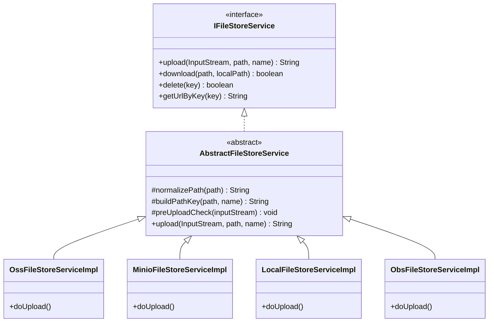
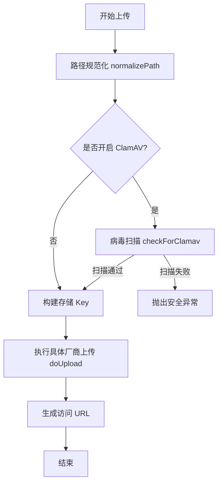

# Peach Cloud 文件存储服务 (File Service) 使用指南

## 1. 概述
`peach-cloud-fileservice` 是一套高度抽象且易于扩展的文件存储解决方案。它采用 **策略模式 (Strategy Pattern)** 和 **模板方法模式 (Template Method Pattern)**，屏蔽了底层存储介质（如阿里云 OSS、华为云 OBS、MinIO、本地磁盘等）的差异，为业务层提供统一的 API 接口。

---

## 2. 架构设计

### 2.1 类图结构
系统通过 `IFileStoreService` 接口定义标准行为，`AbstractFileStoreService` 提供通用逻辑（如路径清洗、安全检测、URL 编码），具体的存储厂商只需继承抽象类并实现核心流操作。



### 2.2 上传流程
上传过程集成了安全检测扩展点，确保文件在落盘前符合安全规范。



---

## 3. 支持的存储类型
目前已实现以下存储介质，支持“配置即切换”：

| 类型 (Type) | 存储介质 | 核心依赖 | 适用场景 |
| :--- | :--- | :--- | :--- |
| `OSS` | 阿里云 | `aliyun-sdk-oss` | 生产环境，主流选型 |
| `OBS` | 华为云 | `esdk-obs-java-bundle` | 生产环境，政企客户常用 |
| `COS` | 腾讯云 | `cos_api` | 生产环境 |
| `MINIO` | MinIO | `minio` | 私有化部署，S3 兼容 |
| `AMAZON` | AWS S3 | `aws-java-sdk-s3` | 国际化业务，标准 S3 协议 |
| `CEPH` | Ceph | `aws-java-sdk-s3` | 私有化大集群，S3 兼容 |
| `MONGO` | MongoDB | `GridFS` | 数据库集成存储，适合小文件 |
| `LOCAL` | 本地磁盘 | `Hutool FileUtil` | 开发环境、单机部署 |
| `NAS` | 网络挂载 | `LocalFileStore` | 局域网共享存储 |

---

## 4. 配置指南

在 `application.yml` 中，通过 `peach.file-store.type` 切换存储实现。

### 4.1 MinIO 配置示例
```yaml
peach:
  file-store:
    type: MINIO
    minio:
      endpoint: http://127.0.0.1:9000
      access-key: minioadmin
      secret-key: minioadmin
      bucket-name: peach-bucket
      is-enable-clamav: false # 是否开启安全扫描
```

### 4.2 本地存储配置示例
```yaml
peach:
  file-store:
    type: LOCAL
    local:
      root-path: /data/files/storage
      proxy-host: https://api.peach-cloud.com/files # 访问前缀域名
```

---

## 5. 使用方法

### 5.1 注入服务
在业务类中直接注入接口即可，Spring 会根据配置自动注入对应的实现。

```java
@Resource
private IFileStoreService fileStoreService;
```

### 5.2 上传文件
```java
// 支持 InputStream, File, 字符串内容上传
String url = fileStoreService.upload(inputStream, "user/avatar", "me.jpg");
// 返回值示例: user/avatar/me.jpg (相对路径)
```

### 5.3 获取访问链接
```java
// 获取带域名的完整访问链接
String fullUrl = fileStoreService.getUrlByKey("user/avatar/me.jpg");
```

---

## 6. 核心特性

### 6.1 路径规范化 (Normalization)
自动处理路径中的双斜杠 `//`、反斜杠 `\` 以及首尾多余的斜杠。无论传入 `\data\\img\` 还是 `/data/img/`，系统都会统一格式化为标准路径。

### 6.2 URL 编码方案
为了兼容 Nginx 反向代理和浏览器直接访问，系统在返回 URL 时会自动对中文、空格等特殊字符进行编码（例如将空格转为 `%20` 而非 `+`），确保链接在任何环境下都可点击。

### 6.3 安全检测扩展 (Extension Point)
在 `AbstractFileStoreService` 中留有 `checkForClamav` 钩子。你可以通过实现 `IFileStoreSecurityStrategy` 接口来增加自定义的漏洞检测逻辑，如：
- **魔数校验**: 检查文件头是否与后缀匹配（防止伪造图片）。
- **病毒扫描**: 调用 ClamAV 引擎。
- **黑名单**: 禁用 `.sh`, `.php`, `.jsp` 等脚本上传。
