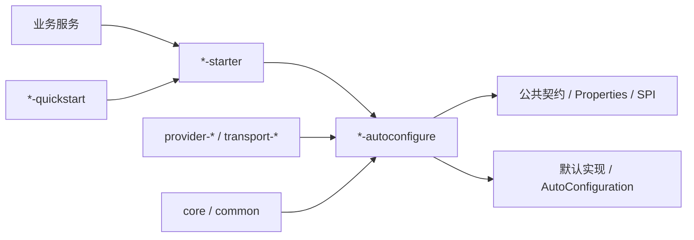

# Peach Cloud Starter 结构规范

本文面向维护 `peach-component` 与 `peach-middleware` 的开发者，说明 Starter 家族为什么统一为 `autoconfigure + starter + quickstart`，以及额外模块何时应该保留。

## 1. 目标

Starter 家族需要同时解决三个不同问题：框架如何装配、业务如何依赖、开发者如何快速验证。把三者混在一个模块会造成依赖污染、示例代码进入生产 classpath、README 与实现边界模糊。

## 2. 三层职责

| 模块 | 负责 | 不负责 |
| --- | --- | --- |
| `*-autoconfigure` | 配置绑定、条件装配、公共契约、默认 Bean、SPI/Provider 装配、metadata | demo、业务启动类、生产部署配置 |
| `*-starter` | 最小依赖聚合和对外接入入口 | 复杂业务逻辑、复制默认实现、示例代码 |
| `*-quickstart` | 可运行的最小集成样例、必要配置、典型覆盖方式 | 被生产模块依赖、真实 secret、完整生产部署 |

## 3. 额外模块

`core`、`common`、`provider-*`、`transport-*` 只有满足至少一个条件时保留：

- 被两个及以上实现共享且有稳定公共契约。
- 需要隔离可选第三方 SDK，避免无关应用承担依赖。
- 具有独立资源生命周期或可替换 Provider/Transport 职责。
- 可以被单独测试、版本治理或在未来提供替代实现。

仅为了目录对称、文件数量或“以后可能用到”不得新增空聚合模块。

## 4. Quickstart 原则

Quickstart 是可执行文档，不是第二套业务系统。

- 只依赖目标 Starter 和完成启动所需的最小 Spring Boot 依赖。
- 使用独立 `@SpringBootApplication` 入口。
- 真实 Redis、Mongo、SMTP、MQ 等外部依赖由本地环境变量/配置提供，不提交凭据。
- 示例必须与当前公共 API 对齐；高级场景进入家族 README 或 `docs/`。
- 非业务 Starter 禁止使用 `example` / `*-example` 命名。

## 5. 文档职责

Starter 家族根目录的 `README.md` 是中文主入口，`README.en-US.md` 是英文等价入口。README 说明定位、模块关系、最小依赖、关键边界和 Quickstart；复杂设计、完整 Reference、迁移和排障按实际复杂度进入 `docs/`。

不要求 `autoconfigure` 和 `starter` 各复制一份 README。只有子模块存在独立使用方式或独立维护者心智模型时才增加子模块文档。

## 6. 结构门禁

仓库级门禁会验证：

- 每个 `*-starter` 都存在同前缀 `*-autoconfigure` 与 `*-quickstart`。
- Quickstart POM 依赖对应 Starter。
- Starter 家族存在中英文主 README。
- `peach-component` / `peach-middleware` 不出现新的 `example` 模块。

具体执行入口只由根 `AGENTS.md` 维护，避免 Rules、Skills 和文档重复绑定脚本名称。
