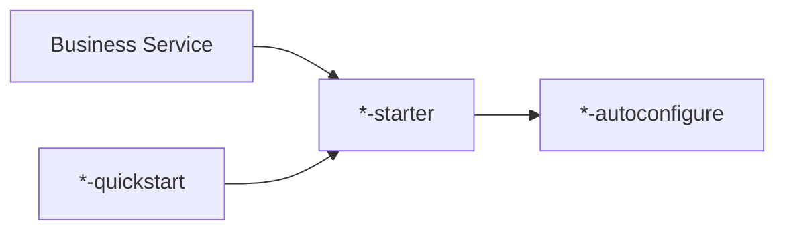

# peach-component

English | [中文](README.md)

`peach-component` aggregates reusable, business-neutral components shared across Peach Cloud services. Business services normally depend only on the corresponding `*-starter`; implementation and auto-configuration stay in `*-autoconfigure`, while runnable integration samples live in `*-quickstart`.

## Standard Structure



See [`../docs/starter-architecture.md`](../docs/starter-architecture.md) for the complete convention.

## Component Navigation

| Component | Responsibility | Quickstart |
| --- | --- | --- |
| [`peach-captcha`](peach-captcha/README.en-US.md) | Captcha generation, cache, validation and throttling | `peach-captcha-quickstart` |
| [`peach-code`](peach-code/README.en-US.md) | Code-generation foundations | `peach-code-quickstart` |
| [`peach-email`](peach-email/README.en-US.md) | SMTP, providers, templates, retry and idempotency | `peach-email-quickstart` |
| [`peach-initialize`](peach-initialize/README.en-US.md) | Application initialization orchestration | `peach-initialize-quickstart` |
| [`peach-observability`](peach-observability/README.en-US.md) | Metrics, tracing, RequestId and OTLP integration | `peach-observability-quickstart` |
| [`peach-scheduler`](peach-scheduler/README.en-US.md) | Scheduler execution SDK, providers and transports | `peach-scheduler-quickstart` |
| [`peach-storage`](peach-storage/README.en-US.md) | Unified storage contracts, providers, direct and multipart upload | `peach-store-quickstart` |
| [`peach-threadpool`](peach-threadpool/README.en-US.md) | Legacy platform-thread-pool compatibility | `peach-threadpool-quickstart` |
| [`peach-virtual-thread`](peach-virtual-thread/README.en-US.md) | Java 21 virtual-thread groups, backpressure, cancellation and lifecycle | `peach-virtual-thread-quickstart` |

`peach-threadpool` remains for compatibility only. New blocking-I/O asynchronous work should prefer `peach-virtual-thread`.

## Development Convention

- `autoconfigure` contains properties, public contracts, defaults and extension assembly; no demos.
- `starter` is a minimal dependency aggregator and contains no complex implementation.
- `quickstart` depends on the starter, provides a minimal runnable verification path and is never a production dependency.
- Extra `core/common/provider/transport` modules require a real independent responsibility.
- A new starter capability must also provide a matching autoconfigure module, quickstart and bilingual family README.

## Build

```bash
mvn -pl peach-component -am test -Pdevelopment
```

Use each component README as the source for dependencies, configuration, APIs and production boundaries.
