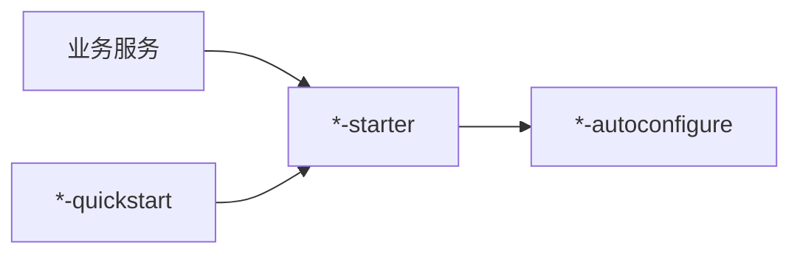

# peach-component

[English](README.en-US.md) | 中文

`peach-component` 聚合与业务域无关、可被多个服务复用的通用组件。业务服务通常只依赖对应 `*-starter`，实现和自动装配保留在 `*-autoconfigure`，可运行接入样例统一放入 `*-quickstart`。

## 统一结构



完整结构约束见 [`../docs/starter-architecture.md`](../docs/starter-architecture.md)。

## 组件导航

| 组件 | 主要职责 | Quickstart |
| --- | --- | --- |
| [`peach-captcha`](peach-captcha/README.md) | 验证码生成、缓存、校验与频控 | `peach-captcha-quickstart` |
| [`peach-code`](peach-code/README.md) | 代码生成基础能力 | `peach-code-quickstart` |
| [`peach-email`](peach-email/README.md) | SMTP、Provider、模板、重试与幂等 | `peach-email-quickstart` |
| [`peach-initialize`](peach-initialize/README.md) | 应用初始化处理器编排 | `peach-initialize-quickstart` |
| [`peach-observability`](peach-observability/README.md) | Metrics、Trace、RequestId 与 OTLP 接入 | `peach-observability-quickstart` |
| [`peach-scheduler`](peach-scheduler/README.md) | 调度执行侧 SDK、Provider 与 Transport | `peach-scheduler-quickstart` |
| [`peach-storage`](peach-storage/README.md) | 统一存储契约、Provider、直传与分片 | `peach-store-quickstart` |
| [`peach-threadpool`](peach-threadpool/README.md) | 存量平台线程池兼容能力 | `peach-threadpool-quickstart` |
| [`peach-virtual-thread`](peach-virtual-thread/README.md) | Java 21 虚拟线程分组、背压、取消与生命周期 | `peach-virtual-thread-quickstart` |

`peach-threadpool` 仅用于兼容历史调用，新建阻塞 IO 异步任务优先使用 `peach-virtual-thread`。

## 开发约定

- `autoconfigure` 承载配置、公共契约、默认实现和扩展装配，不放 demo。
- `starter` 只做最小依赖聚合，不放复杂实现。
- `quickstart` 依赖 starter，用于最小可运行验证，不被生产模块依赖。
- 额外 `core/common/provider/transport` 必须有真实独立职责。
- 新组件若引入 Starter，必须同时提供匹配的 autoconfigure、quickstart 和中英文家族 README。

## 构建

```bash
mvn -pl peach-component -am test -Pdevelopment
```

具体依赖、配置、API 和生产边界以各组件 README 为准。
