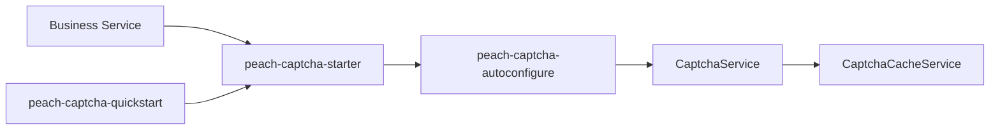

# peach-captcha

English | [中文](README.md)

`peach-captcha` provides captcha generation, caching, validation and throttling extension points. Business modules depend only on `peach-captcha-starter`.

## Structure

| Module | Responsibility |
| --- | --- |
| `peach-captcha-autoconfigure` | `CaptchaService`, cache/providers, configuration and auto-configuration |
| `peach-captcha-starter` | Business integration dependency entry point |
| `peach-captcha-quickstart` | Minimal runnable integration verification |



## Integration

```xml
<dependency>
    <groupId>com.peach</groupId>
    <artifactId>peach-captcha-starter</artifactId>
</dependency>
```

The public entry is the auto-configured `CaptchaService`:

- `get(CaptchaVO)`: generate a captcha
- `check(CaptchaVO)`: frontend first-pass validation
- `verification(CaptchaVO)`: backend second-pass validation; the token is single-use

Defaults are `peach.captcha.cache-type=MEMORY` and `peach.captcha.service-type=BLOCKPUZZLE`. Shared cache in a cluster requires `REDIS` plus your own Redis setup.

## Quick Start

The example lives in [`peach-captcha-quickstart`](./peach-captcha-quickstart/). It is non-web and only verifies minimal starter integration. Production modules must not depend on it.

| Item | Detail |
| --- | --- |
| Capability samples (inject `CaptchaService`) | **Generate**: `get` returns a token and image; **Pass**: `check` then `verification`; **Reject**: wrong answer, expired cache / missing token → `API_CAPTCHA_INVALID` |
| Runner | `CaptchaDemoRunner`; disable with `quickstart.captcha.demo.enabled=false` |
| Minimal config | `peach.captcha.cache-type=MEMORY`, `peach.captcha.service-type=TEXT`, `peach.captcha.req-frequency-limit-enable=0` |
| Prerequisites | No Redis |

```bash
mvn -f peach-component/peach-captcha/peach-captcha-quickstart/pom.xml spring-boot:run
mvn -f peach-component/peach-captcha/peach-captcha-quickstart/pom.xml test
```

## Boundaries

- Captcha does not replace login risk control, account lockout or device identification.
- Cluster deployments require cache semantics shared across instances; in-memory cache is not a production shared-cache guarantee.
- Never log plaintext captcha values, cache credentials or user-sensitive data.
- Successful-validation deletion, failure counts and throttling follow current implementation/configuration, not historical README assumptions.
