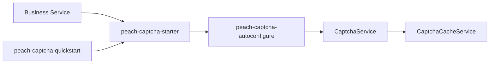

# peach-captcha

English | [中文](README.md)

`peach-captcha` provides captcha generation, caching, validation and throttling extension points. Business modules depend only on `peach-captcha-starter`.

## Structure

| Module | Responsibility |
| --- | --- |
| `peach-captcha-autoconfigure` | `CaptchaService`, cache/providers, configuration and auto-configuration |
| `peach-captcha-starter` | Business integration dependency entry point |
| `peach-captcha-quickstart` | Minimal runnable integration verification |



## Integration

```xml
<dependency>
    <groupId>com.peach</groupId>
    <artifactId>peach-captcha-starter</artifactId>
</dependency>
```

Quickstart: [`peach-captcha-quickstart`](peach-captcha-quickstart/README.en-US.md).

## Boundaries

- Captcha does not replace login risk control, account lockout or device identification.
- Cluster deployments require cache semantics shared across instances; in-memory cache is not a production shared-cache guarantee.
- Never log plaintext captcha values, cache credentials or user-sensitive data.
- Successful-validation deletion, failure counts and throttling follow current implementation/configuration, not historical README assumptions.
