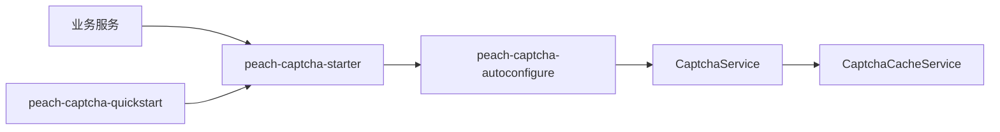

# peach-captcha

[English](README.en-US.md) | 中文

`peach-captcha` 提供验证码生成、缓存、校验和频控扩展。业务侧只依赖 `peach-captcha-starter`。

## 结构

| 模块 | 职责 |
| --- | --- |
| `peach-captcha-autoconfigure` | `CaptchaService`、缓存/Provider、配置和自动装配 |
| `peach-captcha-starter` | 业务接入依赖入口 |
| `peach-captcha-quickstart` | 最小可运行接入验证 |



## 接入

```xml
<dependency>
    <groupId>com.peach</groupId>
    <artifactId>peach-captcha-starter</artifactId>
</dependency>
```

公开入口是自动装配的 `CaptchaService`：

- `get(CaptchaVO)`：生成验证码
- `check(CaptchaVO)`：前端一次校验
- `verification(CaptchaVO)`：后端二次校验，令牌一次性失效

默认 `peach.captcha.cache-type=MEMORY`、`peach.captcha.service-type=BLOCKPUZZLE`。集群共享缓存需改为 `REDIS`，并自行接入 Redis。

## Quick Start

示例位于 [`peach-captcha-quickstart`](./peach-captcha-quickstart/)，无 Web 端口，只验证 starter 最小接入，不作为生产依赖。

| 项 | 说明 |
| --- | --- |
| 能力样例（注入 `CaptchaService`） | **生成**：`get` 返回 token 与图片；**成功校验**：`check` 后 `verification`；**失败路径**：错误答案、缓存过期/缺失 token 返回 `API_CAPTCHA_INVALID` |
| Runner | `CaptchaDemoRunner`；关闭演示：`quickstart.captcha.demo.enabled=false` |
| 最小配置 | `peach.captcha.cache-type=MEMORY`、`peach.captcha.service-type=TEXT`、`peach.captcha.req-frequency-limit-enable=0` |
| 前置 | 无需 Redis |

```bash
mvn -f peach-component/peach-captcha/peach-captcha-quickstart/pom.xml spring-boot:run
mvn -f peach-component/peach-captcha/peach-captcha-quickstart/pom.xml test
```

## 边界

- 验证码不替代登录风控、账号锁定和设备识别。
- 集群场景的缓存必须具备跨实例共享语义，不能把单机内存缓存描述为生产级共享能力。
- 不记录验证码明文、缓存凭据或用户敏感信息。
- 验证码成功后删除、失败次数和频控策略以当前实现与业务配置为准，不从历史 README 推断。
