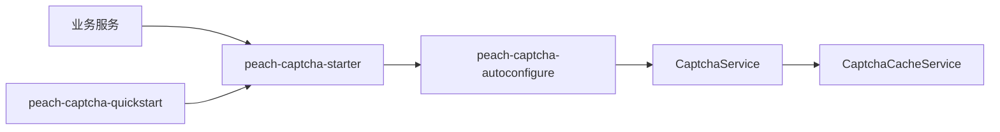

# peach-captcha

[English](README.en-US.md) | 中文

`peach-captcha` 提供验证码生成、缓存、校验和频控扩展。业务侧只依赖 `peach-captcha-starter`。

## 结构

| 模块 | 职责 |
| --- | --- |
| `peach-captcha-autoconfigure` | `CaptchaService`、缓存/Provider、配置和自动装配 |
| `peach-captcha-starter` | 业务接入依赖入口 |
| `peach-captcha-quickstart` | 最小可运行接入验证 |



## 接入

```xml
<dependency>
    <groupId>com.peach</groupId>
    <artifactId>peach-captcha-starter</artifactId>
</dependency>
```

Quickstart：[`peach-captcha-quickstart`](peach-captcha-quickstart/README.md)。

## 边界

- 验证码不替代登录风控、账号锁定和设备识别。
- 集群场景的缓存必须具备跨实例共享语义，不能把单机内存缓存描述为生产级共享能力。
- 不记录验证码明文、缓存凭据或用户敏感信息。
- 验证码成功后删除、失败次数和频控策略以当前实现与业务配置为准，不从历史 README 推断。
