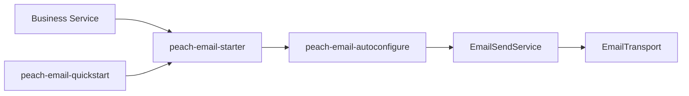

# peach-email

English | [中文](README.md)

`peach-email` standardizes mail models, SMTP transport, provider routing, templates, retry and idempotency extensions. Business modules integrate through `peach-email-starter`.

## Structure

| Module | Responsibility |
| --- | --- |
| `peach-email-autoconfigure` | Public APIs, SMTP/template/retry/idempotency implementations and auto-configuration |
| `peach-email-starter` | Business integration dependency entry point |
| `peach-email-quickstart` | Minimal bootstrap and provider-configuration verification |



## Integration

```xml
<dependency>
    <groupId>com.peach</groupId>
    <artifactId>peach-email-starter</artifactId>
</dependency>
```

Supply provider credentials through environment variables, configuration services or secret management.

### QuickStart

- Module: [`peach-email-quickstart`](./peach-email-quickstart/)
- Capability samples (inject `EmailSendService`; in-memory Mock `EmailTransport`, no outbound SMTP):
  - **Welcome mail**: `send(provider, message)` with plain-text fallback plus HTML
  - **Idempotent send**: `sendAuto` skips Transport on the second call with the same key
  - **Attachment**: `EmailMessage` carries an `Attachment` with byte content; the mock records the count
- `EmailDemoRunner` runs these on startup; disable with `quickstart.email.demo.enabled=false`
- Port: no REST (`web-application-type=none`)
- Run: `mvn -f peach-component/peach-email/peach-email-quickstart/pom.xml spring-boot:run`
- Test: `mvn -f peach-component/peach-email/peach-email-quickstart/pom.xml test`

Continue to supply SMTP credentials via environment variables or configuration services. The QuickStart stores no real credentials. Template rendering does not happen inside `sendAuto`; this sample sets HTML directly.

## Boundaries

- SMTP passwords/tokens, full recipient lists, bodies and attachments must not enter logs.
- Automated sending requires a stable business idempotency key; an in-memory `IdempotencyStore` is not a production multi-instance persistence guarantee.
- Retry only recoverable failures; do not blindly retry authentication, invalid addresses or invalid parameters.
- Provider failover must account for duplicate-send risk.
