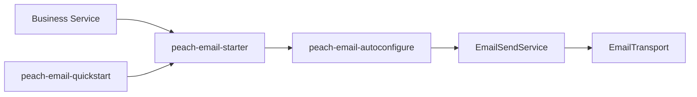

# peach-email

English | [中文](README.md)

`peach-email` standardizes mail models, SMTP transport, provider routing, templates, retry and idempotency extensions. Business modules integrate through `peach-email-starter`.

## Structure

| Module | Responsibility |
| --- | --- |
| `peach-email-autoconfigure` | Public APIs, SMTP/template/retry/idempotency implementations and auto-configuration |
| `peach-email-starter` | Business integration dependency entry point |
| `peach-email-quickstart` | Minimal bootstrap and provider-configuration verification |



## Integration

```xml
<dependency>
    <groupId>com.peach</groupId>
    <artifactId>peach-email-starter</artifactId>
</dependency>
```

Supply provider credentials through environment variables, configuration services or secret management. Quickstart: [`peach-email-quickstart`](peach-email-quickstart/README.en-US.md).

## Boundaries

- SMTP passwords/tokens, full recipient lists, bodies and attachments must not enter logs.
- Automated sending requires a stable business idempotency key; an in-memory `IdempotencyStore` is not a production multi-instance persistence guarantee.
- Retry only recoverable failures; do not blindly retry authentication, invalid addresses or invalid parameters.
- Provider failover must account for duplicate-send risk.
