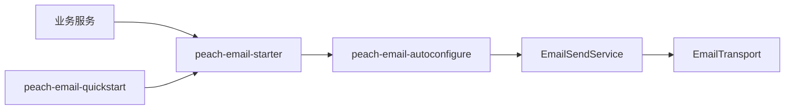

# peach-email

[English](README.en-US.md) | 中文

`peach-email` 统一封装邮件模型、SMTP 传输、Provider 路由、模板、重试和幂等扩展。业务模块通过 `peach-email-starter` 接入。

## 结构

| 模块 | 职责 |
| --- | --- |
| `peach-email-autoconfigure` | 公共 API、SMTP/模板/重试/幂等实现与自动装配 |
| `peach-email-starter` | 业务接入依赖入口 |
| `peach-email-quickstart` | 最小启动与 Provider 配置验证 |



## 接入

```xml
<dependency>
    <groupId>com.peach</groupId>
    <artifactId>peach-email-starter</artifactId>
</dependency>
```

Provider 凭据从环境变量、配置中心或密钥服务提供。

### QuickStart

- 模块：[`peach-email-quickstart`](./peach-email-quickstart/)
- 能力样例（注入 `EmailSendService`，默认内存 Mock `EmailTransport`，不外发）：
  - **欢迎邮件**：`send(provider, message)` 同时发送纯文本降级正文与 HTML
  - **幂等发送**：`sendAuto` 相同幂等键第二次调用不再走 Transport
  - **附件**：`EmailMessage` 携带带字节内容的 `Attachment`，Mock 记录附件数量
- 启动后 `EmailDemoRunner` 依次执行；关闭演示：`quickstart.email.demo.enabled=false`
- 端口：无 REST（`web-application-type=none`）
- 运行：`mvn -pl peach-component/peach-email/peach-email-quickstart -am spring-boot:run`
- 测试：`mvn -pl peach-component/peach-email/peach-email-quickstart -am test`

SMTP provider、用户名和授权码只通过环境变量或配置中心提供，QuickStart 不保存真实凭据。模板渲染不在 `sendAuto` 内自动发生，本样例直接设置 HTML。

## 边界

- SMTP 密码、授权码、完整收件人列表、正文和附件内容不得进入日志。
- 自动发送需要稳定业务幂等键；生产多实例不能把内存 `IdempotencyStore` 当作持久化保证。
- 重试仅覆盖可恢复故障；认证失败、地址无效和参数错误不盲目重试。
- Provider 故障转移必须评估重复发送风险。
