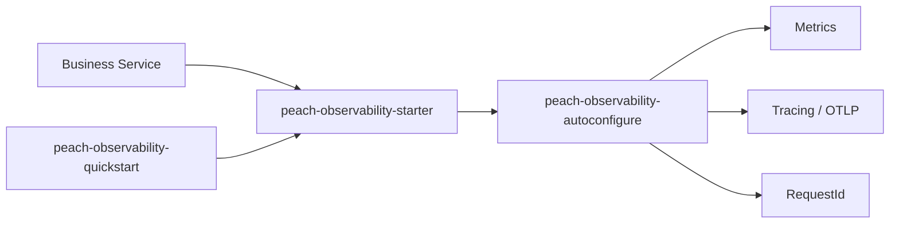

# peach-observability

English | [中文](README.md)

`peach-observability` is Peach Cloud's shared observability integration for Actuator/Prometheus, Micrometer Tracing, OpenTelemetry OTLP and Servlet RequestId correlation.

## Structure

| Module | Responsibility |
| --- | --- |
| `peach-observability-autoconfigure` | Properties, RequestId contracts, conditional auto-configuration and Servlet integration |
| `peach-observability-starter` | Business integration dependency entry point |
| `peach-observability-quickstart` | Minimal Servlet integration verification |



Business dependency:

```xml
<dependency><groupId>com.peach</groupId><artifactId>peach-observability-starter</artifactId></dependency>
```

Quickstart: [`peach-observability-quickstart`](peach-observability-quickstart/README.en-US.md).

## Boundaries

- The component does not deploy Prometheus, Grafana, Loki, Tempo or a Collector.
- Actuator exposure is an application/network security decision; sensitive endpoints must not be public by default.
- `requestId`, `traceId` and `spanId` have different responsibilities and must not be conflated.
- Micrometer/OTLP behavior uses Spring Boot `management.*`; Peach properties cover project-specific extensions only.
