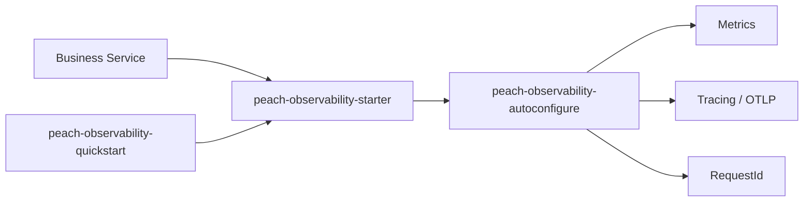

# peach-observability

English | [中文](README.md)

`peach-observability` is Peach Cloud's shared observability integration for Actuator/Prometheus, Micrometer Tracing, OpenTelemetry OTLP and Servlet RequestId correlation.

## Structure

| Module | Responsibility |
| --- | --- |
| `peach-observability-autoconfigure` | Properties, RequestId contracts, conditional auto-configuration and Servlet integration |
| `peach-observability-starter` | Business integration dependency entry point |
| `peach-observability-quickstart` | Minimal Servlet integration verification |



Business dependency:

```xml
<dependency>
    <groupId>com.peach</groupId>
    <artifactId>peach-observability-starter</artifactId>
</dependency>
```

Peach public APIs are `RequestIdResolver` / `RequestIdGenerator` and the Servlet `RequestIdServletFilter`. Metrics, traces and OTLP export come from Actuator, Micrometer and OpenTelemetry auto-configuration pulled in by the starter, using `management.*`.

## Quick Start

The example lives in [`peach-observability-quickstart`](./peach-observability-quickstart/) on fixed port `18086`. It verifies the smallest starter integration and is not a production dependency.

| Item | Detail |
| --- | --- |
| Capability samples | **RequestIdResolver**: reuse a valid upstream ID, generate a new one when the value is invalid or blank; **Servlet filter**: `GET /demo/ping` echoes `X-Request-Id` and writes MDC; **Custom metric**: increment a `MeterRegistry` Counter; **Local span**: open/close a `Tracer` span (noop when sampling is off) |
| Runner | `ObservabilityDemoRunner`; disable with `quickstart.observability.demo.enabled=false` |
| Minimal config | `peach.observability.enabled=true`, `peach.observability.request-id.*`; metrics/tracing use `management.*` |
| Prerequisites | No external Collector; OTLP sampling is off by default |
| Port | `18086` |

```bash
mvn -f peach-component/peach-observability/peach-observability-quickstart/pom.xml spring-boot:run
mvn -f peach-component/peach-observability/peach-observability-quickstart/pom.xml test
```

## Boundaries

- The component does not deploy Prometheus, Grafana, Loki, Tempo or a Collector.
- Actuator exposure is an application/network security decision; sensitive endpoints must not be public by default.
- `requestId`, `traceId` and `spanId` have different responsibilities and must not be conflated.
- Micrometer/OTLP behavior uses Spring Boot `management.*`; Peach properties cover project-specific extensions only.
- RocketMQ trace propagation is assembled only when `MqTraceContextPropagator` and Micrometer Tracing are both present; this quickstart does not add RocketMQ.
