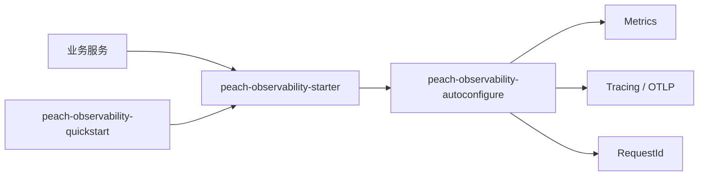

# peach-observability

[English](README.en-US.md) | 中文

`peach-observability` 是 Peach Cloud 的统一可观测性接入组件，封装 Actuator/Prometheus、Micrometer Tracing、OpenTelemetry OTLP 和 Servlet RequestId 关联能力。

## 结构

| 模块 | 职责 |
| --- | --- |
| `peach-observability-autoconfigure` | Properties、RequestId 契约、条件自动配置与 Servlet 集成 |
| `peach-observability-starter` | 业务接入依赖入口 |
| `peach-observability-quickstart` | 最小 Servlet 接入验证 |



业务服务依赖：

```xml
<dependency>
    <groupId>com.peach</groupId>
    <artifactId>peach-observability-starter</artifactId>
</dependency>
```

Peach 公开入口是 `RequestIdResolver` / `RequestIdGenerator` 与 Servlet `RequestIdServletFilter`。指标、Trace 和 OTLP 导出由 starter 引入的 Actuator、Micrometer 与 OpenTelemetry 官方自动配置负责，使用 `management.*`。

## Quick Start

示例位于 [`peach-observability-quickstart`](./peach-observability-quickstart/)，固定端口 `18086`，验证 starter 最小接入，不作为生产依赖。

| 项 | 说明 |
| --- | --- |
| 能力样例 | **RequestIdResolver**：信任合法上游 ID，非法/空值时生成新 ID；**Servlet 过滤器**：`GET /demo/ping` 回写 `X-Request-Id` 并写入 MDC；**自定义指标**：`MeterRegistry` Counter 递增；**本地 Span**：`Tracer` 开闭（采样关闭时为 noop） |
| Runner | `ObservabilityDemoRunner`；关闭演示：`quickstart.observability.demo.enabled=false` |
| 最小配置 | `peach.observability.enabled=true`、`peach.observability.request-id.*`；指标/链路用 `management.*` |
| 前置 | 无外部 Collector；OTLP 采样默认关闭 |
| 端口 | `18086` |

```bash
mvn -pl peach-component/peach-observability/peach-observability-quickstart -am spring-boot:run
mvn -pl peach-component/peach-observability/peach-observability-quickstart -am test
```

## 边界

- 组件不部署 Prometheus、Grafana、Loki、Tempo 或 Collector。
- Actuator 端点暴露由应用和网络安全策略决定，敏感端点不得直接公开。
- `requestId`、`traceId`、`spanId` 职责不同，不应混用。
- Micrometer/OTLP 使用 Spring Boot `management.*` 配置；Peach 配置只承担项目自身扩展。
- RocketMQ 链路传播仅在 `MqTraceContextPropagator` 与 Micrometer Tracing 同时存在时装配，quickstart 不引入 RocketMQ。
