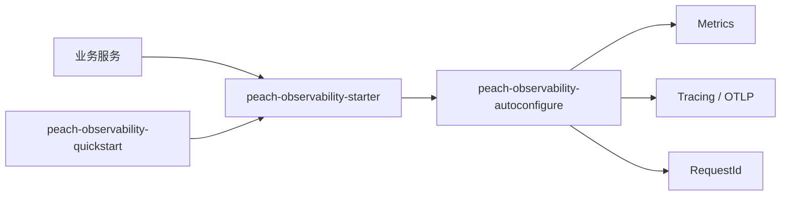

# peach-observability

[English](README.en-US.md) | 中文

`peach-observability` 是 Peach Cloud 的统一可观测性接入组件，封装 Actuator/Prometheus、Micrometer Tracing、OpenTelemetry OTLP 和 Servlet RequestId 关联能力。

## 结构

| 模块 | 职责 |
| --- | --- |
| `peach-observability-autoconfigure` | Properties、RequestId 契约、条件自动配置与 Servlet 集成 |
| `peach-observability-starter` | 业务接入依赖入口 |
| `peach-observability-quickstart` | 最小 Servlet 接入验证 |



业务服务依赖：

```xml
<dependency><groupId>com.peach</groupId><artifactId>peach-observability-starter</artifactId></dependency>
```

### QuickStart

示例代码位于 [`peach-observability-quickstart`](./peach-observability-quickstart/)，用于验证 Servlet 应用中的 Actuator/Micrometer 依赖和 RequestId 自动配置链路：

```bash
mvn -f peach-component/peach-observability/peach-observability-quickstart/pom.xml spring-boot:run -Pdevelopment
```

## 边界

- 组件不部署 Prometheus、Grafana、Loki、Tempo 或 Collector。
- Actuator 端点暴露由应用和网络安全策略决定，敏感端点不得直接公开。
- `requestId`、`traceId`、`spanId` 职责不同，不应混用。
- Micrometer/OTLP 使用 Spring Boot `management.*` 配置；Peach 配置只承担项目自身扩展。
