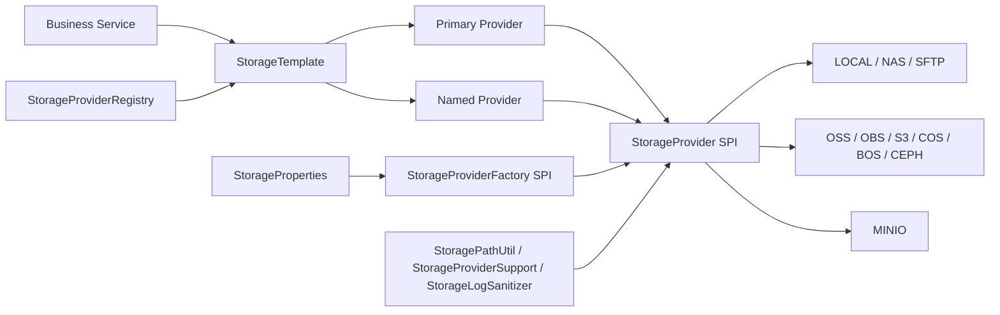
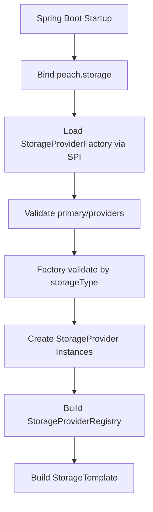
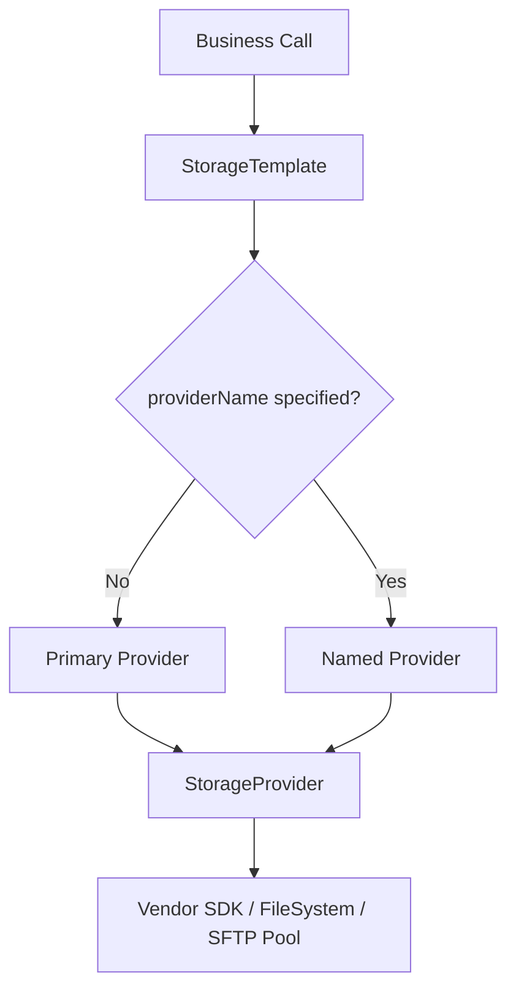
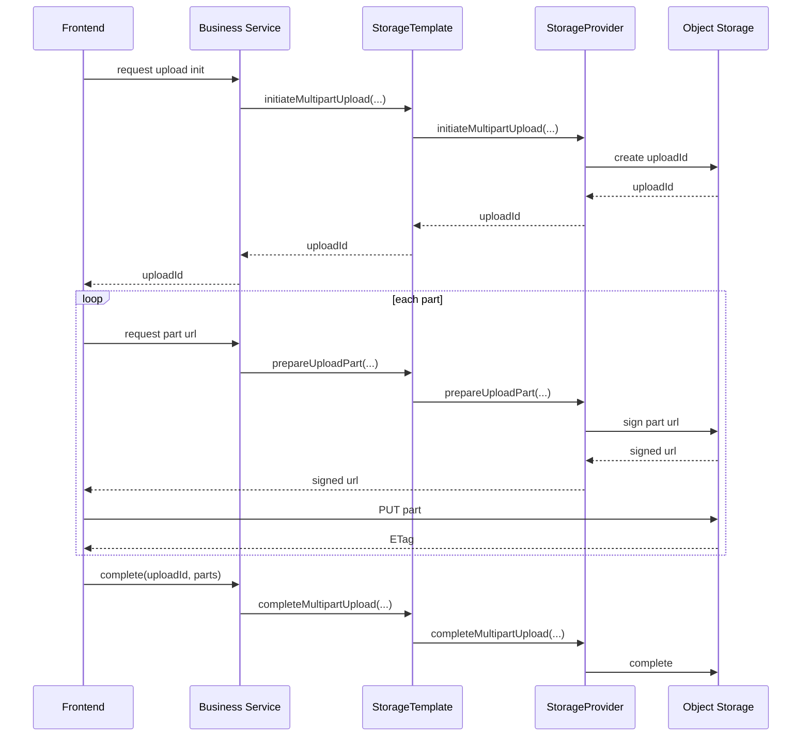

# peach-storage

[`中文`](./README.md) | [`English`](./README.en-US.md)

> A Spring Boot storage starter that provides a unified `StorageTemplate` API for upload, download, delete, list, head, copy, move, batch delete, presigned URLs, frontend direct upload, and multipart upload across local files, remote NAS, SFTP, object storage, and S3-compatible systems.

---

## 1. Overview

`peach-storage` addresses one core problem: storage integration should not leak provider-specific SDK details into business code.

In real projects, development may use local files, test may use MinIO, and production may use OSS, OBS, S3, COS, BOS, Ceph, SFTP, or remote NAS. Those systems differ in authentication, pagination, URL semantics, path handling, and advanced capabilities. If business services call vendor SDKs directly, switching providers and enforcing operational rules becomes expensive.

This starter is designed to centralize that complexity:

- Business code uses `StorageTemplate`.
- Startup validation fails fast through `StorageProviderFactory`.
- Runtime behavior is isolated in `StorageProvider`.
- Provider-specific differences are exposed through `StorageCapability`.
- Routing, lifecycle cleanup, and log sanitization are handled by the framework.

## 2. Problems Solved

| Problem | Without a unified module | How this project solves it |
| --- | --- | --- |
| Multi-cloud switching | Vendor SDK calls spread across business code | All business code goes through `StorageTemplate` |
| Multi-instance routing | Each team re-implements default/archive/temp routing | `primary + providers` routing model |
| Path safety | Local and remote paths may escape intended roots | `StoragePathUtil` rejects `..` |
| Copy/move semantics | Business code may assume atomic or transactional behavior | Unified semantics and documented boundaries |
| Frontend direct upload | Each cloud requires custom API and frontend logic | Unified request/response model |
| Sensitive logging | Keys and signatures may leak in logs | `StorageLogSanitizer` masks sensitive values |
| Resource lifecycle | SDK clients and connection pools may leak | `StorageProviderRegistry` closes providers uniformly |

## 3. Design Principles

From an architecture perspective, this module follows a clear pattern: unified entrypoint, SPI-based extension, explicit capability discovery, and secure defaults.

| Principle | Meaning |
| --- | --- |
| Single business entrypoint | Business code depends on `StorageTemplate` |
| Centralized startup validation | `StorageProviderFactory` owns provider-specific config validation |
| Runtime behavior isolation | Each provider only handles its own execution logic |
| Explicit capability model | Advanced features are discovered through `StorageCapability` |
| Least surprise defaults | `copy`, `move`, and `batchDelete` have shared default behavior |
| Explicit safety boundaries | Path, logging, URL, delete, and frontend-upload rules are documented |
| Non-invasive extensibility | New providers are added through Java SPI |

## 4. Architecture

This diagram shows the main internal layers and responsibilities.



### 4.1 Core Types

| Type | Responsibility |
| --- | --- |
| `StorageTemplate` | Business entrypoint and provider routing |
| `StorageProvider` | Runtime SPI for upload, download, delete, list, copy, move, multipart, and more |
| `StorageProviderFactory` | Startup SPI for `storageType()`, `validate()`, and `create()` |
| `StorageProviderRegistry` | Provider registration, lookup, and lifecycle cleanup |
| `StorageProviderSupport` | Shared logic not suitable for interface default methods |
| `FileSystemStorageSupport` | Shared LOCAL filesystem behavior |
| `SftpStorageSupport` | Connection pooling and remote file operations for NAS/SFTP |

### 4.2 Startup Flow

This diagram shows how providers are validated and created during startup.



### 4.3 Runtime Request Flow

This diagram shows how a normal business request is routed.



## 5. Built-in Capabilities

### 5.1 Storage Types

| Type | Description | Implementation |
| --- | --- | --- |
| `LOCAL` | Local filesystem storage | Native filesystem |
| `NAS` | Remote NAS | Pooled SFTP, not inherited from LOCAL |
| `SFTP` | Standard SFTP | JSch + commons-pool2 |
| `OSS` | Alibaba Cloud OSS | Alibaba OSS SDK |
| `OBS` | Huawei Cloud OBS | Huawei OBS SDK |
| `S3` | AWS S3 | AWS SDK |
| `MINIO` | MinIO | Native MinIO Java SDK |
| `COS` | Tencent Cloud COS | Tencent COS SDK |
| `BOS` | Baidu BOS | Baidu SDK |
| `CEPH` | Ceph RGW | S3-compatible protocol |

### 5.2 Capability Matrix

| Provider | Upload | Download | Head | List | Copy | Move | BatchDelete | PresignedGet | FrontendToken | Multipart |
| --- | --- | --- | --- | --- | --- | --- | --- | --- | --- | --- |
| `LOCAL` | Yes | Yes | Yes | Yes | Yes | Yes | Yes | Degraded | No | No |
| `NAS` | Yes | Yes | Yes | Yes | Yes | Yes | Yes | Degraded | No | No |
| `SFTP` | Yes | Yes | Yes | Yes | Yes | Yes | Yes | Degraded | No | No |
| `OSS` | Yes | Yes | Yes | Yes | Yes | Yes | Yes | Yes | Yes | Yes |
| `OBS` | Yes | Yes | Yes | Yes | Yes | Yes | Yes | Yes | No | Yes |
| `S3` | Yes | Yes | Yes | Yes | Yes | Yes | Yes | Yes | No | Yes |
| `MINIO` | Yes | Yes | Yes | Yes | Yes | Yes | Yes | Yes | Yes | Yes |
| `COS` | Yes | Yes | Yes | Yes | Yes | Yes | Yes | Yes | No | Yes |
| `BOS` | Yes | Yes | Yes | Yes | Yes | Yes | Yes | Yes | No | Yes |
| `CEPH` | Yes | Yes | Yes | Yes | Yes | Yes | Yes | Yes | No | Yes |

Notes:

- `Degraded` means the unified API exists, but the returned URL is not a real permission-controlled signed URL.
- Advanced features should be checked through `StorageCapability` at runtime.

## 6. Project Structure

```text
peach-storage/
├── peach-store-core/       Core abstractions, providers, factories, utilities, auto configuration
├── peach-store-starter/    Starter entrypoint
├── peach-store-example/    Example application
├── pom.xml                 Parent Maven project
├── README.md               Chinese documentation
└── README.en-US.md         English documentation
```

## 7. Quick Start

### 7.1 Requirements

- JDK 8+
- Maven 3.6+
- A Spring Boot application

### 7.2 Dependency

```xml
<dependency>
    <groupId>com.peach</groupId>
    <artifactId>peach-store-starter</artifactId>
    <version>0.0.1-SNAPSHOT</version>
</dependency>
```

### 7.3 Minimal Configuration

```yaml
peach:
  storage:
    enabled: true
    primary: local
    providers:
      local:
        type: LOCAL
        bucket-name: app-local
        root-path: D:/data/peach-storage
        prefix: prod/app-a
        domain: http://localhost/files
```

### 7.4 Business Usage

```java
UploadResult uploadResult = storageTemplate.upload(UploadObjectRequest.builder()
        .objectKey("docs/readme.txt")
        .content(UploadContent.of("hello peach storage"))
        .contentType(StorageContentType.TEXT_PLAIN_UTF8)
        .build());

ObjectInfo objectInfo = storageTemplate.head(HeadObjectRequest.builder()
        .objectKey("docs/readme.txt")
        .build());

try (InputStream inputStream = storageTemplate.download(DownloadObjectRequest.builder()
        .objectKey("docs/readme.txt")
        .build())) {
    // read inputStream
}
```

### 7.5 Named Provider Usage

```java
storageTemplate.upload("archive", uploadRequest);
storageTemplate.download("archive", downloadRequest);
storageTemplate.batchDelete("archive", batchDeleteRequest);
```

## 8. Configuration

### 8.1 Root Properties

Prefix: `peach.storage`

| Field | Type | Default | Description |
| --- | --- | --- | --- |
| `enabled` | boolean | `true` | Whether auto configuration is enabled |
| `primary` | string | none | Default provider name |
| `providers` | map | empty | Named provider definitions |

### 8.2 Common Provider Fields

| Field | Description |
| --- | --- |
| `name` | Provider instance name, usually omitted because the map key is used |
| `type` | Storage type |
| `bucket-name` | Real bucket for object storage; logical alias for `LOCAL`/`NAS`/`SFTP`, optional and defaults to provider name |
| `prefix` | Unified object key prefix |
| `endpoint` | Object storage endpoint or NAS/SFTP address |
| `region` | Region; common for S3/COS/CEPH |
| `access-key` | Object storage access key; username for NAS/SFTP |
| `secret-key` | Object storage secret key; password for NAS/SFTP |
| `root-path` | Local root directory or remote NAS/SFTP root |
| `domain` | Public access domain |
| `path-style-access` | Common for S3/MinIO/Ceph |
| `public-read` | Whether upload should try to apply public-read access policy |
| `extra-properties` | Provider-specific extensions |

### 8.3 NAS / SFTP

NAS is treated as remote NAS and accessed through SFTP.

```yaml
peach:
  storage:
    primary: nas
    providers:
      nas:
        type: NAS
        bucket-name: app-nas
        endpoint: sftp://nas.example.com:22
        access-key: ${NAS_USERNAME}
        secret-key: ${NAS_PASSWORD}
        root-path: /data/peach-storage
        prefix: prod/app-a
        extra-properties:
          maxTotal: "16"
          maxIdle: "8"
          minIdle: "1"
          maxWaitMillis: "10000"
          sessionTimeoutMillis: "30000"
          channelTimeoutMillis: "30000"
          strictHostKeyChecking: "no"
```

SFTP private-key authentication:

```yaml
peach:
  storage:
    primary: sftp
    providers:
      sftp:
        type: SFTP
        bucket-name: app-sftp
        endpoint: sftp://sftp.example.com:22
        access-key: ${SFTP_USERNAME}
        root-path: /upload/app-a
        extra-properties:
          privateKeyPath: ${SFTP_PRIVATE_KEY_PATH}
          privateKeyPassphrase: ${SFTP_PRIVATE_KEY_PASSPHRASE}
```

### 8.4 OSS / S3 / Ceph / MinIO

OSS:

```yaml
peach:
  storage:
    primary: oss
    providers:
      oss:
        type: OSS
        bucket-name: my-oss-bucket
        endpoint: https://oss-cn-hangzhou.aliyuncs.com
        access-key: ${OSS_ACCESS_KEY}
        secret-key: ${OSS_SECRET_KEY}
        prefix: prod/app-a
        domain: https://static.example.com
```

MinIO:

```yaml
peach:
  storage:
    primary: minio
    providers:
      minio:
        type: MINIO
        bucket-name: my-bucket
        endpoint: http://minio.example.com:9000
        region: us-east-1
        access-key: ${MINIO_ACCESS_KEY}
        secret-key: ${MINIO_SECRET_KEY}
        path-style-access: true
```

### 8.5 Multiple Providers

```yaml
peach:
  storage:
    enabled: true
    primary: oss
    providers:
      oss:
        type: OSS
        bucket-name: prod-bucket
        endpoint: https://oss-cn-hangzhou.aliyuncs.com
        access-key: ${OSS_ACCESS_KEY}
        secret-key: ${OSS_SECRET_KEY}
      archive:
        type: MINIO
        bucket-name: archive-bucket
        endpoint: http://minio.example.com:9000
        access-key: ${MINIO_ACCESS_KEY}
        secret-key: ${MINIO_SECRET_KEY}
```

## 9. Operation Semantics and Safety Boundaries

### 9.1 objectKey, prefix, and bucket

| Semantic | Rule |
| --- | --- |
| `objectKey` | A business-level object identifier, not a local absolute path |
| Separator | Always `/` |
| Escape prevention | `..` is rejected |
| `prefix` | Applied automatically by the provider |
| `bucketName` | May override the default bucket for object storage; for `LOCAL`/`NAS`/`SFTP` it must be empty or equal to the provider alias |

### 9.2 copy, move, and batchDelete

| Operation | Boundary |
| --- | --- |
| `copy` | May be implemented as download then upload unless overridden |
| `move` | Defaults to copy then delete and is not atomic |
| `batchDelete` | Defaults to iterative delete and is not transactional |
| Folder operations | Implemented through prefix or recursive listing, not real empty directories |

### 9.3 URLs and Access Control

| Scenario | Meaning |
| --- | --- |
| Object storage presigned URL | Real signed URL |
| `LOCAL` / `NAS` / `SFTP` | Degraded URL, not an access-control token |
| `domain` | Only affects public URL generation, not SDK endpoint resolution |

### 9.4 Safety Boundaries

| Boundary | Constraint |
| --- | --- |
| Credentials | Use environment variables, config centers, or secret managers |
| Logging | Do not output full keys, passphrases, upload tokens, or signed URLs |
| LOCAL path | Restricted to `root-path` |
| NAS/SFTP path | Restricted to the remote `root-path` |
| Delete | Batch deletes should only run on trusted key sets |
| Frontend upload | Tokens must expire, and frontend-returned values must not be blindly trusted |
| Large files | SFTP/NAS downloads currently buffer content in memory |

## 10. Frontend Upload and Multipart Design

This diagram shows the standard multipart collaboration flow.



Current support:

- `OSS` and `MINIO` support frontend direct-upload capabilities.
- `OSS`, `OBS`, `S3`, `MINIO`, `COS`, `BOS`, and `CEPH` support the unified multipart API.
- `MINIO` `prepareUploadPart(...)` returns presigned PUT URLs for browser or client-side part uploads.

## 11. Startup and Runtime Boundaries

### 11.1 Startup Validation

- `primary` is required.
- At least one provider must be configured.
- `primary` must match a configured provider.
- Each provider type must match exactly one `StorageProviderFactory`.
- Provider-specific required fields are validated by the factory.
- Required SDK dependencies must be present.

### 11.2 Provider vs Factory

| Role | Should own | Should not own |
| --- | --- | --- |
| `StorageProviderFactory` | Type binding, config validation, provider creation | Runtime read/write logic |
| `StorageProvider` | Upload, download, delete, list, signing, multipart, capabilities | Repeating the same required-field validation |
| `StorageTemplate` | Routing and business-facing convenience API | Vendor SDK details |

This is one of the most important stable boundaries in the current architecture.

## 12. Extending a New Provider

At minimum, a new provider should implement:

```java
public class CustomStorageProviderFactory implements StorageProviderFactory {

    @Override
    public StorageType storageType() {
        return StorageType.S3;
    }

    @Override
    public void validate(String name, StorageProperties.StorageProvider provider) {
        StorageValidationUtil.requireObjectStorageConfig(name, provider, true);
    }

    @Override
    public StorageProvider create(StorageProperties.StorageProvider provider) {
        return new CustomStorageProvider(provider);
    }
}
```

And register it in:

```text
META-INF/services/com.peach.storage.spi.StorageProviderFactory
```

Recommendations:

- Reuse `StorageProvider` defaults and `StorageProviderSupport` where possible.
- Implement `close()` if the provider owns SDK clients, thread pools, or connection pools.
- Declare advanced features explicitly in `capabilities()`.

## 13. What This Starter Does Not Promise

Architecturally, this starter should not imply the following guarantees:

- Distributed transactions across providers.
- Atomic `move`.
- Consistent empty-folder semantics.
- A universal frontend form-upload protocol across all object-storage vendors.
- Zero-copy streaming downloads for large NAS/SFTP files.

Those are explicit business-level tradeoffs and should remain explicit.

## 14. Troubleshooting

| Problem | Cause | Fix |
| --- | --- | --- |
| `primary` not found | `primary` does not match the provider key | Use the same value |
| Provider type not found | Wrong `type` or missing SPI registration | Check `META-INF/services` |
| SDK classes missing | Dependency excluded or version mismatch | Verify starter dependency transitively |
| objectKey rejected | Absolute path or `..` provided | Use only business-level keys |
| SFTP/NAS connection failure | Wrong endpoint, account, password, key, or root path | Verify with an external SFTP client first |
| Pool exhaustion | Too much concurrency or slow remote server | Tune `maxTotal` and `maxWaitMillis` |
| MinIO access failure | Wrong endpoint, bucket, certificate, or path-style setup | Check service and config |
| Frontend direct upload failure | Missing CORS or expired token | Check OSS CORS and token lifetime |
| Multipart complete failure | Missing ETag or wrong part number | Preserve ETags and submit them in order |
| Source object still exists after move | Delete stage failed | Add compensation logic based on result and logs |
| Garbled Chinese text | File or editor is not using UTF-8 | Use UTF-8 consistently |
