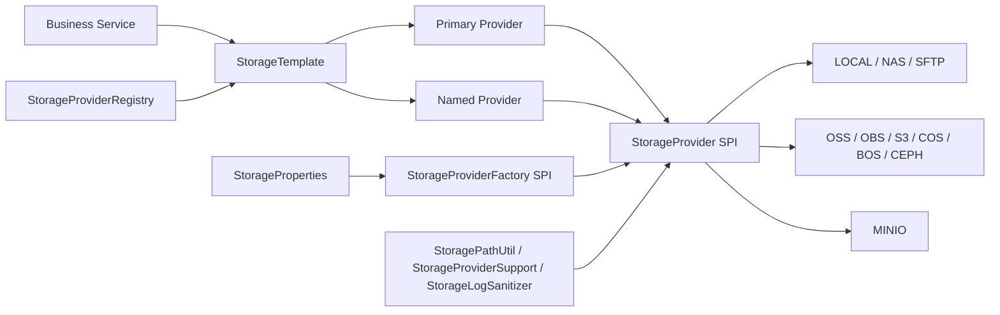
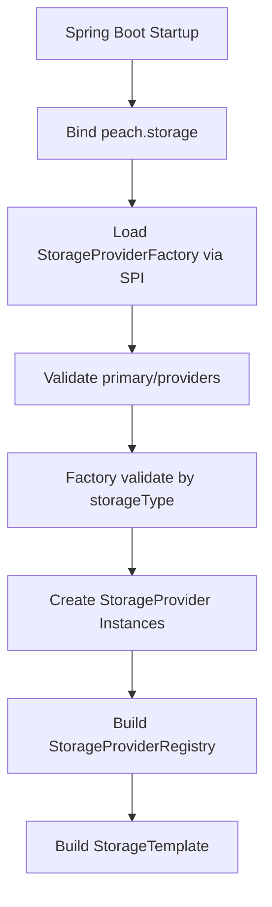
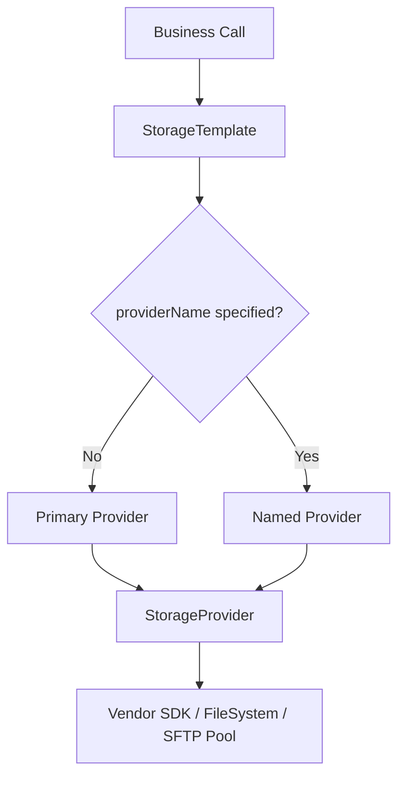
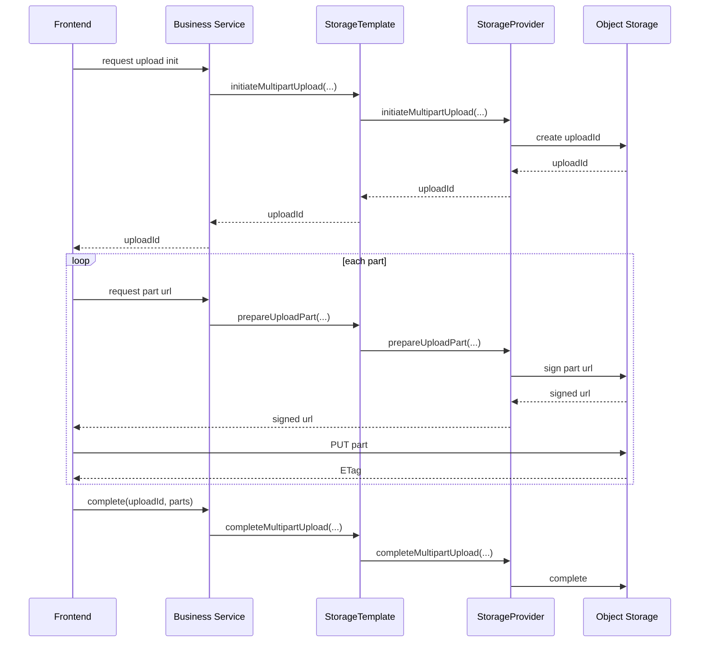

# peach-storage

[`中文`](./README.md) | [`English`](./README.en-US.md)

> 面向 Spring Boot 的统一存储 Starter。通过 `StorageTemplate` 提供上传、下载、删除、列表、元信息查询、复制、移动、批量删除、预签名 URL、前端直传和分片上传等能力，屏蔽本地磁盘、远程 NAS、SFTP、对象存储和 S3 兼容存储之间的接入差异。

---

## 一、概览

`peach-storage` 解决的是业务系统中文件存储接入不统一的问题。

常见场景里，开发环境可能使用本地磁盘，测试环境可能使用 MinIO，生产环境可能使用 OSS、OBS、S3、COS、BOS、Ceph、SFTP 或远程 NAS。不同存储的 SDK、鉴权方式、分页模型、URL 语义、路径边界和高级能力都不一致，业务代码如果直接依赖各厂商 SDK，后续替换、扩展和治理成本会持续升高。

这个 Starter 的目标很明确：

- 业务统一走 `StorageTemplate`，不直接依赖厂商 SDK。
- 启动期统一做配置校验，尽早失败。
- 运行期统一抽象对象语义、路径语义和能力模型。
- 不同 provider 的实现差异下沉到 `StorageProvider`。
- provider 的创建和校验下沉到 `StorageProviderFactory`。
- 路由、多实例、日志脱敏和资源关闭由框架负责。

## 二、解决的问题

| 问题 | 没有统一抽象时的结果 | 项目中的处理方式 |
| --- | --- | --- |
| 多云或多存储切换 | 业务代码散落 SDK 调用 | 统一走 `StorageTemplate` |
| 多实例路由 | 每个业务都要处理默认桶、归档桶、临时桶 | `primary + providers` 统一路由 |
| 路径安全 | 本地/远程路径容易越界 | `StoragePathUtil` 拒绝 `..` |
| 拷贝/移动语义不清 | 容易误认为原子或事务 | 统一语义并暴露边界 |
| 前端直传差异 | 前后端为每家云重新适配 | 统一请求响应模型 |
| 敏感信息泄露 | 日志可能输出密钥和签名 | `StorageLogSanitizer` 脱敏 |
| 生命周期分散 | 连接池、SDK client 容易泄漏 | `StorageProviderRegistry` 统一关闭 |

## 三、设计原则

从架构视角，这个模块采用的是“统一入口 + SPI 扩展 + 能力探测 + 安全默认值”的设计。

| 原则 | 说明 |
| --- | --- |
| 单一业务入口 | 业务只依赖 `StorageTemplate` |
| 启动期校验收口 | 配置合法性由 `StorageProviderFactory` 负责 |
| 运行期行为隔离 | provider 只负责自己怎么工作 |
| 能力显式声明 | 通过 `StorageCapability` 做运行期探测 |
| 默认行为最少惊讶 | `copy`、`move`、`batchDelete` 提供统一默认实现 |
| 安全边界明确 | 路径、日志、URL、删除、前端上传都有显式边界 |
| 扩展不侵入业务 | 新增 provider 通过 Java SPI 注册 |

## 四、架构设计

这张图表达模块内部的职责分层。



### 4.1 核心对象关系

| 对象 | 职责 |
| --- | --- |
| `StorageTemplate` | 业务入口，负责默认 provider 路由和命名 provider 路由 |
| `StorageProvider` | 运行期 SPI，定义上传、下载、删除、列表、复制、移动、分片等行为 |
| `StorageProviderFactory` | 启动期 SPI，定义 `storageType()`、`validate()`、`create()` |
| `StorageProviderRegistry` | 持有 provider 集合，负责注册、查找和关闭 |
| `StorageProviderSupport` | 不适合放进接口默认方法的通用辅助逻辑 |
| `FileSystemStorageSupport` | LOCAL 文件系统通用实现 |
| `SftpStorageSupport` | NAS/SFTP 的连接池和远程文件操作工具 |

### 4.2 启动流程

这张图表达应用启动时配置是如何被校验并创建 provider 的。



### 4.3 运行时调用流程

这张图表达一次普通存储请求的路由过程。



## 五、内置能力

### 5.1 存储类型

| 类型 | 说明 | 实现方式 |
| --- | --- | --- |
| `LOCAL` | 本机磁盘存储 | 本地文件系统 |
| `NAS` | 远程 NAS | 基于池化 SFTP，不继承 LOCAL |
| `SFTP` | 标准 SFTP | JSch + commons-pool2 |
| `OSS` | 阿里云 OSS | 阿里云 OSS SDK |
| `OBS` | 华为云 OBS | 华为云 OBS SDK |
| `S3` | AWS S3 | AWS SDK |
| `MINIO` | MinIO | MinIO 原生 Java SDK |
| `COS` | 腾讯云 COS | 腾讯云 SDK |
| `BOS` | 百度云 BOS | 百度云 SDK |
| `CEPH` | Ceph RGW | S3 兼容协议 |

### 5.2 能力矩阵

| Provider | Upload | Download | Head | List | Copy | Move | BatchDelete | PresignedGet | FrontendToken | Multipart |
| --- | --- | --- | --- | --- | --- | --- | --- | --- | --- | --- |
| `LOCAL` | Yes | Yes | Yes | Yes | Yes | Yes | Yes | Degraded | No | No |
| `NAS` | Yes | Yes | Yes | Yes | Yes | Yes | Yes | Degraded | No | No |
| `SFTP` | Yes | Yes | Yes | Yes | Yes | Yes | Yes | Degraded | No | No |
| `OSS` | Yes | Yes | Yes | Yes | Yes | Yes | Yes | Yes | Yes | Yes |
| `OBS` | Yes | Yes | Yes | Yes | Yes | Yes | Yes | Yes | No | Yes |
| `S3` | Yes | Yes | Yes | Yes | Yes | Yes | Yes | Yes | No | Yes |
| `MINIO` | Yes | Yes | Yes | Yes | Yes | Yes | Yes | Yes | Yes | Yes |
| `COS` | Yes | Yes | Yes | Yes | Yes | Yes | Yes | Yes | No | Yes |
| `BOS` | Yes | Yes | Yes | Yes | Yes | Yes | Yes | Yes | No | Yes |
| `CEPH` | Yes | Yes | Yes | Yes | Yes | Yes | Yes | Yes | No | Yes |

说明：

- `Degraded` 表示统一接口可用，但不是权限控制意义上的真实签名 URL。
- 高级能力使用前建议通过 `StorageCapability` 做运行期探测。

## 六、项目结构

```text
peach-storage/
├── peach-store-core/       核心抽象、Provider、Factory、工具类、自动配置
├── peach-store-starter/    对外 Starter 入口
├── peach-store-example/    示例工程
├── pom.xml                 Maven 父工程
├── README.md               中文主文档
└── README.en-US.md         英文文档
```

## 七、快速开始

### 7.1 环境要求

- JDK 8+
- Maven 3.6+
- Spring Boot 项目

### 7.2 引入依赖

```xml
<dependency>
    <groupId>com.peach</groupId>
    <artifactId>peach-store-starter</artifactId>
    <version>0.0.1-SNAPSHOT</version>
</dependency>
```

### 7.3 最小配置

```yaml
peach:
  storage:
    enabled: true
    primary: local
    providers:
      local:
        type: LOCAL
        bucket-name: app-local
        root-path: D:/data/peach-storage
        prefix: prod/app-a
        domain: http://localhost/files
```

### 7.4 业务调用

```java
UploadResult uploadResult = storageTemplate.upload(UploadObjectRequest.builder()
        .objectKey("docs/readme.txt")
        .content(UploadContent.of("hello peach storage"))
        .contentType(StorageContentType.TEXT_PLAIN_UTF8)
        .build());

ObjectInfo objectInfo = storageTemplate.head(HeadObjectRequest.builder()
        .objectKey("docs/readme.txt")
        .build());

try (InputStream inputStream = storageTemplate.download(DownloadObjectRequest.builder()
        .objectKey("docs/readme.txt")
        .build())) {
    // read inputStream
}
```

### 7.5 指定 provider 调用

```java
storageTemplate.upload("archive", uploadRequest);
storageTemplate.download("archive", downloadRequest);
storageTemplate.batchDelete("archive", batchDeleteRequest);
```

## 八、配置说明

### 8.1 根配置

前缀：`peach.storage`

| 字段 | 类型 | 默认值 | 说明 |
| --- | --- | --- | --- |
| `enabled` | boolean | `true` | 是否启用自动装配 |
| `primary` | string | 无 | 默认 provider 名称 |
| `providers` | map | 空 | 多 provider 实例配置 |

### 8.2 provider 通用字段

| 字段 | 说明 |
| --- | --- |
| `name` | provider 实例名称，通常不填，默认取 map key |
| `type` | 存储类型 |
| `bucket-name` | 对象存储中表示真实 bucket；`LOCAL`/`NAS`/`SFTP` 中表示逻辑 alias，可省略，默认取 provider 名称 |
| `prefix` | 统一对象 key 前缀 |
| `endpoint` | 对象存储 endpoint，或 NAS/SFTP 地址 |
| `region` | 区域；S3/COS/CEPH 等场景常用 |
| `access-key` | 对象存储 access key；NAS/SFTP 中表示用户名 |
| `secret-key` | 对象存储 secret key；NAS/SFTP 中表示密码 |
| `root-path` | LOCAL 本地根目录，或 NAS/SFTP 远程根目录 |
| `domain` | 自定义访问域名 |
| `path-style-access` | S3/MinIO/Ceph 常用 |
| `public-read` | 上传后是否尝试设置公共读访问策略 |
| `extra-properties` | provider 专属扩展参数 |

### 8.3 NAS / SFTP

NAS 默认表示远程 NAS，通过 SFTP 协议访问。

```yaml
peach:
  storage:
    primary: nas
    providers:
      nas:
        type: NAS
        bucket-name: app-nas
        endpoint: sftp://nas.example.com:22
        access-key: ${NAS_USERNAME}
        secret-key: ${NAS_PASSWORD}
        root-path: /data/peach-storage
        prefix: prod/app-a
        extra-properties:
          maxTotal: "16"
          maxIdle: "8"
          minIdle: "1"
          maxWaitMillis: "10000"
          sessionTimeoutMillis: "30000"
          channelTimeoutMillis: "30000"
          strictHostKeyChecking: "no"
```

SFTP 私钥认证示例：

```yaml
peach:
  storage:
    primary: sftp
    providers:
      sftp:
        type: SFTP
        bucket-name: app-sftp
        endpoint: sftp://sftp.example.com:22
        access-key: ${SFTP_USERNAME}
        root-path: /upload/app-a
        extra-properties:
          privateKeyPath: ${SFTP_PRIVATE_KEY_PATH}
          privateKeyPassphrase: ${SFTP_PRIVATE_KEY_PASSPHRASE}
```

### 8.4 OSS / S3 / Ceph / MinIO

OSS：

```yaml
peach:
  storage:
    primary: oss
    providers:
      oss:
        type: OSS
        bucket-name: my-oss-bucket
        endpoint: https://oss-cn-hangzhou.aliyuncs.com
        access-key: ${OSS_ACCESS_KEY}
        secret-key: ${OSS_SECRET_KEY}
        prefix: prod/app-a
        domain: https://static.example.com
```

MinIO：

```yaml
peach:
  storage:
    primary: minio
    providers:
      minio:
        type: MINIO
        bucket-name: my-bucket
        endpoint: http://minio.example.com:9000
        region: us-east-1
        access-key: ${MINIO_ACCESS_KEY}
        secret-key: ${MINIO_SECRET_KEY}
        path-style-access: true
```

### 8.5 多 provider

```yaml
peach:
  storage:
    enabled: true
    primary: oss
    providers:
      oss:
        type: OSS
        bucket-name: prod-bucket
        endpoint: https://oss-cn-hangzhou.aliyuncs.com
        access-key: ${OSS_ACCESS_KEY}
        secret-key: ${OSS_SECRET_KEY}
      archive:
        type: MINIO
        bucket-name: archive-bucket
        endpoint: http://minio.example.com:9000
        access-key: ${MINIO_ACCESS_KEY}
        secret-key: ${MINIO_SECRET_KEY}
```

## 九、操作语义与安全边界

### 9.1 objectKey、prefix、bucket

| 语义 | 规则 |
| --- | --- |
| `objectKey` | 是业务对象标识，不是本地绝对路径 |
| 分隔符 | 统一使用 `/` |
| 越界控制 | 拒绝 `..` |
| `prefix` | provider 级统一前缀，底层自动拼接 |
| `bucketName` | 对象存储中可覆盖默认 bucket；`LOCAL`/`NAS`/`SFTP` 中只能为空或等于 provider alias |

### 9.2 copy、move、batchDelete

| 操作 | 边界 |
| --- | --- |
| `copy` | 默认可能是下载再上传；provider 可覆盖为服务端复制 |
| `move` | 默认等价于 copy 后 delete，不是原子重命名 |
| `batchDelete` | 默认逐个删除，不是事务，可能部分成功 |
| 文件夹操作 | 通过 prefix 或目录递归实现，不依赖真实空目录 |

### 9.3 URL 与访问控制

| 场景 | 语义 |
| --- | --- |
| 对象存储预签名 URL | 真实签名 URL |
| `LOCAL` / `NAS` / `SFTP` | 降级 URL，不是访问控制凭证 |
| `domain` | 只影响公开 URL 生成，不影响 SDK endpoint |

### 9.4 安全边界

| 边界 | 约束 |
| --- | --- |
| 密钥 | 使用环境变量、配置中心或密钥管理系统注入 |
| 日志 | 不输出完整 accessKey、secretKey、私钥口令、上传 token、签名 URL |
| LOCAL 路径 | 限制在 `root-path` 下 |
| NAS/SFTP 路径 | 限制在远程 `root-path` 下 |
| 删除 | 批量删除前确认 key 来源可信 |
| 前端上传 | token 要有有效期，前端回传值不能盲信 |
| 大文件 | 当前 SFTP/NAS 下载会先读入内存 |

## 十、前端上传与分片设计

这张图表达前端大文件上传时的标准协作流程。



当前支持：

- `OSS`、`MINIO` 支持前端直传能力。
- `OSS`、`OBS`、`S3`、`MINIO`、`COS`、`BOS`、`CEPH` 支持统一分片上传接口。
- `MINIO` 的 `prepareUploadPart(...)` 返回预签名 PUT 分片地址，适合浏览器或客户端直传。

## 十一、启动期与运行期边界

### 11.1 启动期校验

- `primary` 必填。
- `providers` 至少配置一个。
- `primary` 必须命中一个 provider。
- provider 类型必须能且只能匹配一个 `StorageProviderFactory`。
- 类型专属必填项由 factory 校验。
- provider 依赖的 SDK 必须存在。

### 11.2 provider 与 factory 的边界

| 角色 | 应负责的事情 | 不应负责的事情 |
| --- | --- | --- |
| `StorageProviderFactory` | 类型绑定、配置校验、实例创建 | 运行期读写逻辑 |
| `StorageProvider` | 上传、下载、删除、列表、签名、分片、能力声明 | 重复做同类必填校验 |
| `StorageTemplate` | 路由、统一入口、简化业务调用 | 持有厂商 SDK 细节 |

这是当前设计中比较重要的稳定边界，也是后续继续扩展 provider 时最不应该打破的部分。

## 十二、扩展新 Provider

新增 provider 时至少需要实现：

```java
public class CustomStorageProviderFactory implements StorageProviderFactory {

    @Override
    public StorageType storageType() {
        return StorageType.S3;
    }

    @Override
    public void validate(String name, StorageProperties.StorageProvider provider) {
        StorageValidationUtil.requireObjectStorageConfig(name, provider, true);
    }

    @Override
    public StorageProvider create(StorageProperties.StorageProvider provider) {
        return new CustomStorageProvider(provider);
    }
}
```

并注册：

```text
META-INF/services/com.peach.storage.spi.StorageProviderFactory
```

扩展建议：

- 优先复用 `StorageProvider` 默认行为和 `StorageProviderSupport` 工具。
- 如果持有 SDK client、连接池或线程池，实现 `close()`。
- 高级能力必须在 `capabilities()` 中显式声明。

## 十三、仍然不解决的问题

从架构角度，以下能力不应由这个 Starter 隐式承诺：

- 跨 provider 分布式事务。
- `move` 的原子语义。
- 文件夹空目录的一致表达。
- 所有对象存储厂商的统一前端表单直传协议。
- NAS/SFTP 大文件零拷贝流式下载。

这些边界应该在业务设计时显式接受，而不是隐藏在文档之外。

## 十四、常见问题

| 问题 | 原因 | 处理方式 |
| --- | --- | --- |
| `primary` 找不到 | `primary` 和 provider key 不一致 | 保持两者完全一致 |
| provider 类型找不到 | `type` 写错或 SPI 未注册 | 检查 `META-INF/services` |
| SDK 类缺失 | 依赖被排除或版本不兼容 | 检查 starter 依赖传递 |
| objectKey 被拒绝 | 传入绝对路径或 `..` | 只传业务 key |
| SFTP/NAS 连接失败 | endpoint、账号、密码、私钥或 rootPath 错误 | 先用 SFTP 客户端验证 |
| 连接池耗尽 | 并发过高或远程服务过慢 | 调整 `maxTotal`、`maxWaitMillis` |
| MinIO 访问异常 | endpoint、bucket、证书或 path-style 配置错误 | 检查服务和配置 |
| 前端直传失败 | CORS 未配置或 token 过期 | 检查 OSS CORS 和有效期 |
| 分片完成失败 | ETag 缺失或 partNumber 错误 | 保存并按顺序提交 ETag |
| move 后源对象仍存在 | delete 阶段失败 | 按结果和日志补偿 |
| 中文乱码 | 文件或编辑器不是 UTF-8 | 统一使用 UTF-8 |
