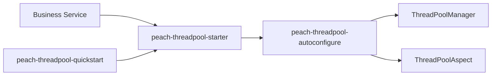

# peach-threadpool

English | [中文](README.md)

`peach-threadpool` is the legacy platform-thread-pool compatibility component, preserving `ThreadPoolManager`, `@AsyncExecuted` and the `peach.threadpool` contract. New blocking-I/O asynchronous work should prefer `peach-virtual-thread`.

## Structure

| Module | Responsibility |
| --- | --- |
| `peach-threadpool-autoconfigure` | Properties, `ThreadPoolManager`, `@AsyncExecuted` aspect and default pool implementation |
| `peach-threadpool-starter` | Legacy business integration dependency entry point |
| `peach-threadpool-quickstart` | Minimal compatibility verification; not a new-business template |



## Integration

```xml
<dependency>
    <groupId>com.peach</groupId>
    <artifactId>peach-threadpool-starter</artifactId>
</dependency>
```

The public entries are the auto-configured `ThreadPoolManager` and the method annotation `@AsyncExecuted`:

- `submit(PoolType, Callable)` / `submit(PoolType, Runnable)`: submit a task and return a `Future`
- `execute(PoolType, Runnable)`: submit a task with no return value
- `get(PoolType)`: obtain a managed `ExecutorService`; an unconfigured type is created with default parameters
- `@AsyncExecuted`: run the method body on the selected pool; when `async=true` the caller still blocks until the result is ready

When `peach.threadpool.pools` is empty, auto-configuration installs the CPU / IO default templates. `submit` / `execute` propagate MDC through `TaskWrapper` (`peach.threadpool.global.enable-mdc`, default `true`).

## Quick Start

The example lives in [`peach-threadpool-quickstart`](./peach-threadpool-quickstart/). It is non-web and only verifies starter compatibility. Production modules must not depend on it, and it is not a new-business template.

| Item | Detail |
| --- | --- |
| Capability samples (inject `ThreadPoolManager` / `@AsyncExecuted`) | **Submit Callable**: IO-pool `submit` and await the result; **Execute Runnable**: `execute` / `submit(Runnable)`; **Annotation**: `@AsyncExecuted(type = IO)` runs the method body on a managed pool thread |
| Runner | `ThreadPoolDemoRunner`; disable with `quickstart.threadpool.demo.enabled=false` |
| Minimal config | `peach.threadpool.global.enable-mdc=true`, `peach.threadpool.global.enable-security-context=false` |
| Prerequisites | No external dependencies |

```bash
mvn -pl peach-component/peach-threadpool/peach-threadpool-quickstart -am spring-boot:run
mvn -pl peach-component/peach-threadpool/peach-threadpool-quickstart -am test
```

Continue to prefer `peach-virtual-thread` for new blocking-I/O asynchronous work.

## Boundaries

- Platform pools remain suitable for CPU-intensive work or workloads requiring explicitly bounded worker resources.
- New blocking-I/O code should prefer `peach-virtual-thread` group concurrency, pending and backpressure semantics.
- Thread-pool context propagation must not be interpreted as Spring transaction propagation across threads.
- `@AsyncExecuted` waits for the pooled result by default; it is not fire-and-forget.
- Queueing, rejection, timeout and cancellation semantics follow the current implementation, not copied historical examples.
