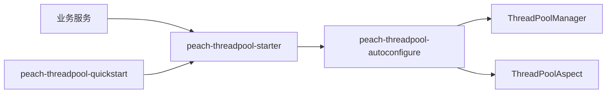

# peach-threadpool

[English](README.en-US.md) | 中文

`peach-threadpool` 是平台线程池的存量兼容组件，保留 `ThreadPoolManager`、`@AsyncExecuted` 与 `peach.threadpool` 契约。新建阻塞 IO 异步能力优先迁移到 `peach-virtual-thread`。

## 结构

| 模块 | 职责 |
| --- | --- |
| `peach-threadpool-autoconfigure` | 配置、`ThreadPoolManager`、`@AsyncExecuted` 切面和默认线程池 |
| `peach-threadpool-starter` | 存量业务接入依赖入口 |
| `peach-threadpool-quickstart` | 兼容行为最小验证，不作为新业务模板 |



## 接入

```xml
<dependency>
    <groupId>com.peach</groupId>
    <artifactId>peach-threadpool-starter</artifactId>
</dependency>
```

公开入口是自动装配的 `ThreadPoolManager` 与方法注解 `@AsyncExecuted`：

- `submit(PoolType, Callable)` / `submit(PoolType, Runnable)`：提交任务并返回 `Future`
- `execute(PoolType, Runnable)`：提交无返回值任务
- `get(PoolType)`：取得受管 `ExecutorService`；未预配置的类型会按默认参数补建
- `@AsyncExecuted`：把方法体提交到指定池；`async=true` 时调用方仍会阻塞等待结果

未配置 `peach.threadpool.pools` 时，自动装配使用 CPU / IO 默认模板。`submit` / `execute` 会经 `TaskWrapper` 传播 MDC（`peach.threadpool.global.enable-mdc`，默认 `true`）。

## Quick Start

示例位于 [`peach-threadpool-quickstart`](./peach-threadpool-quickstart/)，无 Web 端口，只验证 starter 兼容接入，不作为生产依赖或新业务模板。

| 项 | 说明 |
| --- | --- |
| 能力样例（注入 `ThreadPoolManager` / `@AsyncExecuted`） | **提交 Callable**：IO 池 `submit` 等待结果；**执行 Runnable**：`execute` / `submit(Runnable)`；**注解**：`@AsyncExecuted(type = IO)` 在受管池线程执行方法体 |
| Runner | `ThreadPoolDemoRunner`；关闭演示：`quickstart.threadpool.demo.enabled=false` |
| 最小配置 | `peach.threadpool.global.enable-mdc=true`、`peach.threadpool.global.enable-security-context=false` |
| 前置 | 无外部依赖 |

```bash
mvn -pl peach-component/peach-threadpool/peach-threadpool-quickstart -am spring-boot:run
mvn -pl peach-component/peach-threadpool/peach-threadpool-quickstart -am test
```

新建阻塞 IO 异步能力继续优先使用 `peach-virtual-thread`。

## 边界

- 平台线程池仍适用于 CPU 密集或明确需要固定工作线程资源的场景。
- 阻塞 IO 新代码优先使用 `peach-virtual-thread` 的分组并发、Pending 和背压模型。
- 线程池上下文传播不能被理解为 Spring 事务跨线程传播。
- `@AsyncExecuted` 默认会等待池内结果返回，不能当成 fire-and-forget。
- 队列、拒绝、超时和取消语义必须以当前实现为准，不从旧示例复制。
