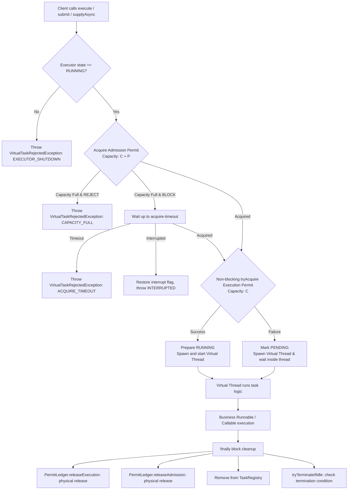

# peach-virtual-thread

A lightweight Virtual Thread Starter for Peach Cloud, designed specifically for **Java 21 blocking I/O** workloads. It provides a global starter toggle, static business group isolation, bounded concurrency quotas, pending backpressure control, standard `ExecutorService` / managed `CompletableFuture` APIs, task state observability, transparent exception propagation, and graceful shutdown capabilities.

- **Baseline**: Java 21 / Spring Boot 3.5.4 / Spring Cloud 2025.0.0
- **Architecture & Design Specification**: See `docs/virtual-thread/2026-09-09-peach-virtual-thread-design.md` in the workspace root.

---

## 1. Module Positioning

### What It Solves

- **Unified Global Toggle**: Enable or disable auto-configuration cleanly via `peach.virtual-thread.enabled`. When disabled, it fails fast instead of silently disguising execution.
- **Static Business Group Isolation**: Create independent `VirtualExecutorService` beans by resource domain (e.g., `database`, `storage`, `remote`, `email`) to prevent slow external calls from starving cluster resources.
- **Physical Concurrency Limits**: Strictly cap concurrently executing tasks on carrier threads via `max-concurrency` to protect database connection pools, external API rate limits, and filesystem I/O.
- **Strictly Bounded Pending Queue**: Limit accepted tasks waiting for execution permits via `max-pending` to prevent unbounded memory growth during downstream latency spikes.
- **Dual Backpressure Policies**: Offer explicit `REJECT` (fail-fast) and bounded `BLOCK` (timed waiting on caller thread) backpressure strategies. Eliminates `CallerRuns` polluting gateway event loops and `Discard` silently losing tasks.
- **Permit Safety via Exactly-Once Release**: Guaranteed by `PermitLedger` using atomic CAS bitwise tracking for both Admission and Execution permits across success, failure, cancellation, timeout, and shutdown paths.
- **Safe Cancellation & Concurrency Invariant**: Managed Future cancellation (`cancel(true)`) signals interrupts to virtual threads. Even if underlying drivers ignore interrupts, the execution permit is released **only when the thread physically terminates**, strictly enforcing the concurrency limit.
- **Transparent Exception Propagation**: Preserves original business exception chains without framework-level swallows or obfuscations.
- **Low-Cardinality Metrics**: Automatically exports low-cardinality Micrometer metrics tagged solely with `group` when Micrometer is present on the classpath.
- **Graceful Lifecycle Shutdown**: Integrated into the Spring context lifecycle, providing two-phase graceful shutdown (`shutdown` await grace period followed by `shutdownNow` interrupt) to prevent lingering orphaned futures.

### What It Does NOT Solve

- **No Thread Pooling**: Adheres strictly to the one-task-one-thread principle without worker reuse, keepAlive, or core/max pool size complexity.
- **No Transaction Propagation**: Does not propagate Spring `@Transactional` contexts across threads or coordinate distributed transactions.
- **No Dynamic Capacity Mutation**: Does not mutate concurrency quotas at runtime from Nacos or Apollo. Capacity tuning requires rolling restarts or explicit orchestrators.
- **No Automatic ThreadLocal Copying**: Explicitly disables `inheritInheritableThreadLocals(false)` to prevent memory leaks and dirty context inheritance.
- **No Replacement for CPU Thread Pools**: Strictly forbidden for CPU-heavy tasks such as video transcoding, image compression, or SHA-256 calculation. Platform thread pools must be used for CPU-bound work.

---

## 2. Directory Structure

```text
peach-virtual-thread/
├── pom.xml                                  # Parent POM
├── README.md                                # Chinese architecture and usage guide
├── README.en-US.md                          # English architecture and usage guide
├── peach-virtual-thread-autoconfigure/      # Core executor, concurrency controller, auto-configuration & metrics
│   ├── src/main/java/com/peach/virtualthread/
│   │   ├── annotation/VirtualGroup.java     # @VirtualGroup qualifier annotation
│   │   ├── api/VirtualExecutorService.java  # Public interface for virtual executors
│   │   ├── autoconfigure/                   # Spring Boot autoconfig & bean registrar
│   │   ├── concurrency/                     # Dual semaphore concurrency controller & PermitLedger
│   │   ├── config/                          # Properties & BackpressurePolicy enum
│   │   ├── exception/                       # Rejection exceptions & unhandled exception SPI
│   │   ├── executor/                        # DefaultVirtualExecutorService implementation
│   │   ├── registry/VirtualExecutorRegistry # Read-only registry & shutdown coordinator
│   │   ├── state/                           # Executor state & read-only snapshot VOs
│   │   └── task/                            # TaskControl state machine & task registry
│   └── src/main/resources/
│       └── META-INF/additional-spring-configuration-metadata.json
├── peach-virtual-thread-starter/            # Starter dependency aggregating autoconfigure
└── peach-virtual-thread-quickstart/            # Example service (Web/MyBatis/Feign/Storage)
```

---

## 3. Quick Start

### 3.1 Maven Dependency

Add the starter dependency to your service `pom.xml`:

```xml
<dependency>
    <groupId>com.peach</groupId>
    <artifactId>peach-virtual-thread-starter</artifactId>
</dependency>
```

### 3.2 Configuration

Configure group quotas and backpressure policies in `application.yaml`:

```yaml
peach:
  virtual-thread:
    enabled: true
    thread-name-prefix: peach-vt-
    shutdown-await: 30s
    groups:
      database:
        max-concurrency: 50
        max-pending: 100
        backpressure: BLOCK
        acquire-timeout: 50ms
      storage:
        max-concurrency: 100
        max-pending: 200
        backpressure: REJECT
      remote:
        max-concurrency: 80
        max-pending: 160
        backpressure: BLOCK
        acquire-timeout: 100ms
```

### 3.3 Injection and Usage

Inject executors using the `@VirtualGroup` qualifier:

```java
@Service
@RequiredArgsConstructor
public class UserOrderService {

    @VirtualGroup("database")
    private final VirtualExecutorService databaseExecutor;

    @VirtualGroup("remote")
    private final VirtualExecutorService remoteExecutor;

    public CompletableFuture<OrderDetailVO> queryOrderDetailAsync(Long orderId) {
        // 1. Asynchronously query local database in the database group
        CompletableFuture<OrderDO> orderFuture = databaseExecutor.supplyAsync(
                () -> orderMapper.selectById(orderId)
        );

        // 2. Asynchronously call remote payment gateway in the remote group
        CompletableFuture<PaymentVO> paymentFuture = remoteExecutor.supplyAsync(
                () -> paymentFeignClient.getPayment(orderId)
        );

        // 3. Compose results asynchronously
        return orderFuture.thenCombine(paymentFuture, OrderDetailVO::of);
    }
}
```

Or dispatch via the centralized `VirtualExecutorRegistry`:

```java
@Service
@RequiredArgsConstructor
public class DirectDispatchService {

    private final VirtualExecutorRegistry virtualExecutorRegistry;

    public void dispatch(String groupName, Runnable task) {
        virtualExecutorRegistry.execute(groupName, task);
    }
}
```

---

## 4. Core Concepts & APIs

### 4.1 Key Components

- **`VirtualExecutorService`**: Main contract extending JDK `ExecutorService`, enriched with managed `supplyAsync`, `runAsync`, `snapshot()`, and `activeTasks()`.
- **`@VirtualGroup`**: Qualifier annotation mapping an executor to a specific business resource group.
- **`VirtualExecutorRegistry`**: Static read-only registry providing a facade similar to legacy `ThreadPoolManager`, implementing `DisposableBean` for shutdown coordination.
- **`GroupConcurrencyController`**: Internal engine managing `admissionSemaphore` (capacity: C+P) and `executionSemaphore` (capacity: C).
- **`PermitLedger`**: Exactly-once permit ledger tracking `ADMISSION` and `EXECUTION` ownership.
- **`TaskControl`**: Lightweight state machine transitioning a task from `PENDING` -> `RUNNING` -> terminal states.
- **`VirtualTaskExceptionHandler`**: Fallback handler SPI for unhandled exceptions in direct `execute(Runnable)`.

### 4.2 Submission Model Comparison

| Method | Return Type | Cancellation & Interrupt | Exception Handling | Recommended Use |
| --- | --- | --- | --- | --- |
| `databaseExecutor.supplyAsync(Supplier)` | Managed `CompletableFuture<T>` | `cancel(true)` interrupts runner; permit released on runner exit | Wrapped in `CompletionException` | Async pipeline composition (Preferred) |
| `databaseExecutor.runAsync(Runnable)` | Managed `CompletableFuture<Void>` | `cancel(true)` interrupts runner; permit released on runner exit | Wrapped in `CompletionException` | Side-effect async execution |
| `databaseExecutor.submit(Callable)` | `Future<T>` (`ManagedFutureTask`) | `cancel(true)` interrupts runner; permit released on runner exit | `get()` throws `ExecutionException` | Synchronous future retrieval |
| `databaseExecutor.execute(Runnable)` | `void` | Cannot be cancelled externally | Logged by `VirtualTaskExceptionHandler` then rethrown | Fire-and-forget submission |
| `CompletableFuture.supplyAsync(fn, executor)` | JDK `CompletableFuture<T>` | Retains JDK default behavior; `cancel()` **does not guarantee** runner interrupt | Handled by JDK CompletableFuture | Not recommended (bypasses managed lifecycle) |

---

## 5. Configuration Reference

Configuration prefix: `peach.virtual-thread`

| Property | Type | Default | Constraints | Description |
| --- | --- | --- | --- | --- |
| `enabled` | `Boolean` | `true` | - | Global toggle for virtual thread auto-configuration |
| `thread-name-prefix` | `String` | `peach-vt-` | Must be non-blank | Unified naming prefix for all virtual threads |
| `shutdown-await` | `Duration` | `30s` | Positive, no nanos overflow | Max timeout to wait for groups to terminate naturally during Spring shutdown |
| `groups.<name>.max-concurrency` | `Integer` | `256` | `> 0` | Maximum concurrent virtual threads actively running business code |
| `groups.<name>.max-pending` | `Integer` | `512` | `>= 0` | Maximum virtual threads queued waiting for execution permits |
| `groups.<name>.backpressure` | `BackpressurePolicy` | `REJECT` | `REJECT` / `BLOCK` | Policy when admission capacity (`C + P`) is exhausted |
| `groups.<name>.acquire-timeout` | `Duration` | `50ms` | Must be `> 0` for BLOCK | Max wait time on caller thread when backpressure is `BLOCK` |

---

## 6. Execution Flow & Concurrency Model

### 6.1 Dual Semaphore Lifecycle



### 6.2 PermitLedger Atomic CAS Tracking

```text
Bit 0: ADMISSION (0x01)
Bit 1: EXECUTION (0x02)

Initial state:    00
Acquired Admission: 01 (ADMISSION)
Reserved Execution: 11 (ADMISSION | EXECUTION)

Release phase:
clearOwned(EXECUTION) -> Thread successfully clearing 0x02 physically calls executionSemaphore.release()
clearOwned(ADMISSION) -> Thread successfully clearing 0x01 physically calls admissionSemaphore.release()
Subsequent calls return false immediately, eliminating double-release risks entirely!
```

---

## 7. Extension Points

### Custom Unhandled Exception Handler

For tasks submitted via `execute(Runnable)`, unhandled exceptions are logged by default via `DefaultVirtualTaskExceptionHandler`. You can override this by registering a custom bean:

```java
@Configuration(proxyBeanMethods = false)
public class VirtualThreadCustomizerConfiguration {

    @Bean
    public VirtualTaskExceptionHandler customVirtualTaskExceptionHandler(AlarmService alarmService) {
        return (context, throwable) -> {
            // Context contains group, taskId, threadName, etc.
            alarmService.sendAlarm("VirtualTaskFailed",
                    "Group: " + context.group() + ", TaskId: " + context.taskId(), throwable);
        };
    }
}
```

---

## 8. Boundaries & Guardrails

1. **Self-Deadlock on Same-Group Nesting**:
   Never submit a task to the **same group** and synchronously wait on its result (`future.get()` / `join()`) from within a task already occupying an Execution Permit of that group. For example, in a `database` group with `max-concurrency=1`, recursive submissions will permanently starve the permit. Perform compositions outside the group.
2. **Spring Transaction Boundaries**:
   Starter does not propagate `@Transactional` contexts across threads. Strong consistency operations must stay within a single transaction boundary; cross-thread async workflows should utilize Outbox patterns or transactional MQ.
3. **Gateway / WebFlux Constraint**:
   Never configure `BLOCK` backpressure on Spring Cloud Gateway or Reactor Netty EventLoop threads. Doing so blocks the event loop, collapsing gateway throughput.
4. **Virtual Thread Pinning Guardrail**:
   Executing `synchronized` blocks or JNI native methods inside virtual threads pins the carrier platform thread. Use `java.util.concurrent.locks.ReentrantLock` instead. Detect pinning during runtime using `-Djdk.tracePinnedThreads=full`.

---

## 9. Verification & Build Gates

Execute standard quality gates from the project root:

```powershell
# 1. UTF-8 without BOM verification
node scripts/check-utf8.mjs

# 2. Run module tests
mvn test -pl peach-component/peach-virtual-thread/peach-virtual-thread-autoconfigure

# 3. Check git diff for whitespace anomalies
git diff --check
```

---

## 10. Troubleshooting Guide

| Symptom | Investigation Point | Root Cause & Resolution |
| --- | --- | --- |
| `@VirtualGroup` injection fails with NoSuchBeanDefinitionException | Check `groups` in `application.yaml` | Ensure the group name is spelled correctly and `peach.virtual-thread.enabled` is not set to `false`. |
| Tasks rejected with `CAPACITY_FULL` | Check `peach.virtual.thread.rejected` metrics | Inflow rate exceeds `max-concurrency + max-pending`. Assess downstream capacity before increasing limits or switching to `BLOCK`. |
| Business threads wait until `ACQUIRE_TIMEOUT` | Check `running` and `pending` gauges | Downstream calls are hanging or slow. Inspect database slow query logs, remote API timeouts, and connection pool sizing. |
| `cancel(true)` succeeds but active concurrency does not drop | Check task execution duration | The task is blocked in an uninterruptible I/O call (e.g., legacy socket). Permits are retained until the runner physically exits. Ensure explicit connect/read timeouts are set on underlying clients. |
| Async logs lose TraceId / MDC context | Check ThreadLocal inheritance | The starter explicitly disables `InheritableThreadLocal`. Use explicit context wrappers or task decorators to capture and restore MDC snapshots. |
| Slow application shutdown | Check remaining active tasks in logs | Tasks are still running and not responding to interrupts. Verify client timeout configs or increase `shutdown-await`. |
| Intermittent Gateway freezes | Check if virtual threads are blocked on EventLoop | Never use `BLOCK` in Gateway filters. Use `REJECT` or delegate blocking operations downstream. |
