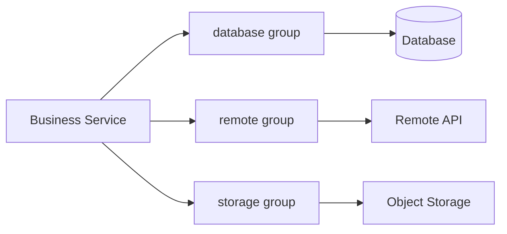

# peach-virtual-thread

Peach Cloud's Java 21 Virtual Thread Starter for **blocking I/O** workloads. It provides static business groups, bounded concurrency, pending-task control, `REJECT / BLOCK` backpressure, standard `ExecutorService` compatibility, managed `CompletableFuture` APIs, runtime snapshots, and graceful Spring shutdown.

[中文](./README.md)

<!-- doc-sync:positioning -->
## 1. When to Use It

Use this module to move blocking database, remote HTTP, object storage, email, and similar calls onto virtual threads while protecting real downstream resources with per-group capacity limits.



Current implementation boundaries:

- One task maps to one virtual thread; virtual threads are not pooled.
- `max-concurrency` limits tasks that are actually running business logic.
- `max-pending` limits admitted tasks that have not yet acquired an execution permit.
- Maximum active tasks for one group are `max-concurrency + max-pending`.
- `REJECT` fails immediately when admission capacity is exhausted; `BLOCK` performs only bounded and interruptible admission waiting.
- The starter does not provide Spring transaction propagation across threads, runtime capacity resizing, CPU-bound scheduling, or implicit copying of arbitrary ThreadLocal state.

<!-- doc-sync:modules -->
## 2. Module Layout

```text
peach-virtual-thread/
├── peach-virtual-thread-autoconfigure/  # Public contract, concurrency, auto-config and lifecycle
├── peach-virtual-thread-starter/        # Minimal dependency aggregation for applications
├── peach-virtual-thread-quickstart/     # Runnable integration examples
├── docs/
│   ├── design.md                        # Concurrency, cancellation, permits and shutdown design
│   └── reference.md                     # Configuration and public API reference
├── README.md
└── README.en-US.md
```

<!-- doc-sync:quick-start -->
## 3. Quick Start

### 3.1 Add the Starter

```xml
<dependency>
    <groupId>com.peach</groupId>
    <artifactId>peach-virtual-thread-starter</artifactId>
</dependency>
```

### 3.2 Define a Business Group

```yaml
peach:
  virtual-thread:
    enabled: true
    thread-name-prefix: peach-vt-
    shutdown-await: 30s
    groups:
      database:
        max-concurrency: 50
        max-pending: 100
        backpressure: BLOCK
        acquire-timeout: 50ms
```

### 3.3 Inject with a Constructor and Submit Work

```java
@Service
public class UserQueryService {

    private final VirtualExecutorService databaseExecutor;

    public UserQueryService(
            @VirtualGroup("database") VirtualExecutorService databaseExecutor) {
        this.databaseExecutor = databaseExecutor;
    }

    public Future<User> query(Long id) {
        return databaseExecutor.submit(() -> userMapper.selectById(id));
    }
}
```

`VirtualExecutorService` extends `ExecutorService`, so existing `execute`, `submit`, `invokeAll`, `invokeAny`, shutdown, and termination patterns remain available. Use the starter's `supplyAsync` / `runAsync` when you need managed `CompletableFuture` composition and cancellation semantics.

### 3.4 Runnable Quickstart

[`peach-virtual-thread-quickstart`](./peach-virtual-thread-quickstart/) is non-web and only verifies `VirtualExecutorService` grouped submit, managed cancellation, and REJECT backpressure. Production modules must not depend on it.

| Item | Detail |
| --- | --- |
| Capability samples (inject `VirtualExecutorService`) | **Grouped submit**: `@VirtualGroup("database")` submits a Callable and awaits the Future; **Managed cancel**: `supplyAsync` then `cancel(true)` interrupts the runner; **REJECT backpressure**: a `burst` group with `max-concurrency=1` / `max-pending=0` rejects overflow with `VirtualTaskRejectedException(CAPACITY_FULL)` |
| Runner | `VirtualThreadDemoRunner`; disable with `quickstart.virtual-thread.demo.enabled=false` |
| Minimal config | `peach.virtual-thread.groups.database` (BLOCK), `peach.virtual-thread.groups.burst` (REJECT) |
| Prerequisites | No external dependencies |
| Port | No REST: `spring.main.web-application-type=none` |

```bash
mvn -f peach-component/peach-virtual-thread/peach-virtual-thread-quickstart/pom.xml spring-boot:run
mvn -f peach-component/peach-virtual-thread/peach-virtual-thread-quickstart/pom.xml test
```

<!-- doc-sync:api-choice -->
## 4. Choosing an API

| Scenario | Recommended API | Notes |
| --- | --- | --- |
| Migrating from a traditional executor | `submit(...)` | Keeps the familiar `ExecutorService` / `Future` model |
| Asynchronous result composition | `supplyAsync(...)` / `runAsync(...)` | Returns a starter-managed `CompletableFuture` |
| Routing dynamically by group name | `VirtualExecutorRegistry` | Still passes through that group's concurrency and backpressure controls |
| Fire-and-forget | `execute(...)` | No Future captures failures, so exception semantics must be understood |

When starter-managed cancellation must stay linked to the real virtual-thread lifecycle, do not replace the starter's `supplyAsync` with JDK `CompletableFuture.supplyAsync(fn, executor)`.

<!-- doc-sync:capacity -->
## 5. Capacity and Backpressure

Let:

```text
C = maxConcurrency
P = maxPending
```

The current implementation enforces:

```text
Running <= C
Pending <= P
Accepted <= C + P
```

`GroupConcurrencyController` uses two levels of permits: Admission bounds all active tasks and Execution bounds tasks actually entering business logic. Permit ownership is released through the managed task lifecycle so cancellation, failure, and shutdown races do not double-release capacity or silently increase concurrency.

Production limits should be derived from real downstream constraints such as database connection-pool size, HTTP-client concurrency, or storage throughput. Virtual threads make waiting cheaper; they do not make downstream capacity unlimited.

<!-- doc-sync:production-boundaries -->
## 6. Production Boundaries

- **Transactions**: switching threads does not automatically propagate the original Spring transaction context. Define a new transaction boundary inside asynchronous work or use a business-level consistency pattern when required.
- **Cancellation**: `cancel(true)` sends an interrupt request to a managed virtual thread, but an underlying call that ignores interruption will not stop instantly. The Execution permit is not released early while the runner is still active.
- **Shutdown**: when Spring closes, `VirtualExecutorRegistry` first calls `shutdown()` for all groups and then waits within one shared `shutdown-await` budget. Executors that exceed the remaining budget move to `shutdownNow()`.
- **Dynamic configuration**: groups and capacities are startup-time static configuration; runtime hot resizing is not currently promised.
- **Workload**: the starter targets blocking I/O and is not a replacement for a dedicated CPU-bound execution strategy.

<!-- doc-sync:docs -->
## 7. Further Documentation

| Document | Content |
| --- | --- |
| [Design](./docs/design.md) | Capacity model, permit ownership, submission/cancellation semantics, graceful shutdown, design boundaries |
| [Reference](./docs/reference.md) | Configuration defaults and constraints, `VirtualExecutorService`, `@VirtualGroup`, `VirtualExecutorRegistry` |
| [Quickstart](./peach-virtual-thread-quickstart/) | Runnable examples backed by the current code |

The README intentionally stays focused on onboarding, the core mental model, and production boundaries. Implementation-level algorithms and complete API/configuration details live in the deeper documentation instead of being duplicated here.
