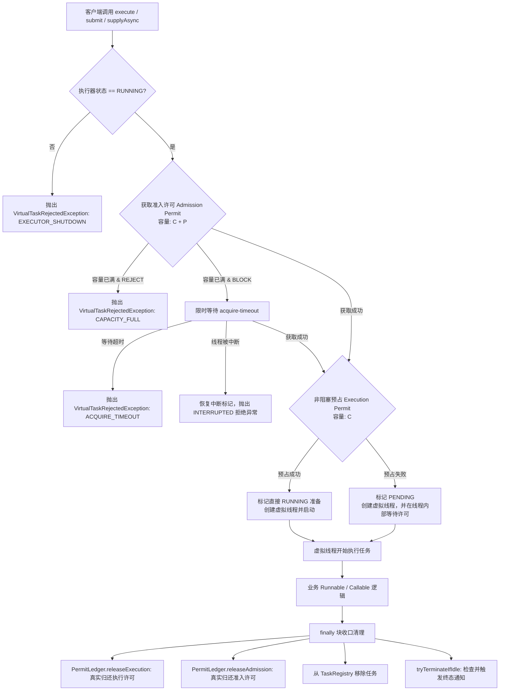

# peach-virtual-thread

Peach Cloud 的轻量级 Virtual Thread Starter，面向 **Java 21 阻塞 IO** 场景提供统一的虚拟线程全局开关、静态业务分组隔离、有界并发配额、Pending 背压控制、标准 `ExecutorService` / 受管 `CompletableFuture`、任务状态安全观察、异常透明传播与优雅关闭能力。

- **基线版本**：Java 21 / Spring Boot 3.5.4 / Spring Cloud 2025.0.0
- **架构设计方案**：详见根目录 `docs/virtual-thread/2026-09-09-peach-virtual-thread-design.md`

---

## 1. 模块定位

### 解决什么问题

- **统一全局控制**：通过 `peach.virtual-thread.enabled` 开启或关闭 Starter 自动装配，关闭时绝不静默伪装或无告警退化。
- **静态业务分组隔离**：按 `database`、`storage`、`remote`、`email` 等业务资源域创建独立的 `VirtualExecutorService` Bean，避免单点慢调用耗尽全系统资源。
- **物理硬并发限制**：使用 `max-concurrency` 严格限制真正运行在底层 Carrier 线程上的业务任务数量，保护数据库连接池、外部 HTTP 限制和文件 IO 瓶颈。
- **严格有界 Pending 队列**：使用 `max-pending` 限制已接受但等待执行许可的虚拟线程数，防止下游抖动时内存无限堆积。
- **双背压策略支持**：支持 `REJECT`（立即拒绝）与有界 `BLOCK`（调用线程限时等待）两种清晰背压，杜绝 `CallerRuns` 把阻塞带回网关线程或 `Discard` 静默丢任务。
- **许可安全 Exactly-Once 归还**：通过 `PermitLedger` 原子状态位保证准入许可（Admission）与执行许可（Execution）在成功、失败、取消、中断与停机路径下恰好归还一次，彻底消除信号量漂移。
- **真实取消与并发保护**：受管 Future 取消（`cancel(true)`）将中断信号下发到底层虚拟线程；即使底层调用不响应中断，真实执行许可仅在线程真正退出后才释放，严格守住并发上限。
- **异常透明传播**：保留原始业务异常链，不在框架层吞掉、截断或篡改为不可识别的包装异常。
- **低基数指标观测**：类路径存在 Micrometer 时，自动暴露低基数（仅按 `group` 标记）的 Gauge 与 Counter 监控指标。
- **安全优雅停机**：集成 Spring 容器生命周期，支持两阶段优雅关闭（`shutdown` 宽限期等待与超时 `shutdownNow` 强制中断），防止任务句柄永久悬垂。

### 不解决什么问题

- **不池化虚拟线程**：坚持 One-Task-One-Thread 原则，不引入平台线程池的 worker reuse、keepAlive、核心线程数概念。
- **不处理事务传播**：不进行 Spring 事务跨线程传递，不作为分布式事务协调器。
- **不进行动态扩缩容**：不从 Nacos/Apollo 运行期动态修改并发容量，容量变更需重启或通过独立控制面编排。
- **不自动透传 ThreadLocal**：显式配置 `inheritInheritableThreadLocals(false)`，不自动隐式深拷贝 MDC、SecurityContext，避免内存膨胀与脏上下文污染。
- **不替代 CPU 密集型线程池**：严禁用于视频转码、图像压缩、大文件哈希计算等 CPU 密集场景，该类场景应继续使用平台线程池。

---

## 2. 模块结构

```text
peach-virtual-thread/
├── pom.xml                                  # 模块聚合 POM
├── README.md                                # 中文接入与架构指南
├── README.en-US.md                          # 英文接入与架构指南
├── peach-virtual-thread-autoconfigure/      # 核心执行器、并发控制器、自动配置与指标绑定
│   ├── src/main/java/com/peach/virtualthread/
│   │   ├── annotation/VirtualGroup.java     # @VirtualGroup 分组限定注入注解
│   │   ├── api/VirtualExecutorService.java  # 虚拟线程执行器公共接口
│   │   ├── autoconfigure/                   # Spring Boot 自动配置与 Bean 动态注册
│   │   ├── concurrency/                     # 双信号量并发控制器与 PermitLedger 账本
│   │   ├── config/                          # 属性配置与 BackpressurePolicy 枚举
│   │   ├── exception/                       # 拒绝异常与未承接异常处理器 SPI
│   │   ├── executor/                        # DefaultVirtualExecutorService 核心实现
│   │   ├── registry/VirtualExecutorRegistry # 全局只读注册中心与关闭协调器
│   │   ├── state/                           # 执行器状态与只读快照 VO
│   │   └── task/                            # TaskControl 状态机与任务注册表
│   └── src/main/resources/
│       └── META-INF/additional-spring-configuration-metadata.json
├── peach-virtual-thread-starter/            # 业务接入依赖，聚合 autoconfigure
└── peach-virtual-thread-example/            # 典型场景演示工程（Web/MyBatis/Feign/Storage）
```

---

## 3. 快速接入

### 3.1 引入依赖

在业务服务的 `pom.xml` 中引入 starter：

```xml
<dependency>
    <groupId>com.peach</groupId>
    <artifactId>peach-virtual-thread-starter</artifactId>
</dependency>
```

### 3.2 声明配置

在 `application.yaml` 中声明业务分组容量与背压策略：

```yaml
peach:
  virtual-thread:
    enabled: true
    thread-name-prefix: peach-vt-
    shutdown-await: 30s
    groups:
      database:
        max-concurrency: 50
        max-pending: 100
        backpressure: BLOCK
        acquire-timeout: 50ms
      storage:
        max-concurrency: 100
        max-pending: 200
        backpressure: REJECT
      remote:
        max-concurrency: 80
        max-pending: 160
        backpressure: BLOCK
        acquire-timeout: 100ms
```

### 3.3 业务代码注入与使用

推荐使用 `@VirtualGroup` 限定符进行显式构造器注入：

```java
@Service
@RequiredArgsConstructor
public class UserOrderService {

    @VirtualGroup("database")
    private final VirtualExecutorService databaseExecutor;

    @VirtualGroup("remote")
    private final VirtualExecutorService remoteExecutor;

    public CompletableFuture<OrderDetailVO> queryOrderDetailAsync(Long orderId) {
        // 1. 在 database 组中并发异步查询本地数据库
        CompletableFuture<OrderDO> orderFuture = databaseExecutor.supplyAsync(
                () -> orderMapper.selectById(orderId)
        );

        // 2. 在 remote 组中并发调用第三方服务
        CompletableFuture<PaymentVO> paymentFuture = remoteExecutor.supplyAsync(
                () -> paymentFeignClient.getPayment(orderId)
        );

        // 3. 组合异步结果
        return orderFuture.thenCombine(paymentFuture, OrderDetailVO::of);
    }
}
```

也可以通过统一门面 `VirtualExecutorRegistry` 按组名称调用：

```java
@Service
@RequiredArgsConstructor
public class DirectDispatchService {

    private final VirtualExecutorRegistry virtualExecutorRegistry;

    public void dispatch(String groupName, Runnable task) {
        virtualExecutorRegistry.execute(groupName, task);
    }
}
```

---

## 4. 核心概念与 API

### 4.1 核心组件

- **`VirtualExecutorService`**：分组执行器主契约，继承 JDK `ExecutorService`，扩展了受管 `supplyAsync`、`runAsync`、`snapshot()` 与 `activeTasks()`。
- **`@VirtualGroup`**：限定符注解，标识具体目标业务资源组，替代易出错的 Bean 字符串名称注入。
- **`VirtualExecutorRegistry`**：只读静态执行器注册中心，提供类似原 `ThreadPoolManager` 的集中访问入口，同时实现 `DisposableBean` 协调优雅关闭。
- **`GroupConcurrencyController`**：底层并发控制器，持有 `admissionSemaphore`（C+P）与 `executionSemaphore`（C）。
- **`PermitLedger`**：任务许可账本，维护 `ADMISSION` 与 `EXECUTION` 两类许可的所有权状态，保障 Exactly-Once 物理释放。
- **`TaskControl`**：管理单个任务从 `PENDING` -> `RUNNING` -> 终态的轻量状态机。
- **`VirtualTaskExceptionHandler`**：SPI 扩展点，处理 direct `execute(Runnable)` 任务未捕获异常的兜底处理器。

### 4.2 任务提交模型差异

| 入口方法 | 返回类型 | 取消与中断联动 | 异常传播方式 | 适用场景 |
| --- | --- | --- | --- | --- |
| `databaseExecutor.supplyAsync(Supplier)` | 受管 `CompletableFuture<T>` | `cancel(true)` 强关联底层虚拟线程中断，延迟至退出归还 Permit | 异常包装在 `CompletionException` | 异步链式编排（推荐） |
| `databaseExecutor.runAsync(Runnable)` | 受管 `CompletableFuture<Void>` | `cancel(true)` 强关联底层虚拟线程中断，延迟至退出归还 Permit | 异常包装在 `CompletionException` | 无返回值异步操作 |
| `databaseExecutor.submit(Callable)` | `Future<T>`（`ManagedFutureTask`） | `cancel(true)` 关联底层虚拟线程中断，延迟至退出归还 Permit | `get()` 抛出 `ExecutionException`（Cause 保留） | 经典 Future 阻塞获取 |
| `databaseExecutor.execute(Runnable)` | `void` | 不支持外部主动 cancel | 由 `VirtualTaskExceptionHandler` 记录后继续抛出 | Fire-and-Forget 异步投递 |
| `CompletableFuture.supplyAsync(fn, executor)` | 原生 `CompletableFuture<T>` | 保留 JDK 原生语义，`cancel()` **不保证**中断运行中的虚拟线程 | JDK 原生处理 | 不推荐，无法深度受管 |

---

## 5. 配置参数说明

配置前缀：`peach.virtual-thread`

| 配置项 | 类型 | 默认值 | 校验约束 | 说明 |
| --- | --- | --- | --- | --- |
| `enabled` | `Boolean` | `true` | - | 是否启用 Starter 自动装配 |
| `thread-name-prefix` | `String` | `peach-vt-` | 必须非空 | 所有虚拟线程名称统一前缀 |
| `shutdown-await` | `Duration` | `30s` | 正数，纳秒不溢出 | Spring 容器停机时等待业务组自然终止的最长时间 |
| `groups.<name>.max-concurrency` | `Integer` | `256` | `> 0` | 业务组最大真实运行并发数（对应下游资源上限） |
| `groups.<name>.max-pending` | `Integer` | `512` | `>= 0` | 最大排队等待执行许可的虚拟线程数 |
| `groups.<name>.backpressure` | `BackpressurePolicy` | `REJECT` | `REJECT` / `BLOCK` | 准入容量耗尽时的背压策略 |
| `groups.<name>.acquire-timeout` | `Duration` | `50ms` | BLOCK 时必须 `> 0` | `BLOCK` 策略在提交线程上的最大阻塞等待时间 |

---

## 6. 运行机制与核心设计

### 6.1 双信号量执行流程



### 6.2 PermitLedger CAS 位图防重释放机制

```text
位图表示：
Bit 0: ADMISSION (0x01)
Bit 1: EXECUTION (0x02)

初始状态: 00
准入获取: 01 (ADMISSION)
预占执行: 11 (ADMISSION | EXECUTION)

释放时：
clearOwned(EXECUTION) -> 成功清除 0x02 的线程物理调用 executionSemaphore.release()
clearOwned(ADMISSION) -> 成功清除 0x01 的线程物理调用 admissionSemaphore.release()
重复调用时返回 false，绝不发生重复释放！
```

---

## 7. 扩展方式

### 自定义未承接异常处理器

当使用 `execute(Runnable)` 发生未捕获异常时，默认会通过 `DefaultVirtualTaskExceptionHandler` 打印 ERROR 日志。业务可以通过声明自定义 Bean 完全接管：

```java
@Configuration(proxyBeanMethods = false)
public class VirtualThreadCustomizerConfiguration {

    @Bean
    public VirtualTaskExceptionHandler customVirtualTaskExceptionHandler(AlarmService alarmService) {
        return (context, throwable) -> {
            // context 包含 group, taskId, threadName 等安全上下文
            alarmService.sendAlarm("VirtualTaskFailed",
                    "Group: " + context.group() + ", TaskId: " + context.taskId(), throwable);
        };
    }
}
```

---

## 8. 边界与限制

1. **同组自等待死锁陷阱**：
   严禁在已持有某个业务组 Execution Permit 的任务内部，再次向**同一个业务组**提交子任务并同步调用 `future.get()` 或 `join()`。例如配置 `max-concurrency=1` 的 `database` 组，在任务内部递归请求 `databaseExecutor.submit(...).get()` 将造成永久资源饥饿。建议跨组调用或外层完成 Future 编排。
2. **Spring 事务隔离**：
   Starter 不进行 `@Transactional` 的跨线程传递。强一致性数据库更新务必在一个连续的事务块内完成；跨线程异步流程应结合 Outbox / RocketMQ 事务消息 / 最终一致性设计。
3. **Gateway / WebFlux 禁忌**：
   在 Spring Cloud Gateway 或 Reactor EventLoop 线程中，**绝对禁止**使用 `BLOCK` 背压策略，否则会导致 Netty 事件循环线程被阻塞，瞬间拉垮网关吞吐。
4. **虚拟线程 Pinning 陷阱**：
   虚拟线程内部如果调用了包含 `synchronized` 关键字的同步块或 JNI 本地方法，会导致载体线程被 Pin 住无法让出。高并发下应改用 `java.util.concurrent.locks.ReentrantLock`。启动排查建议增加 JVM 参数：`-Djdk.tracePinnedThreads=full`。

---

## 9. 构建与验证

### 编译与测试门禁

在工程根目录下执行构建与测试：

```powershell
# 1. 严格 UTF-8 编码门禁
node scripts/check-utf8.mjs

# 2. 运行 peach-virtual-thread 模块测试
mvn test -pl peach-component/peach-virtual-thread/peach-virtual-thread-autoconfigure

# 3. 检查代码格式与空白
git diff --check
```

---

## 10. 排障指南

| 现象 | 排查切入点 | 根因与解决方案 |
| --- | --- | --- |
| `@VirtualGroup` 注入报错找不到 Bean | 检查 `application.yaml` 的 `groups` 节点 | 确认业务组名称拼写正确，且未配置 `peach.virtual-thread.enabled: false` |
| 任务被高频拒绝（`CAPACITY_FULL`） | 查看 `peach.virtual.thread.rejected` 指标 | 当前组瞬时吞吐超出 `max-concurrency + max-pending`，评估下游容量后适当调大或改为 `BLOCK` |
| 业务线程等待超时（`ACQUIRE_TIMEOUT`） | 查看 `running` 和 `pending` 指标水位 | 下游出现严重慢调用，排查 SQL 执行计划、三方 HTTP 超时时间与连接池容量 |
| `cancel(true)` 成功但并发未下降 | 查看任务真实执行耗时 | 业务调用了不响应中断的底层 IO（如原生 Socket/阻塞驱动），属于安全保护机制；请为底层 SDK 设置明确的 connect/read timeout |
| 异步任务日志丢失 TraceId / 用户信息 | 检查 ThreadLocal 传递方式 | Starter 默认禁用 `InheritableThreadLocal`；需使用显式上下文包装或装饰器透传 TraceId |
| 应用停机缓慢或超时 | 查看停机日志中的剩余活跃任务数 | 任务仍在执行且未响应中断；检查第三方调用的超时配置，或适当延长 `shutdown-await` |
| 网关偶发性卡顿延迟飙升 | 检查是否在 EventLoop 线程中阻塞调用了虚拟线程 | 网关层切勿使用 `BLOCK` 背压，将阻塞逻辑下沉至业务微服务处理 |
