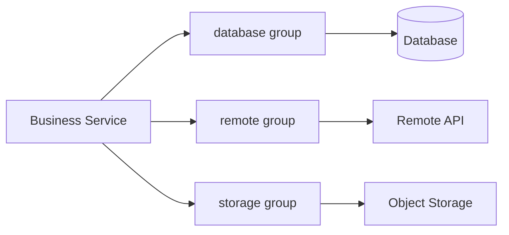

# peach-virtual-thread

Peach Cloud 的 Java 21 Virtual Thread Starter，用于 **阻塞 I/O** 场景下的统一异步执行与资源隔离。它提供静态业务分组、有界并发、Pending 控制、`REJECT / BLOCK` 背压、标准 `ExecutorService` 兼容入口、受管 `CompletableFuture`、运行快照与 Spring 优雅关闭。

[English](./README.en-US.md)

<!-- doc-sync:positioning -->
## 1. 适用场景

适合把数据库、远程 HTTP、对象存储、邮件等阻塞调用放到虚拟线程中执行，同时用业务组级容量保护真实下游资源。



当前实现的核心边界：

- 一个任务对应一个虚拟线程，不池化虚拟线程。
- `max-concurrency` 限制真正执行中的任务数。
- `max-pending` 限制已经准入、但尚未获得执行许可的任务数。
- 单组最大活动任务数为 `max-concurrency + max-pending`。
- `REJECT` 容量满时立即拒绝；`BLOCK` 只做有界、可中断的准入等待。
- Starter 不负责 Spring 事务跨线程传播、动态扩缩容、CPU 密集任务调度或任意 ThreadLocal 的隐式复制。

<!-- doc-sync:modules -->
## 2. 模块结构

```text
peach-virtual-thread/
├── peach-virtual-thread-autoconfigure/  # 公共契约、并发控制、自动配置与生命周期
├── peach-virtual-thread-starter/        # 业务侧最小依赖聚合
├── peach-virtual-thread-quickstart/     # 可运行接入示例
├── docs/
│   ├── design.md                        # 并发模型、取消、Permit、关闭设计
│   └── reference.md                     # 配置与公共 API 速查
├── README.md
└── README.en-US.md
```

<!-- doc-sync:quick-start -->
## 3. Quick Start

### 3.1 引入 Starter

```xml
<dependency>
    <groupId>com.peach</groupId>
    <artifactId>peach-virtual-thread-starter</artifactId>
</dependency>
```

### 3.2 定义业务组

```yaml
peach:
  virtual-thread:
    enabled: true
    thread-name-prefix: peach-vt-
    shutdown-await: 30s
    groups:
      database:
        max-concurrency: 50
        max-pending: 100
        backpressure: BLOCK
        acquire-timeout: 50ms
```

### 3.3 构造器注入并提交任务

```java
@Service
public class UserQueryService {

    private final VirtualExecutorService databaseExecutor;

    public UserQueryService(
            @VirtualGroup("database") VirtualExecutorService databaseExecutor) {
        this.databaseExecutor = databaseExecutor;
    }

    public Future<User> query(Long id) {
        return databaseExecutor.submit(() -> userMapper.selectById(id));
    }
}
```

`VirtualExecutorService` 继承 `ExecutorService`，因此可以继续使用熟悉的 `execute`、`submit`、`invokeAll`、`invokeAny` 等标准入口。需要 `CompletableFuture` 编排和组件受管取消时，使用组件提供的 `supplyAsync` / `runAsync`。

### 3.4 可运行 Quickstart

[`peach-virtual-thread-quickstart`](./peach-virtual-thread-quickstart/) 无 Web 端口，只验证 `VirtualExecutorService` 的分组提交、受管取消与 REJECT 背压，不作为生产依赖。

| 项 | 说明 |
| --- | --- |
| 能力样例（注入 `VirtualExecutorService`） | **分组 submit**：`@VirtualGroup("database")` 提交 Callable 并等待 Future；**受管取消**：`supplyAsync` 后 `cancel(true)` 中断 runner；**REJECT 背压**：`burst` 组 `max-concurrency=1` / `max-pending=0` 时超额提交抛出 `VirtualTaskRejectedException(CAPACITY_FULL)` |
| Runner | `VirtualThreadDemoRunner`；关闭演示：`quickstart.virtual-thread.demo.enabled=false` |
| 最小配置 | `peach.virtual-thread.groups.database`（BLOCK）、`peach.virtual-thread.groups.burst`（REJECT） |
| 前置 | 无外部依赖 |
| 端口 | 无 REST：`spring.main.web-application-type=none` |

```bash
mvn -f peach-component/peach-virtual-thread/peach-virtual-thread-quickstart/pom.xml spring-boot:run
mvn -f peach-component/peach-virtual-thread/peach-virtual-thread-quickstart/pom.xml test
```

<!-- doc-sync:api-choice -->
## 4. 如何选择调用入口

| 场景 | 推荐入口 | 说明 |
| --- | --- | --- |
| 从传统线程池迁移 | `submit(...)` | 保持 `ExecutorService` / `Future` 使用习惯 |
| 异步结果编排 | `supplyAsync(...)` / `runAsync(...)` | 返回组件受管 `CompletableFuture` |
| 按业务组名称动态路由 | `VirtualExecutorRegistry` | 仍然经过对应组的并发与背压控制 |
| Fire-and-forget | `execute(...)` | 没有 Future 承接异常，需要明确异常处理语义 |

如果需要组件提供的取消与实际虚拟线程生命周期联动，不要用 JDK `CompletableFuture.supplyAsync(fn, executor)` 替代组件自己的 `supplyAsync`。

<!-- doc-sync:capacity -->
## 5. 容量与背压

设：

```text
C = maxConcurrency
P = maxPending
```

当前实现满足：

```text
Running <= C
Pending <= P
Accepted <= C + P
```

`GroupConcurrencyController` 使用 Admission 与 Execution 两级许可控制：Admission 限制总活动任务，Execution 限制真实业务执行并发。Permit 的释放由任务生命周期统一管理，避免取消、异常、关闭等竞态导致重复释放或容量漂移。

生产配置应围绕数据库连接池、HTTP 客户端并发限制、存储吞吐等真实下游约束设置，而不是因为虚拟线程便宜就无限放大并发。

<!-- doc-sync:production-boundaries -->
## 6. 生产边界

- **事务**：线程切换后不会自动继承原 Spring 事务上下文。需要一致性时在异步任务内重新定义事务边界，或采用业务层一致性方案。
- **取消**：`cancel(true)` 会向受管虚拟线程发出中断请求，但底层调用若不响应中断，业务代码不会瞬间停止；Execution Permit 也不会提前伪释放。
- **关闭**：Spring 容器关闭时，`VirtualExecutorRegistry` 先 `shutdown()` 全部业务组，再在共享 `shutdown-await` 时间预算内等待；超时的执行器会进入 `shutdownNow()`。
- **动态配置**：业务组和容量目前是启动期静态配置，不承诺运行期热更新。
- **工作负载**：主要面向阻塞 I/O，不替代 CPU 密集型任务的专用执行策略。

<!-- doc-sync:docs -->
## 7. 深入文档

| 文档 | 内容 |
| --- | --- |
| [设计说明](./docs/design.md) | 双容量模型、Permit 所有权、提交/取消语义、优雅关闭、设计边界 |
| [Reference](./docs/reference.md) | 全量配置默认值与约束、`VirtualExecutorService`、`@VirtualGroup`、`VirtualExecutorRegistry` |
| [Quickstart](./peach-virtual-thread-quickstart/) | 当前代码可运行的最小使用示例 |

README 只保留接入路径、关键心智模型和生产边界；实现级算法与完整配置/API 不在此重复维护。
