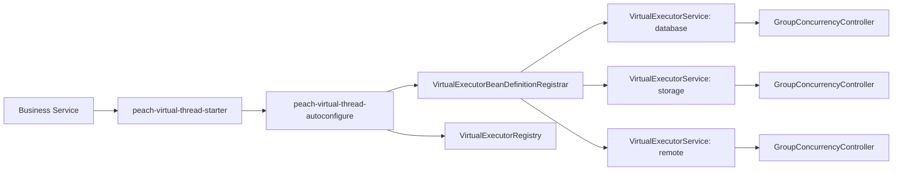
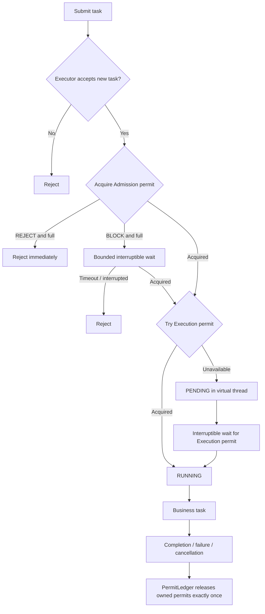
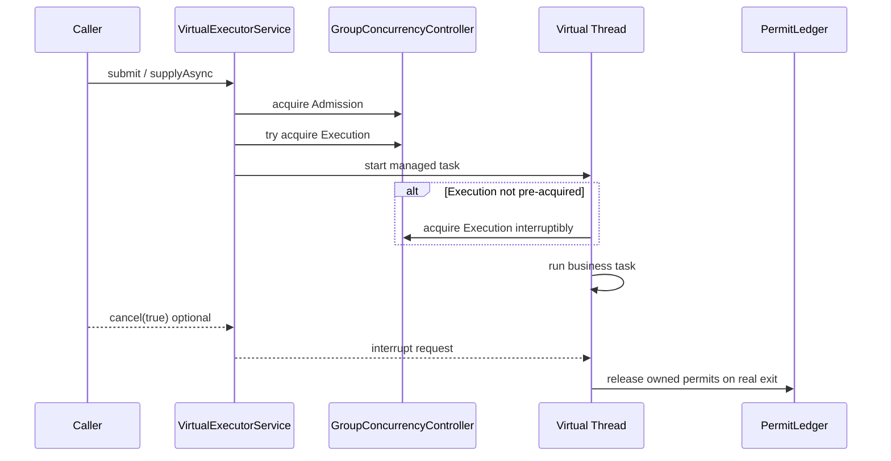
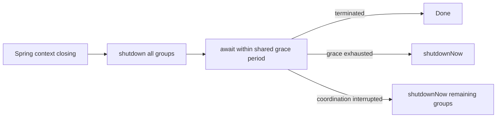

# peach-virtual-thread 设计说明

本文面向维护者，解释 `peach-virtual-thread` 当前实现的并发模型、任务生命周期、取消语义与关闭策略。对外接入请先阅读 [README](../README.md)，完整配置与 API 见 [Reference](./reference.md)。

## 1. 设计目标

该组件用于 Java 21 阻塞 I/O 场景：通过一个任务一个虚拟线程降低平台线程占用，同时使用业务组级并发边界保护数据库连接池、远程 HTTP、对象存储等真实下游资源。

它不是“无限并发”执行器。组件显式控制两类容量：

- `maxConcurrency`：允许真正进入业务逻辑的任务上限。
- `maxPending`：已经准入、但尚未拿到执行许可的任务上限。

因此单个业务组满足：

```text
Running <= maxConcurrency
Pending <= maxPending
Accepted <= maxConcurrency + maxPending
```

## 2. 模块关系



业务组来自启动期 `peach.virtual-thread.groups` 配置。每个组创建独立的 `VirtualExecutorService`，同时注册到 `VirtualExecutorRegistry`。当前实现不负责运行期动态创建、删除或调整业务组容量。

## 3. 双容量模型

`GroupConcurrencyController` 使用两个 `Semaphore`：

- Admission：容量为 `maxConcurrency + maxPending`，在创建受管任务前限制总活动任务数。
- Execution：容量为 `maxConcurrency`，限制真正进入业务逻辑的任务数。



`REJECT` 对 Admission 做即时 `tryAcquire()`；`BLOCK` 在提交线程上执行带超时、可中断的 `tryAcquire(timeout)`。Pending 等待发生在已受 `maxPending` 限制的虚拟线程中，不把无限排队转移到内存。

## 4. Permit 所有权

许可获取与释放被刻意分离：`GroupConcurrencyController` 只负责获取，任务生命周期通过 `PermitLedger` 统一记录和释放。

核心约束：

1. 任务只有获得 Admission 后才进入受管生命周期。
2. Execution Permit 只代表真实业务逻辑的并发名额。
3. 成功、异常、中断、取消、关闭等路径最终都由任务清理阶段归还自身持有的 Permit。
4. Permit 不能因 Future 已完成或调用方已取消就提前释放；真实 runner 未退出时仍占用真实执行容量。

该设计用于避免重复释放、遗漏释放和并发上限被取消竞态击穿。

## 5. 提交与取消语义

`VirtualExecutorService` 继承 `ExecutorService`，并额外提供受管 `CompletableFuture` API。



对 Starter 自己创建的受管 `Future` / `CompletableFuture`，`cancel(true)` 会把取消请求关联到实际虚拟线程。取消请求不等价于“业务代码已经停止”：如果底层阻塞调用不响应中断，Permit 仍需等 runner 真正退出后才能释放。

将本执行器作为参数传给 JDK 原生 `CompletableFuture.supplyAsync(fn, executor)` 时，返回的是 JDK 自己管理的 `CompletableFuture`，其取消语义不应与组件的 `supplyAsync` 混为一谈。因此需要可控取消时优先使用组件提供的受管 API。

## 6. 背压选择

### REJECT

容量满时立即失败，适合：

- 调用方已有降级、重试、限流或失败反馈机制。
- 请求线程不应被等待占用。
- 更看重快速失败和尾延迟可控。

### BLOCK

容量满时允许提交线程在 `acquire-timeout` 内等待 Admission Permit。它仍然是有界等待，不是无期限阻塞。适合短暂峰值可被吸收、且调用方能接受有限提交延迟的场景。

无论使用哪种策略，容量都应围绕下游真实约束设置，而不是按 CPU 核数机械配置。

## 7. 优雅关闭

`VirtualExecutorRegistry` 实现 Spring `DisposableBean`，容器关闭时先对全部业务组调用 `shutdown()`，再共享 `shutdown-await` 作为总 grace period 等待终止；超出剩余时间的执行器进入 `shutdownNow()`。等待线程被中断时，会对尚未终止的执行器执行强制停止，并恢复中断状态。



关闭后的执行器不应继续接收新任务；Pending/Running 任务能否快速退出仍取决于业务代码和底层客户端是否正确响应中断。

## 8. 设计边界

当前实现明确不承担：

- Spring 事务跨线程传播。
- 运行期动态扩缩容或 Nacos 热更新并发边界。
- CPU 密集型工作负载的专用调度。
- 对任意 ThreadLocal/MDC/SecurityContext 的隐式复制。
- 下游资源容量的自动探测与自适应调参。

需要这些能力时，应由上层业务、专用执行组件或独立控制面处理，而不是把职责继续堆到虚拟线程 Starter 内。
