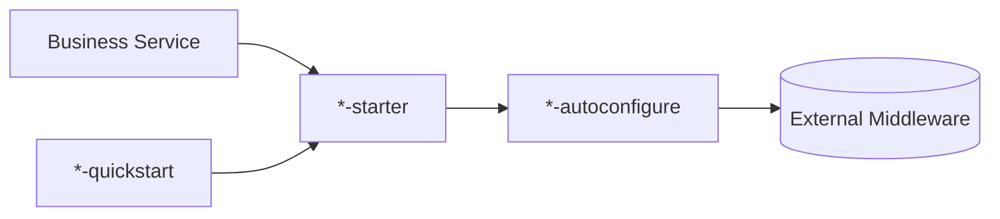

# peach-middleware

English | [中文](README.md)

`peach-middleware` provides Peach Cloud client-side integrations for external middleware. Business services use the corresponding starters to obtain consistent contracts and default governance instead of duplicating vendor-SDK configuration.

## Standard Structure



See [`../docs/starter-architecture.md`](../docs/starter-architecture.md) for the complete convention.

## Middleware Navigation

| Family | Capability | Quickstart |
| --- | --- | --- |
| [`peach-rocket`](peach-rocket/README.en-US.md) | RocketMQ events, producers/consumers, transaction messages, Outbox and idempotency | `peach-rocket-quickstart` |
| [`peach-redis`](peach-redis/README.en-US.md) | Redis tools, multi-level cache and Stream | separate `multicache / stream / tool` quickstarts |
| [`peach-redission`](peach-redission/README.en-US.md) | Redisson distributed locks, delay queues, bloom filters and repeat guards | four capability-specific quickstarts |
| [`peach-mongo`](peach-mongo/README.en-US.md) | MongoDB auto-configuration and unified access | `peach-mongo-quickstart` |
| [`peach-satoken`](peach-satoken/README.en-US.md) | Sa-Token Web / Same-Token integration | `peach-satoken-quickstart` |
| [`peach-openfeign`](peach-openfeign/README.en-US.md) | OpenFeign Same-Token, RequestId, timeouts, retry and Sentinel | `peach-openfeign-quickstart` |

The former `peach-kafka` module contained only placeholder POM/README files and no real starter implementation, so it is removed from the Maven reactor. It should return only after real autoconfigure, starter, quickstart and documentation exist.

## Development Convention

- Business modules depend on starters, not autoconfigure modules directly.
- `common` contains only stable contracts genuinely shared within one middleware family.
- When an aggregate family contains multiple independent starters, every starter has a matching autoconfigure module and quickstart.
- Quickstarts verify integration only; they do not carry production deployment settings, real credentials or business consistency guarantees.
- Messaging, caching, locking and queue abstractions must not turn development defaults into claims of Exactly-Once, strong consistency or unlimited reliability.

## Build

```bash
mvn -pl peach-middleware -am test -Pdevelopment
```

Use each family README as the source for configuration, extension points and production boundaries.
