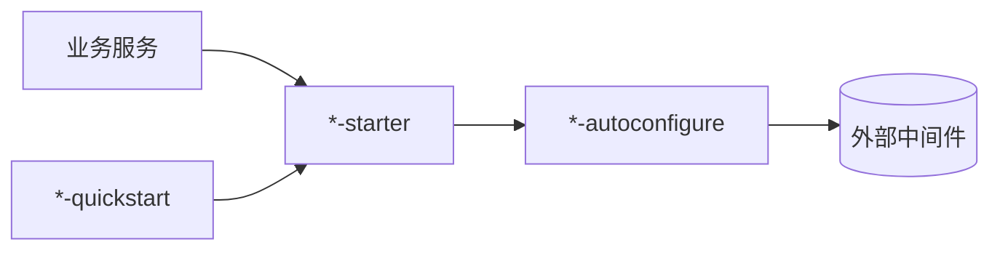

# peach-middleware

[English](README.en-US.md) | 中文

`peach-middleware` 封装 Peach Cloud 对外部中间件的客户端接入能力。业务服务通过对应 Starter 使用统一契约和默认治理，不直接复制底层 SDK 配置。

## 统一结构



完整结构约束见 [`../docs/starter-architecture.md`](../docs/starter-architecture.md)。

## 中间件导航

| 家族 | 能力 | Quickstart |
| --- | --- | --- |
| [`peach-rocket`](peach-rocket/README.md) | RocketMQ 事件、生产消费、事务消息、Outbox 与幂等 | `peach-rocket-quickstart` |
| [`peach-redis`](peach-redis/README.md) | Redis 工具、多级缓存、Stream | `multicache / stream / tool` 三个 quickstart |
| [`peach-redission`](peach-redission/README.md) | Redisson 分布式锁、延迟队列、布隆过滤器、防重复 | 四个独立能力 quickstart |
| [`peach-mongo`](peach-mongo/README.md) | MongoDB 自动配置和统一操作入口 | `peach-mongo-quickstart` |
| [`peach-satoken`](peach-satoken/README.md) | Sa-Token Web / Same-Token 接入 | `peach-satoken-quickstart` |
| [`peach-openfeign`](peach-openfeign/README.md) | OpenFeign Same-Token、RequestId、超时、重试与 Sentinel | `peach-openfeign-quickstart` |

原 `peach-kafka` 只有占位 POM/README，没有形成真实 Starter 能力，本次从 Maven 聚合中清理；后续只有在实现真实 autoconfigure、starter、quickstart 与文档后再引入。

## 开发约定

- 业务模块依赖 starter，不直接依赖 autoconfigure。
- `common` 只保存同一家族确实共享的稳定契约。
- 一个聚合家族包含多个独立 Starter 时，每个 Starter 都有匹配的 autoconfigure 和 quickstart。
- Quickstart 只验证接入，不承担生产部署、真实凭据或业务最终一致性。
- MQ、缓存、锁、队列等基础设施能力不能把默认实现包装成 Exactly-Once、强一致或无限可靠保证。

## 构建

```bash
mvn -pl peach-middleware -am test -Pdevelopment
```

具体配置、扩展点和生产边界以各家族 README 为准。
