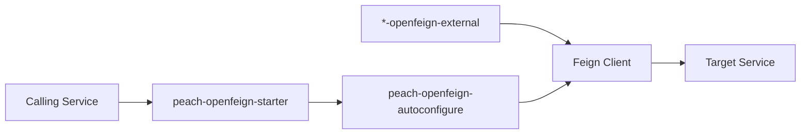

# peach-openfeign

English | [中文](README.md)

`peach-openfeign` is Peach Cloud's service-to-service HTTP governance starter, standardizing Same-Token, RequestId, timeouts, bounded retry, Sentinel and error boundaries. Business Feign contracts remain in each domain's `*-openfeign-external` module.

## Structure

| Module | Responsibility |
| --- | --- |
| `peach-openfeign-autoconfigure` | Interceptors, timeout/retry, error governance, Sentinel and auto-configuration |
| `peach-openfeign-starter` | Business integration dependency entry point |
| `peach-openfeign-quickstart` | Minimal governance auto-configuration verification without duplicating business APIs |

Quickstart: [`peach-openfeign-quickstart`](peach-openfeign-quickstart/README.en-US.md).

## Boundaries

- Propagate only project-defined Same-Token and RequestId by default; do not turn arbitrary business headers into implicit propagation.
- Retry only explicitly recoverable and safe calls; write requests are not blindly retried by default.
- Sentinel governs calls, while business fallback semantics remain the caller's responsibility.
- Large files should use dedicated storage channels rather than treating Feign as an unlimited relay.
