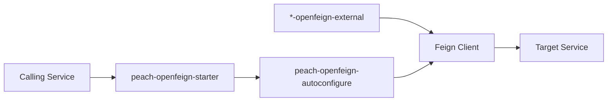

# peach-openfeign

English | [中文](README.md)

`peach-openfeign` is Peach Cloud's service-to-service HTTP governance starter, standardizing Same-Token, RequestId, timeouts, bounded retry, Sentinel and error boundaries. Business Feign contracts remain in each domain's `*-openfeign-external` module.

## Structure

| Module | Responsibility |
| --- | --- |
| `peach-openfeign-autoconfigure` | Interceptors, timeout/retry, error governance, Sentinel and auto-configuration |
| `peach-openfeign-starter` | Business integration dependency entry point |
| `peach-openfeign-quickstart` | In-process Stub + Feign Client loop that verifies governance auto-configuration |



## Quick Start

The example lives in [`peach-openfeign-quickstart`](./peach-openfeign-quickstart/). Real Feign contracts remain in business `*-openfeign-external` modules; the QuickStart does not duplicate business APIs and does not call external services.

| Item | Detail |
| --- | --- |
| Capability sample | In-process `DownstreamStubController` + `LocalStubClient` loop |
| Success call | Feign `GET /stub/echo` echoes `source=stub` |
| Error classification | Stub returns 500; `PeachOpenFeignErrorDecoder` maps it to `PeachFeignRemoteException` |
| Timeout classification | Stub returns 408; ErrorDecoder maps it to `PeachFeignTimeoutException` |
| Runner | `OpenFeignDemoRunner`; tests set `quickstart.openfeign.demo.enabled=false` |
| Prerequisites | Same-Token, Sentinel, fallback fail-fast and retry are disabled so ErrorDecoder classification is visible |
| Port | Demo run defaults to `18085` (stub and caller in-process); tests use `RANDOM_PORT` + `local.server.port` |

```bash
mvn -pl peach-middleware/peach-openfeign/peach-openfeign-quickstart -am spring-boot:run
mvn -pl peach-middleware/peach-openfeign/peach-openfeign-quickstart -am test
```

## Boundaries

- Propagate only project-defined Same-Token and RequestId by default; do not turn arbitrary business headers into implicit propagation.
- Retry only explicitly recoverable and safe calls; write requests are not blindly retried by default.
- Sentinel governs calls, while business fallback semantics remain the caller's responsibility.
- Large files should use dedicated storage channels rather than treating Feign as an unlimited relay.
